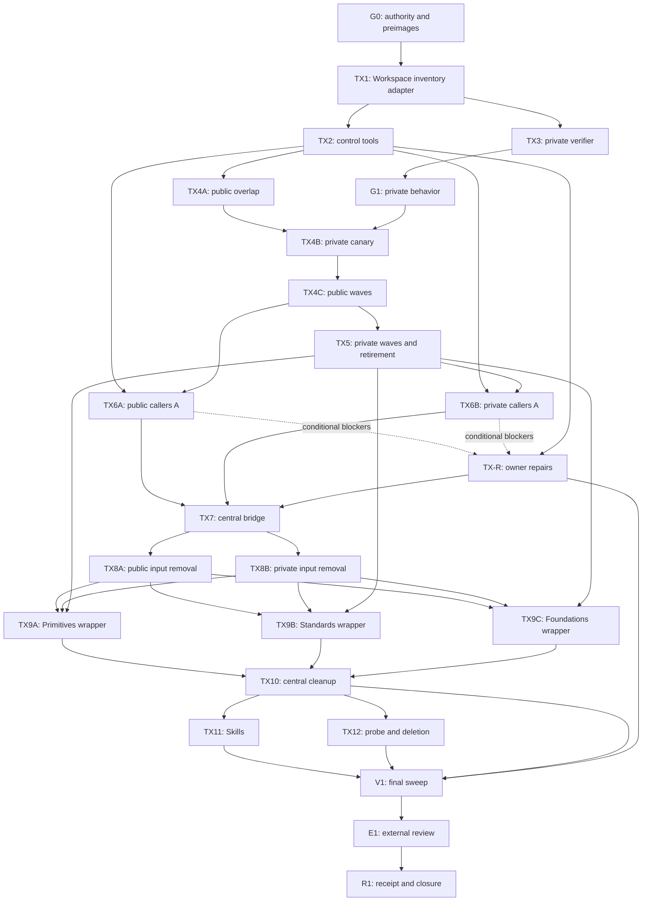

# CI/CD Completion Programme

**Provisional filename:** `CI-CD-COMPLETION-PROGRAMME.md`  
**Commission posture:** read-only investigation; this document authorizes nothing by itself  
**Evidence cut:** repository state through 2026-08-05 08:56:06 UTC; ruling-timestamp REST read 2026-08-05 06:39:02 UTC; individual rows state their exact earlier coordinates  
**Governing Goal:** [`swift-institute/.github#276`](https://github.com/swift-institute/.github/issues/276)  
**Decision:** proceed by forward repair from the checkpoint; do not roll back the architecture

This is the sole execution programme from the verified checkpoint to the prescribed §6.3 completion receipt. It replaces the unfinished task sequence as an execution plan. The original programme remains the architectural authority; this document changes sequencing and transaction boundaries only. No mutation, workflow dispatch, issue change, ruleset change, merge, or destructive operation was performed while preparing it.

## 1. Executive ruling

The intended architecture is sound, and most landed architectural work is worth retaining. The checkpoint is a valid basis for completion, but it is **not safe to resume fleet mutation as-is**. Four live control-plane defects are load-bearing: the caller generator still emits a pre-terminal two-job/docs form; the sweep can bypass the authoritative layer; the private verifier deletes its receipt at the end of the producing step and also invokes raw `swift build`; and the convergence driver can misclassify red candidates, silently omit corrupt records, and merge without a confirmed rollback blob. Predicate 5 was also marked `MET` despite cancelled validator cells. These are implementation and execution-model defects, not proof that the selected architecture is wrong.

The correct remaining strategy is:

> Encode the terminal implementation in the fewest recoverable transactions; retain Class A/B evidence and Class C hazard canaries; then perform one receipt-oriented Class D sweep.

The programme has **24 operational nodes**: one read-only gate (`G0`), one private-behaviour gate (`G1`), nineteen mutation nodes (`TX1`–`TX12`, including the four R21 settings boundaries `TX4A`/`TX4B`/`TX4C`/`TX5`, visibility/owner partitions and the parameterized `TX-R` repair stream), one final validation sweep (`V1`), one principal-owned external review (`E1`), and one receipt/closure transaction (`R1`). `TX9A`, `TX9B`, and `TX9C` may run in parallel after their shared preconditions. Public and private fleet mutations remain separate. Workspace's effective-inventory and verification semantics are already landed and retained; `TX1` is only the missing typed CLI/report adapter that makes those semantics consumable by caller generation and trusted private verification.

The expected terminal ledger is **27 `MET` and predicate 21 `DESCOPED — principal authorized`**. No other predicate is eligible for descope. Receipt filing is blocked until:

- every accessible ordinary repository has the terminal state on its authoritative default branch;
- every pre-existing-red blocker has been repaired under exact-owner authority (an open PR or classification does not count as convergence);
- the principal expressly resolves both the R19.2/predicate-28 historical-timing conflict and the performative P27/P28 receipt/link/Goal-close order defined in §2.4;
- the public probe evidence is captured and the principal performs the authorized deletion;
- all private behaviour is proved on private subjects without public leakage;
- the external full review required by R14a/R20 is complete; and
- the exact §6.3 structure **as amended by Corrigendum §11.2** is populated: one Authority block, sixteen tables, one Workspace reconciliation list, and sixteen assertions. The Corrigendum adds only the required name-reservation field to population table 8; the programme's prose says fifteen tables, but its literal receipt contains sixteen, and “Operational stops encountered” may not be deleted.

### 1.1 Definition of fleet completion

A repository is converged only when its generated terminal caller, or an exact authorized typed exception, is read back from its authoritative default branch. A pull request, correct diff, passing run elsewhere, or `blocked-pre-existing` classification is not convergence. Under the current authority, the §6.3 receipt cannot issue with an accessible ordinary repository unmerged. The selected treatment for the expected red population is therefore **repair all pre-existing defects through exact-owner `TX-R` transactions**. `G0` obtains principal authority for that bounded expansion; if it is withheld, implementation unrelated to those repositories may continue, but `V1` and the receipt remain blocked.

### 1.2 Architecture challenge ruling

No live evidence makes the authoritative architecture internally inconsistent, impossible, or materially unsafe. One apparent simplification is rejected: the three layer `swift-ci.yml` wrappers are not to be deleted wholesale. Their runner-backed outer `ci-ok` jobs are compatibility shims, but each wrapper's `matrix` reusable call owns the literal layer token (`primitives`, `standards`, or `institute`). The terminal state retains that semantic interface and removes only the old-check aggregate, temporary docs input, and layer docs wrapper.

## 2. Authority and provenance

### 2.1 Authority document verification

The authority was fetched from Git commit [`bb3fa49c416be6ce55c6c828a0b2cfbb6bea8119`](https://github.com/swift-institute/.github/commit/bb3fa49c416be6ce55c6c828a0b2cfbb6bea8119); Git identified blob `f6556f1f704b854cb2fdff23788cfb02fd270216`. The fetched bytes were independently hashed and counted before use.

| Verification | Expected | Observed | Disposition |
|---|---:|---:|---|
| Commit | `bb3fa49c416be6ce55c6c828a0b2cfbb6bea8119` | same | accepted |
| SHA-256 | `184db8ef230cd7e532f9aeb167a51508bc897f8221ec935cb5a776ca1eaf62ef` | same | accepted |
| Size | 158,327 bytes | 158,327 bytes | accepted |
| Line count | 2,747 | 2,747 | accepted |

The known `bb9b6ebb…`/154,371-byte/2,679-line copy was not loaded or reconciled. The implementation report was read in full as an evidence index; its SHA-256 is `628b22202397fd7b90784ffaf497f81029fc4f87fae57cb49117e417690029bf`, size 27,253 bytes, 379 lines. It is not cited as final proof where a repository, issue, pull request, run, or job object exists.

### 2.2 Source precedence

| Authority source | Exact coordinate | Controlled proposition | Precedence | Current conformance | Completion action |
|---|---|---|---|---|---|
| CI/CD Refactor Programme | commit `bb3fa49c416be6ce55c6c828a0b2cfbb6bea8119`, digest above | architecture, tasks, §6.3/§6.4, 28 predicates | base authority | architecture mostly present; terminal state incomplete | preserve architecture; replace only execution sequence |
| Programme Corrigendum §11.2 | same immutable commit, lines 2729–2747 | Task 0C-01 has an explicit live-enumerated **name reservation** class; the two named repositories are positive controls, never the census; no caller/archive/exclusion mutation | same base authority; later section corrects the earlier class list | missing from the checkpoint model | encode in `G0`/`TX2` census schema, durable records, receipt population table and `V1` closure |
| Goal activation | [comment 5179025205](https://github.com/swift-institute/.github/issues/276#issuecomment-5179025205) | activates exact programme | later goal record | conforms; Goal open | keep open through `R1` |
| Principal rulings R1/R1a–R27 | exact comments below | express amendments and operational rulings | later express ruling controls only to conflict extent | mixed | encode each binding ruling; stop on unresolved conflict |
| `ci-cd` Skill | `swift-institute/Skills@a4c752911015e8c7ea1cd5fe6f3f8e586e9f55c4`, blob `b641c597a5ab2e87b9719e53fa6d793fdd93785b` | CI/CD execution/evidence doctrine | subordinate to programme/rulings | pre-terminal doctrine | update in `TX11` |
| `github` Skill | same commit, blob `206231fc3e6332b90154bb9fc55cf744794665ad` | GitHub mutation/evidence discipline | subordinate | no conflict found | update terminal examples in `TX11` |
| `workspace` Skill | same commit, blob `f7ea147c7b99e6656182c997d6733e088e7e3aea` | Workspace-only SwiftPM; Full-Swift default | subordinate; Workspace-only SwiftPM remains binding, while the programme's express #113 implementation-language exemption controls this refactor | private workflow violates Workspace-only execution; Python/shell tooling is authorized only within the exact programme scope | repair private execution in `TX3`; retain the general Skill rule without forcing redesign of programme-authorized glue |
| `instrument-traps.md` companion | same commit; [`workspace/instrument-traps.md`](https://github.com/swift-institute/Skills/blob/a4c752911015e8c7ea1cd5fe6f3f8e586e9f55c4/workspace/instrument-traps.md), blob `f22195f145bcdc7b896197b6dd88192cf465ac37` | false-zero instruments, positive controls, unfiltered absence reads | subordinate; reinforces §6.4/R10 | conforms to retained evidence rules | read before `G0`/zero-use/`V1`; retain unchanged in `TX11` |
| `release-gates.md` companion | same commit; [`github/release-gates.md`](https://github.com/swift-institute/Skills/blob/a4c752911015e8c7ea1cd5fe6f3f8e586e9f55c4/github/release-gates.md), blob `3f77d7125260cf17c672a9e759aa56af99463a91` | principal-owned tag/publication/visibility/deployment gates | subordinate; reinforces programme prohibition and receipt assertion 14 | no release action authorized or performed | retain unchanged in `TX11`; use in final external-mutation audit |
| `package-heritage.md` companion | same commit; [`github/package-heritage.md`](https://github.com/swift-institute/Skills/blob/a4c752911015e8c7ea1cd5fe6f3f8e586e9f55c4/github/package-heritage.md), blob `93379a0a360a04f6ac6686018a7daeba355ca82c` | fork/transfer heritage and per-action destructive authorization | subordinate; reinforces principal ownership of probe deletion | conforms; probe deletion remains unauthorized until principal action | retain unchanged in `TX11`; apply its destructive gate at `TX12` |
| GitHub investigation transport | GitHub plugin `0.1.9-alpha.0-5f2a107-2841cf9749ae` | read-only retrieval provenance | evidence transport only | adequate with stated endpoint gaps | do not treat connector absence as zero |

**Resolved programme/Skill conflict.** The Workspace Skill at the pinned blob, line 127, says Institute tooling is Full Swift and prohibits new Python or shell automation. The exact programme expressly authorizes repair or narrow creation of Python, shell, Ruby, Swift, and YAML logic under its #113 exemption (authority lines 52–53 and direction 11 at line 760). The programme is both higher and more specific, so that exemption controls only this CI/CD refactor. The Skill's surviving constraints still bind: put semantics at their exact owner, do not weaken a typed predicate into ad hoc glue, and run every local package operation through Workspace. `TX11` preserves the general Full-Swift doctrine; this programme records the local exception and does not turn it into permanent Institute doctrine.

No older architecture assessment, fleet inventory, draft programme, addendum, agent summary, or superseded implementation plan was used as authority.

### 2.3 Principal ruling map

All ruling comments were authored by `coenttb`. The supplied export and authenticated connector projection returned `created_at: null`, but a separate paginated GitHub REST read of the same 37 comment IDs returned exact `created_at` and `updated_at` values. Those UTC timestamps are recorded below and per ruling in `authority-map.json`; every ruling comment currently has `updated_at == created_at`, so no later comment-body amendment is observed. That machine map also records, ruling by ruling, whether the proposition is encoded in repository source or remains prose-only. Comment IDs, URLs, bodies, authors, and timestamps are exact.

| Ruling | Exact comment | Created / amended UTC | Status and controlled proposition | Affected programme area | Live conformance / required action |
|---|---|---|---|---|---|
| R1 | [5179334323](https://github.com/swift-institute/.github/issues/276#issuecomment-5179334323) | `2026-08-04T12:51:55Z`; no amendment | superseded permission finding | §2.12; Tasks 00-03/2-02/7-01; P11 | superseded by R1a; historical only |
| R1a | [5179467795](https://github.com/swift-institute/.github/issues/276#issuecomment-5179467795) | `2026-08-04T13:04:25Z`; no amendment | App has statuses/checks/contents/workflows write in all 17 installations; no broader grant; no untrusted write token | permissions; P11/P22 | reported conforming; fresh 17-row readback in `V1` |
| R2 | [5179334323](https://github.com/swift-institute/.github/issues/276#issuecomment-5179334323) | `2026-08-04T12:51:55Z`; no amendment | exact work-object reuse and exclusions | work graph; P4/P9/P12–15 | retain object ownership; do not turn bot issues into implementation objects |
| R3 | [5179533925](https://github.com/swift-institute/.github/issues/276#issuecomment-5179533925) | `2026-08-04T13:10:33Z`; no amendment | #43 owns Task 6-01 outcome and links to Goal by reference | Task 6-01; P19/P20/P28 | #43 reopened; complete through `TX7` |
| R4 | [5179659039](https://github.com/swift-institute/.github/issues/276#issuecomment-5179659039) | `2026-08-04T13:21:44Z`; no amendment | explicit full-SHA self-referential composite-action pins; sequencing amended by R4a/R4b/R6 | Corrigendum §11.1; P19/P23/P25 | landed and retained; re-audit pins after central changes |
| R4a | [5179764333](https://github.com/swift-institute/.github/issues/276#issuecomment-5179764333) | `2026-08-04T13:31:09Z`; no amendment | `job.workflow_sha` interpolation is impossible; context partition and sequencing refined | Corrigendum §11.1; Phase 0A | sequencing later finalized by R4b/R6 |
| R4b | [5179826809](https://github.com/swift-institute/.github/issues/276#issuecomment-5179826809) | `2026-08-04T13:36:36Z`; no amendment | uniform full-SHA action-reference policy and final Phase 0A sequence | Corrigendum §11.1; P19/P23/P25 | landed and retained; re-audit pins after central changes |
| R5 | [5179764333](https://github.com/swift-institute/.github/issues/276#issuecomment-5179764333) | `2026-08-04T13:31:09Z`; no amendment | bot approval only after frozen exact-head accepted plan; no bypass | mutation protocol; P24/P28 | retain for every future PR |
| R6 | [5179971035](https://github.com/swift-institute/.github/issues/276#issuecomment-5179971035) | `2026-08-04T13:48:19Z`; no amendment | distinct reviewer for bot-authored caller PRs; evidence actually executes at frozen head | Task 5; P17/P24/P28 | first path reportedly proved; apply per `TX6`/`TX8` PR |
| R7 | [5180040780](https://github.com/swift-institute/.github/issues/276#issuecomment-5180040780) | `2026-08-04T13:54:32Z`; no amendment | exactly one CI-subject deriver; search fixture detects a second | 0A-01; deletion proof; P2/P23 | current repair retained; revalidate after sweep/dispatch repair |
| R8 | [5180158215](https://github.com/swift-institute/.github/issues/276#issuecomment-5180158215) | `2026-08-04T14:03:10Z`; no amendment | skipped required-check hazard must be reachable; job conclusion independently consumed | ruleset migration; P9/P14/P15/P23 | evidence incomplete; reclaim in `V1` before wrapper reduction closes |
| R9 | [5180182636](https://github.com/swift-institute/.github/issues/276#issuecomment-5180182636) | `2026-08-04T14:05:14Z`; no amendment | every public merge path must refuse a skipped required check | ruleset migration; P9/P14/P15/P23 | evidence incomplete; reclaim in `V1` before wrapper reduction closes |
| R10 | [5180538999](https://github.com/swift-institute/.github/issues/276#issuecomment-5180538999) | `2026-08-04T14:34:57Z`; no amendment | a hazard-incapable sample is no evidence; every zero needs positive control | all census/absence claims | binding throughout `G0`, deletion gates, `V1` |
| R11 | [5180731845](https://github.com/swift-institute/.github/issues/276#issuecomment-5180731845) | `2026-08-04T14:51:42Z`; no amendment | distinct Phase-5 reviewer; live count must be re-derived | caller convergence; P17/P28 | old 550 count stale; exact current accessible census below |
| R12 | [5181136135](https://github.com/swift-institute/.github/issues/276#issuecomment-5181136135) | `2026-08-04T15:24:59Z`; no amendment | native Swift 6.4; no auto-close trailer; issue types; durable long waits; `--fresh` only final evidence | all Swift/work objects | retain; all SwiftPM through Workspace |
| R13 | [5181164566](https://github.com/swift-institute/.github/issues/276#issuecomment-5181164566) | `2026-08-04T15:27:30Z`; no amendment | hazard-capable exact-head full-tier run evidence and dep-graph controls | Tasks 0A-01/03; P2/P3/P4/P23 | P4/P10 evidence incomplete; reclaim with exact run objects |
| R14 | [5181329785](https://github.com/swift-institute/.github/issues/276#issuecomment-5181329785) | `2026-08-04T15:41:37Z`; no amendment | per-PR external-review rule superseded; review-depth finding survives | review | historical rule superseded |
| R14a | [5181360883](https://github.com/swift-institute/.github/issues/276#issuecomment-5181360883) | `2026-08-04T15:44:28Z`; no amendment | final substantive review is principal-owned/external and blocks Goal closure | receipt; P28 | outstanding; `E1` |
| R15 | [5181461638](https://github.com/swift-institute/.github/issues/276#issuecomment-5181461638) | `2026-08-04T15:52:43Z`; no amendment | merge is a mutation; behavioural proof follows; tripwires remain binding | sequencing | replaced here by transaction-level encoding plus retained tripwires |
| R16 | [5181533757](https://github.com/swift-institute/.github/issues/276#issuecomment-5181533757) | `2026-08-04T15:59:09Z`; no amendment | implementation-first may overlap except tripwires and collision boundaries | sequencing | replaced here by transaction-level encoding plus retained tripwires |
| R17 | [5181773817](https://github.com/swift-institute/.github/issues/276#issuecomment-5181773817) | `2026-08-04T16:21:31Z`; no amendment | correctness/evidence-honesty terms survive; closure timing later amended | landing/closure | do not weaken controls; evidence debt remains |
| R18 | [5181964819](https://github.com/swift-institute/.github/issues/276#issuecomment-5181964819) | `2026-08-04T16:39:56Z`; no amendment | GraphQL auto-close check; skipped/cancelled never execution | PR lifecycle; P28 | retain in every PR transaction |
| R19 | [5182231184](https://github.com/swift-institute/.github/issues/276#issuecomment-5182231184) | `2026-08-04T17:05:57Z`; no amendment | implementation-time evidence deferral and closure on landed source | all predicates | creates residual conflict with literal P28; `G0` routes exact amendment |
| R20 | [5182337853](https://github.com/swift-institute/.github/issues/276#issuecomment-5182337853) | `2026-08-04T17:16:43Z`; no amendment | reaffirms R14a and permission hard stops; principal expressly selects final review via ChatGPT, outside Claude Code | review/approval | external review outstanding; `E1` must use the named venue |
| R21 | [5182451166](https://github.com/swift-institute/.github/issues/276#issuecomment-5182451166) | `2026-08-04T17:27:58Z`; no amendment | staged ruleset migration, reverse payloads, private truth gate, old producer retained until old rule zero | P12–15/P23 | compatibility live; execute public overlap `TX4A` → post-`G1` isolated private canary `TX4B` → bounded public waves `TX4C` → bounded private/control/retirement `TX5`, then `TX9A-C` |
| R22 | [5182717299](https://github.com/swift-institute/.github/issues/276#issuecomment-5182717299) | `2026-08-04T17:55:27Z`; no amendment | P21/Task 7-01 explicitly descoped; original ruleset operator term superseded | P21; receipt table 13 | record only authorized descope; no fake annotation rows |
| R23 | [5182825015](https://github.com/swift-institute/.github/issues/276#issuecomment-5182825015) | `2026-08-04T18:06:18Z`; no amendment | no further scope reduction; every accessible caller | P12–28 | fleet incomplete; no red exception inferred |
| R23a | [5182845600](https://github.com/swift-institute/.github/issues/276#issuecomment-5182845600) | `2026-08-04T18:08:14Z`; no amendment | one idempotent scripted logical fleet run, preimages, rate handling, one #90 start check | Task 5-02; P17 | durable mechanics retained but driver repaired before reuse |
| R24 | [5183978148](https://github.com/swift-institute/.github/issues/276#issuecomment-5183978148) | `2026-08-04T20:01:42Z`; no amendment | reclaim all evidence debt; P4 uses findings-separation disjunct; only P21 descoped | P4/P7–9/P21/P28 | P4 remains unmeasured until instrumentation repair; do not wait for natural schedule by default |
| R25 | [5184239365](https://github.com/swift-institute/.github/issues/276#issuecomment-5184239365) | `2026-08-04T20:27:34Z`; no amendment | rulesets/surfaces/sync are independent verdicts; every finding repaired or typed | P4/P18 | REPO-ACTIONS-004 still live; repair in `TX-R` |
| R26 | [5184490178](https://github.com/swift-institute/.github/issues/276#issuecomment-5184490178) | `2026-08-04T20:52:44Z`; no amendment | coordinator executes settings work; R21 controls survive | rulesets/security | no per-operation reauthorization; destructive/server-scope stops remain |
| R27 | [5185070592](https://github.com/swift-institute/.github/issues/276#issuecomment-5185070592) | `2026-08-04T21:56:24Z`; no amendment | every central/callee change requires exact-proposed-head live package caller with non-zero jobs; P20 broken-fixture failure before re-land | Task 6-01; P19/P20 | mandatory for `TX7` and `TX10`; stop on rejection/zero jobs |

### 2.4 Unresolved authority questions

`G0` must obtain three exact principal comments before their dependent work may close. The first comment resolves two linked predicate-28 defects:

1. **Predicate 28 restatement and performative finalization.** Proposed controlling text: “For work objects closed under R19.2, exact evidence attached to the Goal before finalization satisfies the historical closure-evidence limb; every object still open or reopened closes only after its own evidence, and R14a external review remains mandatory. Predicates 27 and 28 are performative and cannot both be true before the receipt/link/Goal-close actions that make them true. Therefore pre-finalization readiness may prove predicates 1–26 terminal (predicate 21 authorized `DESCOPED`) plus every non-performative limb of predicates 27–28 and freeze an immutable `receiptCandidateDigest`; that candidate is not the §6.3 receipt and may not be presented as one. R1 then attaches the candidate digest and source coordinates to Goal #276, closes the Goal `completed`, independently reads the Goal and every child back, commits the one final §6.3 receipt containing those post-action readbacks and predicates 27–28 as `MET`, posts that immutable final commit in a follow-up Goal comment, independently reads the comment/link and Goal state back, and only then runs the post-finalization validator. For this sequence only, the candidate attached at closure plus the byte-bound post-action receipt is the meaning of ‘closes with the final receipt.’ Any mismatch or post-finalization failure requires reopening the Goal and no completion receipt may be claimed.” Without this exact amendment, predicate 28 and `R1` are `BLOCKED`; this programme does not pretend either the historical timing or the live causal loop is satisfied.
2. **Exact-owner repair authority.** Authorize `TX-R` to repair pre-existing package defects only to restore the repository's unconverged-main CI contract, without weakening controls or broadening product scope. Without it, every affected ordinary repository remains unconverged and the receipt blocks.
3. **Named source-only surface repairs with external-route suppression.** Proposed controlling text: “Authorize `TX-R` to repair only action identity/ref/class conformance in `swift-institute/cclsp:.github/workflows/ci.yml`, `swift-institute/swift-institute.org:.github/workflows/deploy-docs.yml`, and `swift-foundations/swift-linter:{.github/workflows/ci.yml,.github/workflows/lint.yml,.github/workflows/publish-ci-binaries.yml}` while preserving their existing release/deployment semantics and package/release versions. Candidate PR controls run normally; each final default-branch squash commit uses the GitHub-recognized `[skip ci]` instruction solely to suppress the out-of-scope push-main npm/Pages/rolling-release route. The executor must then prove no release, deployment, publication, tag or external metadata mutation occurred. The skipped/non-created push run is prevention, never evidence.” Without this exact authority, `S26` blocks those source changes, P18, assertion 14 and the receipt; it does not authorize a publication or a weaker action-pin policy.

## 3. Verified checkpoint inventory

### 3.1 Governing default-branch heads

| Repository | Default branch | Verified head | Material state |
|---|---|---|---|
| `swift-institute/.github` | `main` | `dd7af62198b451341a5566368914195eb1baecec` | control plane; two post-checkpoint commits with zero net source diff, adjudicated below |
| `swift-institute/Workspace` | `main` | `22776d8b4ebd6180e2d04de3c7d4daf0a1d702ab` | receipt source landed, behavioural contract incomplete |
| `swift-institute/Skills` | `main` | `a4c752911015e8c7ea1cd5fe6f3f8e586e9f55c4` | doctrine pre-terminal |
| `swift-primitives/.github` | `main` | `3a52c7101115ec37f2408d02bfaf7867dd6068aa` | matrix + old aggregate + docs compatibility |
| `swift-standards/.github` | `main` | `d7566e05aa02f601d4856ad53a9a3bab66b62e31` | matrix + old aggregate + docs compatibility |
| `swift-foundations/.github` | `main` | `756e67264a9c614bf4735b8cce9fbb34fbbfe29f` | matrix + old aggregate + docs compatibility |
| `swift-foundations/swift-linter` | `main` | `6b37a58aff1506f71b76079da88ac7d185b6f78d` | retained linter authority input |

There is real post-report history drift in the control plane. After checkpoint head `5b651b5372cbd81f537da5de92d3d25fd64170a4`, PR [#324](https://github.com/swift-institute/.github/pull/324) landed `5a93bb42f82df7f1d1ab4c5d7ba65d3d0217dc3c`, temporarily adding an `OrganizationAdmin`/`always` bypass actor to the public compatibility ruleset source after the attempted settings writer was refused. PR [#325](https://github.com/swift-institute/.github/pull/325) then landed current head `dd7af62198b451341a5566368914195eb1baecec`, reverting that source window before the unattended nightly could propagate it. The compare is two commits ahead, zero behind, merge base `5b651b5372cbd81f537da5de92d3d25fd64170a4`, with zero net changed files. Direct three-ref blob reads prove the current versions of `protected-main-public-compatibility-ruleset.json`, `Repository.Policy.Ruleset.swift`, and its tests are byte-identical to the checkpoint versions; the intermediate versions differ. Thus the current terminal-state diff is unchanged, but the implementation history and verdict are not: landing an unattended bypass source before the settings transaction was executable was materially unsafe, and the prompt revert was correct. The commit message's statement that no live ruleset changed is **not** accepted as settings proof; `G0` must independently read `bypass_actors`, current payloads, and reverse payloads for every ruleset.

No other material default-branch drift from the report was found across the inspected governing repositories. Goal #276 remains open with 37 comments; the latest is [checkpoint comment 5187646191](https://github.com/swift-institute/.github/issues/276#issuecomment-5187646191).

### 3.2 Fresh public census

The authenticated enumeration across the 17 active manifest organizations observed 487 public repositories, of which 9 were archived and 478 were public/non-archived. It then read root `Package.swift` and `.github/workflows/ci.yml` contents directly.

| Observation | Exact count |
|---|---:|
| active manifest organizations | 17 |
| connector-visible public repositories | 487 |
| public archived | 9 |
| public non-archived | 478 |
| root `Package.swift` | 455 |
| `ci.yml` caller files | 456 |
| root package and caller | 454 |
| root package without caller | 1 |
| caller without root package | 2 |
| Corrigendum name reservations observed | 2 |
| separate layer-docs calls | 450 |
| callers passing `integrated-docs: true` | 0 |

The connector projection did not expose `isFork`, and private repositories were not visible. Therefore 478 is an exact **accessible public** count, not yet the canonical public-nonfork-plus-private root. `G0` must re-enumerate with a positive-controlled endpoint that exposes fork, visibility, archived, disabled, default branch, package class, and pagination. Any inaccessible page remains `UNMEASURED`.

Observed package caller distribution:

| Route | Count |
|---|---:|
| `swift-primitives/.github/.github/workflows/swift-ci.yml@main` | 204 |
| `swift-standards/.github/.github/workflows/swift-ci.yml@main` | 108 |
| `swift-foundations/.github/.github/workflows/swift-ci.yml@main` | 140 |
| Foundations wrapper pinned to `aee6862f860ff05f70a584ff42b0a40526c23d68` | 1 |
| typed direct-universal `swift-institute/Issues` | 1 |
| **total package callers** | **454** |

There are 453 observed wrapper callers: 373 same-wrapper-organization and 80 cross-organization. Because the available projection omitted `isFork`, “wrapper caller” is the proved class; “ordinary non-fork caller” is not. The Corrigendum's two live positive controls—`swift-foundations/swift-certificates-reservation-2026` and `swift-foundations/swift-crypto-reservation-2026`—are recorded as **name reservations**, not non-package exceptions: they remain enumerated, receive no caller/package check, and are never hard-coded as the class population. `swift-institute/cclsp` and `swift-institute/Skills` have callers without root manifests and receive the exact dispositions in §5.1.1. `swift-institute/swift-institute.org` has a root manifest but no package caller because its explicit control-plane Pages disposition controls. These facts contradict the checkpoint's use of “473 callers” and “approximately 456 remaining” as current terms. More importantly, **zero observed wrapper callers are terminal**: the generator has not emitted the terminal docs-integrated form, so the 14 reported initial merges must be rewritten again. `fleet-scope.json` serializes every observed public row; `G0` supplies the missing fork/private/default-head dimensions before mutation.

### 3.3 Material implementation artifacts

| Artifact | Class | Verified current state | Forced terminal disposition |
|---|---|---|---|
| universal `.github/workflows/swift-ci.yml` | terminal base with temporary compatibility | central 23-job topology; integrated docs gated by temporary input; Task 6 receipt absent | retain topology; `TX7` adds smaller receipt/docs bridge; `TX10` removes temp contract |
| three layer `swift-ci.yml` wrappers | semantic interface + temporary compatibility | only `matrix` plus runner-backed `ci-ok`; fixed literal lint bundle is semantic | retain `matrix` and literal token; delete outer aggregate/temp input after zero old rules |
| three layer `swift-docs.yml` | temporary compatibility | secret transport only; zero layer-specific predicate | delete after positive-controlled zero consumers |
| canonical generator | incorrect/pre-terminal artifact | `INTEGRATED_DOCS_SUPPORTED=False`; two-job caller; layer inferred from existing `uses`; missing terminal permission/event shape | replace atomically in `TX2`; retain migration modes only until `TX10` |
| `ci-sweep.yml` | incorrect artifact | calls universal directly with `tier: full`, omits layer token, separately sweeps docs, includes nonpackages | repair Workspace-derived class/route in `TX2`; retain separate docs until `TX7`, then remove it atomically with unconditional universal docs |
| `ci-dispatch.yml` | prose-only typed debug exception | operator selects layer; default `institute` can under-check | encode typed exception and authoritative layer resolution in `TX2` |
| compatibility ruleset payload | temporary safety artifact | requires both old and new public checks | retain through `TX4A`/`TX4B`/`TX4C`; delete in `TX5` only after public/private/control readback and independent zero-old census |
| nightly `ruleset-compat: true` | temporary safety hold | source present; behavioural execution unmeasured | retain through `TX4A`/`TX4B`/`TX4C`; remove with compatibility source in `TX5`; never leave stale |
| private verification workflows | incorrect/unproved artifact | raw `swift build`; receipt cleanup trap deletes producer output; best-effort topic/default inventory | repair in `TX3`; prove in `G1` |
| convergence driver | migration-only tooling with reusable core | durable per-repo JSON and concurrency 6; unsafe classification/corruption/rollback ordering | repair before fleet; retain only permanent reconciliation/repair mode after `TX10` |
| intermediate reports/ledgers | evidence-only artifacts | useful leads; not durable final proof | superseded by §6.3 receipt after `R1` |
| Task 6-01 merge | reverted artifact | PR #303 merge `69e4306da2d0f3f4a3a5fa175beb8b0620e58da1`; reverted by PR #315 `d4066eda9ff25093dabc96ed2829be71330b9124` | keep absent until materially smaller `TX7` replacement passes R27 |
| SQL-provider repair PR #5 | unmerged candidate | head `27151140319801cbe9c4003a3f57173399405d54`; default still pinned at `e86442fc5c01bd5f40c043fabd859598ab4ffc4b` | repair exact-owner blockers, merge, and read back under `TX-R` |
| `coenttb/swift-single-primitives` probe fork | temporary evidence subject | exists; upstream PR `swift-primitives/swift-single-primitives#6` is closed/unmerged; probe head `7940637f731247332e1b0939a866fbee5b7cfb45`; prior fork-origin PR [run 30967227509](https://github.com/swift-primitives/swift-single-primitives/actions/runs/30967227509) has 25 jobs (15 success, 10 skipped) | separate terminal full-tier nested canary and authentic fork-origin `pull_request` canary in `TX12`; capture evidence; principal deletes this exact repository; independent not-found read |

`work-object-state.json` is the complete machine-readable reconciliation of the 14 programme task/work-object groups: live state, merged or reverted pull requests, full merge SHAs, evidence quality, unmerged material objects, principal dependencies, probe state, and changes observed since the report checkpoint. It treats the implementation report as a lead and preserves every retained unknown rather than promoting narrative to proof.

### 3.4 Rulesets and checks

Source policy defines:

- public ordinary terminal: only `ci / matrix / ci-ok`;
- public compatibility: `ci / ci-ok` and `ci / matrix / ci-ok`;
- private ordinary: only `verification / workspace`;
- control/meta: no package required check.

A direct read of public sample `swift-primitives/swift-array-primitives` ruleset ID `20247655`, updated 2026-08-04 19:07:20 UTC, showed both public contexts required. This positively confirms the compatibility window for one hazard-capable subject; it is not a fleet proof. The available connector lacked a ruleset endpoint, so full live ruleset state remains `UNMEASURED` until `G0` uses the authenticated settings API.

The hold mechanism is exact: `sync-metadata-nightly.yml` is triggered by both `schedule` and `workflow_dispatch`, passes `heal-rulesets: true` and `ruleset-compat: true` to `sync-metadata.yml`, and that input selects the two-context public payload while rejecting compatibility treatment for private classes. Source inspection proves the call contract, not execution. A future `workflow_dispatch` with `dry-run: true` is a lawful non-mutating behavioral probe of payload selection through the same reusable path; it does **not** prove `event=schedule` and does not prove an apply. This programme does not rely on an assumed cron window: `TX4A` freezes and reads the public overlap cohort, `TX4B` is an isolated private settings canary after `G1`, and `TX4C` applies public new-only payloads in bounded single-organization waves while the hold and old producer remain. Each boundary enumerates queued/in-progress synchronizer runs, records each run head, admits no unexplained writer and reads every settings write. Only `TX5`, after remaining private/control reads and an independent zero-`ci / ci-ok` census, deletes the input/compatibility/wave source, drains pre-retirement writers, reconciles at the landed head, and repeats the all-settings read. Leaving the hold after terminal ruleset retirement is dangerous because it can reintroduce the old requirement; removing it before the complete R21 sequence is dangerous because a terminal/no-hold run can strip the old requirement outside the ordered transaction.

Producer/consumer contract:

| Context | Current producer | Current consumers | Terminal disposition |
|---|---|---|---|
| `ci / ci-ok` | caller job `ci` → wrapper outer job `ci-ok` | compatibility rulesets and migration policy | zero consumer proved fleet-wide in `TX5` after `TX4A`/`TX4B`/`TX4C`; producers deleted only in `TX9A-C` |
| `ci / matrix / ci-ok` | caller `ci` → wrapper `matrix` → universal `ci-ok` | compatibility rulesets; terminal policy source | sole public ordinary required context |
| `verification / workspace` | trusted central private verifier | private policy source; live application not proved | sole private ordinary context after `G1`/`TX5` |

### 3.5 Predicate checkpoint

The report headline `12 MET · 1 DESCOPED · 6 UNMET · 9 PENDING` is not reproducible: it uses partial credit, enumerates ten pending predicates, conflicts with R24 on predicate 4, and marks predicate 5 `MET` despite cancelled cells. The independently adjudicated current ledger is:

- `MET`: 1, 2, 3, 11, 22 (5 total; each revalidated where later transactions can affect it);
- `DESCOPED — principal authorized`: 21 (1);
- `INVALIDATED`: 5, 6 (2);
- `UNMEASURED`: 4, 7, 8, 9, 10 (5);
- `UNMET`: 12–20 except 21, plus 23 (10);
- `PENDING`: 24, 25, 26, 27 (4);
- `BLOCKED`: 28 (1).

These sum to 28. `BLOCKED` is current, not a permitted receipt disposition.

### 3.6 Supplied checkpoint hypotheses adjudicated

| Supplied checkpoint claim | Fresh disposition and coordinate | Confidence | Later-state / transaction effect |
|---|---|---|---|
| `12 MET · 1 DESCOPED · 6 UNMET · 9 PENDING` | **Rejected.** The independently split ledger is 5 MET, 1 authorized DESCOPED, 2 INVALIDATED, 5 UNMEASURED, 10 UNMET, 4 PENDING, 1 BLOCKED. The headline conflicts with its own detailed list and with R24. | high—authority, live evidence, and all 28 propositions reconciled | `predicate-ledger.json` is the only forward ledger; no partial credit reaches `R1`. |
| initial wave `17 PRs / 14 merged / 3 pre-existing / 0 convergence-caused` | **Provisional, not independently reconstructible.** [Checkpoint comment 5187646191](https://github.com/swift-institute/.github/issues/276#issuecomment-5187646191) states it, but no durable receipt directory or published Actions artifact was cited from which the three-way tally can be rederived. | medium for narrative; insufficient as completion evidence | Do not reverse the 14 merges; regenerate them because their caller form is pre-terminal. Reclassify any red subject with the repaired discriminator. |
| approximately 456 public repositories remain | **Stale/ill-defined.** Fresh accessible read: 478 public non-archived, 454 root-package callers, zero terminal callers; fork/private membership remains unmeasured. | high for accessible rows; canonical root pending `G0` | Replace approximation with exact `G0` root; every eligible row enters `TX6`/`TX8` or exact typed treatment. |
| approximately 18% existing-red rate | **Invalid forecast.** It is 3/17 from a selected bring-up set, not a fleet estimator. | high | No green-first wave or exception budget; `TX-R` is driven only by observed exact-main/candidate comparisons. |
| driver survives `SIGKILL`; tally derives from durable records | **Plausible core, insufficient terminal proof.** [PR #323](https://github.com/swift-institute/.github/pull/323) supplies the implementation narrative, but live source silently drops corrupt records, mis-tallies typed failures, and can merge before rollback validation. | high for source defects; medium for historical SIGKILL claim | Retain atomic per-repository design; `TX2` must fail closed and repeat kill/corruption/concurrency controls before fleet mutation. |
| supervising harness kills around 62 minutes | **Accepted operational constraint**, not an architecture fact. | medium—report/environment observation | 24-new-target segments, concurrency 6, 55-minute self-deadline, same logical run and durable resume. |
| Task 6-01 reverted | **Verified.** [PR #303](https://github.com/swift-institute/.github/pull/303) merged `69e4306da2d0f3f4a3a5fa175beb8b0620e58da1`; [PR #315](https://github.com/swift-institute/.github/pull/315) reverted it at `d4066eda9ff25093dabc96ed2829be71330b9124`; #43 is reopened. | high | Keep absent; replace with the smaller `TX7` implementation. |
| predicate 19 UNMET | **Verified.** Runtime receipt producer is absent after the revert and required identities were previously unmeasured. | high | Reclaim through `TX7` plus `V1`; never descope. |
| predicate 20 UNMET; required test never existed | **Verified.** R27 records a positive-controlled search of all fifteen tests with zero `referenced_workflows` coverage. | high | Create the empty-chain `UNMEASURED` test and observe a broken false-success variant fail before `TX7` merges. |
| hosted parser rejection not root-caused | **Verified unknown.** R27 establishes candidate/parent/revert behavior but no rejected construct or line. | high | A second unexplained rejection is a stop; delta-bisect the retained patch on new `.github` candidate heads through the same candidate-ref dispatch, then repeat exact-head R27. This programme selects no external synthetic repository; if candidate-head bisection cannot isolate the cause, principal authorization must name an exact additional subject before use. |
| predicates 17/18 blocked by SQL-provider repair | **Verified.** `swift-foundations/swift-sql-postgres-provider@e86442fc5c01bd5f40c043fabd859598ab4ffc4b` still pins both routes to `aee6862f860ff05f70a584ff42b0a40526c23d68`; [PR #5](https://github.com/swift-foundations/swift-sql-postgres-provider/pull/5) head `27151140319801cbe9c4003a3f57173399405d54` is unmerged. | high | First known `TX-R` subject; it does not count converged until repair and generated caller are on default branch. |
| predicate 10 four of five; nested manifest unmeasured | **Terminal proposition remains UNMEASURED.** Historical Windows/layer/docs/fork evidence is bounded, but the terminal exact-head full-tier nested execution does not exist. | high | Split nested/full-tier and authentic fork-PR hazards in `TX12`; do not substitute PR tier for full tier. |
| only public nested carrier is red | **Verified within the accessible public search.** `swift-foundations/swift-records` has `Tests/Package.swift` with unavailable sibling-path dependencies, so the relevant test never executes. | high within accessible public scope | Retain its exact-owner convergence route; use the lawful terminal nested fixture for predicate measurement. |
| predicate 4 waits for `submit-dep-graph-weekly` on 2026-08-10 | **Natural event date is correct but waiting is not selected.** Last cited scheduled run 30805660536 failed; `workflow_dispatch` is not `schedule`. R24.2 expressly permits complete findings-separation instead. | high | Repair instrumentation in `TX2`; close both limbs by run/job/issue separation in `V1`, or remain blocked. Freeze exact workflow SHA if natural schedule evidence is later used. |
| private waves gated on predicate 13 behavior | **Verified.** Source landing/merge is not pass/block/replay/opacity behavior; newly found receipt-lifetime defect prevents a truthful positive path. | high | `TX3` then `G1` precede `TX5` and all private caller work. |
| hold merged but behavior not demonstrated | **Still UNMEASURED.** Source contract is exact, but no definitive scheduled run object proves that the running synchronizer observed it; an eligible window has now passed, so “has not fired” is stale wording. | high | `TX4A`/`TX4C` census and correlate queued/in-progress writers while retaining the hold; `TX5` proves fleet-wide zero old requirements, removes hold/source, drains stale writers, reconciles at the landed head and repeats the settings read. |
| principal owns probe deletion and external review | **Verified.** R14a/R20 make review external/principal-owned; exact public probe deletion needs `delete_repo` authority and is destructive. | high | VAL-36 evidence precedes principal deletion in `TX12`; `E1` and both readbacks block `R1`. |

## 4. Adversarial implementation verdict

### 4.1 Retain unchanged in intent

- permanent intra-Institute reusable workflow references at `@main` and composite/third-party full-SHA pin discipline;
- the centralized universal matrix, strict selected-leg aggregation model, and relocated Primitives platform jobs;
- fixed layer-token ownership in the three semantic wrappers;
- the new required-check name and terminal public/private/control policy shapes;
- the compatibility ruleset and nightly hold **only until their forced retirement transaction**;
- Workspace receipt types and private control-plane separation as architectural foundations;
- durable per-repository driver files, atomic-renaming pattern, restart-first behavior, PR reuse, and concurrency default 6;
- the R27 live-parser acceptance control; and
- all Phase 0A repairs whose exact evidence remains valid.

### 4.2 Repair or replace

- replace the pre-terminal generator and source-of-truth inference;
- repair `ci-sweep`/`ci-dispatch` so no package can reach the universal default with a guessed layer;
- repair validator population reconciliation and empty-token identity reporting;
- repair private receipt lifetime, Workspace-only invocation, inventory provenance, replay, and confidentiality checks;
- replace Task 6-01 with a smaller producer/helper whose workflow shape differs materially from #303 and includes the missing predicate-20 negative test;
- normalize every universal local-action call site to the deliberately advanced full SHA `d1af72d05bf8262fb3918a2f1607b82fafcafdf9`; the relocated Primitives jobs still use `1862f98d955f31a11addc7d41d2a3a6cdd87533c` despite identical `configure-private-repos` and `install-swift-sdk` blobs;
- repair the driver state machine before any fleet run; and
- repeat all 14 early caller merges as part of terminal convergence rather than preserving a built-in second pass later.

### 4.3 Technically unsound work

The private workflow comments claim a step-scoped `trap cleanup EXIT` leaves the receipt for the next step. Bash runs that trap when the producing step exits; lines 205–212 delete the receipt, while the next step expects it at lines 262–340. A truthful positive path is therefore impossible. The same workflow invokes raw `swift build` at line 181, directly violating the Workspace-only rule. This is source-proven, not merely unmeasured behavior.

The current driver is also unsafe for fleet use. It calls a candidate “pre-existing red” from unsuccessful required-context conclusions without dispatching unconverged `main` and comparing legs/material failures; silently skips unreadable JSON records; collapses unrelated typed failures into convergence-caused tallies; and can invoke merge before rejecting a missing rollback blob. These defects invalidate the driver as the authority for the next fleet wave, although its persistence design is retained.

Task 6-01's closure/evidence decision was technically unsound: required receipt fields were explicitly unmeasured, the empty-`referenced_workflows` test did not exist, and GitHub rejected the resulting workflow. The revert was correct; it was not a descope.

The mixed local-action pins are not a functional outage—the relevant action blobs are identical at the old and advanced commits—but they violate R4b's uniform, deliberate pin-advance contract and make receipt identity needlessly ambiguous. Correcting only those `uses:` values belongs in the `TX7` R27 batch because they are central-workflow call sites.

### 4.4 Procedurally expensive but technically sound work

The explicit action-pin advance, universal relocation, compatibility window, nightly hold, per-repository result persistence, and SIGKILL-oriented restart design were expensive but defensible. The problem was granularity: the earlier sequence repeatedly proved intermediate compatibility states and re-adjudicated settled questions. That is a systemic execution-model inefficiency, not a reason to discard correct code.

### 4.5 Failure audit

`failure-audit.json` is the normalized causal ledger behind this operator summary. It records exact issue, pull-request, commit, workflow-run and job coordinates where available, the proposition each coordinate proves, confidence, controls that missed the defect, retained unknowns, and the required preventive control. Missing outage run IDs and an unproved parser construct remain explicit unknowns.

| Failure | Direct cause | Detection / why earlier controls missed it | Disposition and prevention | Classification |
|---|---|---|---|---|
| central outage / Task 6-01 | GitHub rejected receipt-enhanced reusable workflow; exact parser construct remains unknown | first live caller after merge resolved zero jobs; YAML, actionlint, pins, tests, and review do not exercise hosted parser | keep reverted; materially smaller replacement; P20 broken fixture; R27 exact-head non-zero run | isolated implementation defect plus systemic missing hosted-parser gate, now repaired by R27 |
| driver restart 1 | GraphQL `Int!` sent via string `-f` | [PR #307](https://github.com/swift-institute/.github/pull/307) first live attempt; no real type-coercion fixture | repaired in [PR #317](https://github.com/swift-institute/.github/pull/317) at `d84a6b631e8fe5021ac40574f1437161ae7eea0a`; retain typed fixture | isolated |
| driver restart 2 | advisory/skipped checks treated as required | [PR #317](https://github.com/swift-institute/.github/pull/317); realistic job mixture absent from fixture | repaired at `d84a6b631e8fe5021ac40574f1437161ae7eea0a` to live required contexts; re-test skipped hazard | isolated |
| driver restart 3 | empty/unparseable transport response outside retry classes | live census in [PR #320](https://github.com/swift-institute/.github/pull/320); narrow transport fixtures | retry/page checkpoint repair retained at `6c6b08aa38a0beac958e984ca3db10adae61417b` | isolated resilience gap |
| driver restart 4 / confounded canary | candidate and historical check results could not distinguish a convergence regression from an existing SwiftLint red | [PR #321](https://github.com/swift-institute/.github/pull/321) canary stopped before merge; the discriminator existed as operator practice, not a mandatory driver algorithm | retain the manual stop as sound but encode a unique fresh-main dispatch and candidate leg/material comparison in `TX2`; historical change was `2a6a39afba95ad0681d2ba02a76e0a28c47af23b` | systemic automation defect; historical manual recovery plausible, terminal automation unsafe |
| harness kill near 62 minutes | one process outlived supervisor and held aggregate state | [PR #322](https://github.com/swift-institute/.github/pull/322)/[PR #323](https://github.com/swift-institute/.github/pull/323); assumed uninterrupted lifetime | per-repo state retained at `7097bd7519a3cc269fcf2e7ed2d3b423718f72d9`/`5b651b5372cbd81f537da5de92d3d25fd64170a4`; segment 24, concurrency 6, stop before 55 minutes, resume same logical run | environment limit with sound durability response, but residual source defects remain |
| predicate 5 false `MET` | 20-minute validator wrapper cancelled cells; report counted population without execution | [run 30922874797](https://github.com/swift-institute/.github/actions/runs/30922874797): cancelled `scan-github-metadata` jobs 92037805516 (swift-standards), 92037805824 (swift-incits), 92037805968 (swift-iec), and 92037806693 (swift-whatwg), with 25 successes on the same read as positive control | fail closed on expected/actual cell mismatch; forced-cancellation fixture | systemic evidence aggregation defect |
| empty App token | mint step succeeded with empty output and downstream silently used `GITHUB_TOKEN` | job 92037820001; downstream failed closed but identity degraded silently | require nonempty token or explicit degraded identity; negative fixture | systemic identity-observability defect |
| SQL provider PR #5 | unrelated package red blocks pinned-workflow repair | default-branch source and open PR | exact-owner `TX-R`; no exception inferred | valid unresolved delta |
| nested manifest | only reported carrier needs unavailable sibling paths in single checkout | hazard-capable canary selection | terminal public synthetic nested fixture in `TX12`; production repository still converges under `TX-R` if blocked | honest evidence gap |
| private implementation-only closure | source landed without pass/block/replay behavior | issue #253 closure correctly retained evidence debt | `TX3` then `G1`; no public substitute | expected evidence debt plus newly found source defect |
| nightly hold | configuration merged without observed scheduled behavior | no definitive post-hold run object | do not rely on behavior: execute `TX4A`/`TX4B`/`TX4C` in R21 order with writer censuses and exact readback; `TX5` retires the hold/source only after complete settings and zero-old proof, then reconciles | time-dependent gap safely absorbed |
| transient bypass-source window | PR #324 landed `OrganizationAdmin`/`always` in the compatibility source before the live settings writer was proved able to execute; the nightly could have propagated it unattended | live write refusal exposed the authorization gap; dry-run had exercised payload generation but not live authorization or the second-writer hazard | PR #325 correctly reverted it; current affected blobs equal the checkpoint; `G0` must independently read live `bypass_actors`, queued writers and reverse payloads before `TX4A` | technically unsafe transaction boundary, promptly recovered; live settings remain `UNMEASURED` |

The “approximately 18% red” number is merely 3/17 from a selected bring-up sample. It is not a fleet forecast and must not drive exception policy.

## 5. Terminal-state specification

### 5.1 Repository-class topology

| Repository class | Terminal caller / route | Reference and secrets | Events / permissions | Required check | Docs, release, exception treatment |
|---|---|---|---|---|---|
| ordinary same-org Primitives | `.github/workflows/ci.yml` → Primitives wrapper → universal | both hops `@main`; `secrets: inherit`; wrapper literal `lint-bundle: primitives` | push `main` and tags `'*'`; PR to `main`; dispatch; concurrency `ci-${{ github.ref }}` cancel true; top `actions: read`, `contents: read` | `ci / matrix / ci-ok` | universal docs exactly once; no package/layer docs job |
| ordinary same-org Standards | caller → Standards wrapper → universal | `@main`; inherit; literal `standards` | same canonical contract | `ci / matrix / ci-ok` | same |
| ordinary same-org Foundations | caller → Foundations wrapper → universal | `@main`; inherit; literal `institute` | same canonical contract | `ci / matrix / ci-ok` | same |
| ordinary cross-org package | caller → semantic layer wrapper → universal | `@main`; exactly four CI-059 secret mappings | same canonical contract | `ci / matrix / ci-ok` | same; no organization-name layer inference |
| `swift-primitives` package | Primitives route | as above | as above; central embedded/wasm/android/musl legs selected by layer/tier | new check only | layer token preserved in wrapper |
| private ordinary package | canonical caller retained but its package CI is zero signal; trusted public control-plane verifier executes Workspace against exact private head | no private write credential in untrusted subject; private identifiers opaque publicly | automatic exact-head dispatch; trusted verification owns publication | `verification / workspace` only | private CI green never evidence; no public diagnostics/source/deps/tests |
| control-plane / organization `.github` | typed policy-specific workflows, not ordinary generated caller | exact typed grants; no fake package route | only declared triggers | typed control rule, normally no package check | wrappers remain semantic owners; control workflows separately validated |
| non-package repository | no ordinary package caller unless exact typed exception | exact owner/reason/review condition | fail closed if generator encounters unknown shape | no package required check | `cclsp`, `Skills`, and `swift-institute.org` resolved explicitly |
| name reservation | no caller installation, archive, or enumeration exclusion; remains in the root; source-controlled control/no-package-check ruleset may be reconciled with a stored reverse payload | no workflow ref/secrets; semantic live-purpose classifier and default head recorded | none | no package required check | distinct Corrigendum class, neither non-package exception nor archive/fork; live-enumerated from description/README semantics, never a name regex; the two named subjects are positive controls only |
| typed/bespoke exception | exact policy record with owner, purpose, hazard, review condition, and allowed shape | no implicit exception from source comments | exact events/permissions in record | exact class rule | `swift-institute/Issues` direct-universal fan-out remains typed; debug route non-gating/public-only |

Release readiness remains outside the programme. Terminal tag triggers are part of CI caller shape, but execution must create no tag, release, deployment, publication, visibility change, SPI entry, or announcement.

#### 5.1.1 Exact nonordinary and tool-surface dispositions

These are decisions, not placeholders. `Tools/RepositoryPolicy/Policy/repository-surfaces.json` at current control-plane head `dd7af62198b451341a5566368914195eb1baecec` (blob `dc141f532e8c8e7638410bb6f5be32101d9b1e7b`, unchanged from checkpoint baseline `5b651b5372cbd81f537da5de92d3d25fd64170a4`) already proves the Issues, website and swift-linter semantic ownership described below. `TX2` upgrades each retained record to the terminal §8.10 fields—repository/path, class, owner, reason, triggers, direct uses/inputs, permissions, ruleset, and forced review condition—and refuses every unlisted surface. A typed grant never waives §2.11 action identity.

| Repository / current blob | Exact terminal disposition | Source owner transaction | Required rule/check and forced review |
|---|---|---|---|
| `swift-institute/cclsp:.github/workflows/ci.yml` / `1e9271b62b257a0370132fe17d63d797469a4306` | retain as one non-package-tool exception: existing push/PR Bun/Node OS-version matrix and main-only npm job; identity-pin `checkout`, `setup-node`, and `setup-bun`; no Swift caller | `TX2` exact grant; `TX-R(cclsp)` identity-only source repair after `S26` | typed control/non-package payload, no package check; review on root manifest, path/event/use/permission/matrix or npm boundary change |
| `swift-institute/Skills:.github/workflows/ci.yml` / `6afcc9895ff5576cb6b04c4836cb3d45266e9482` | retain one manifestless skill-hygiene exception, but replace the prohibited reusable SHA and `validator-ref` with `main`; preserve markdown/path events, concurrency and inherited secrets | `TX2` exact grant; `TX11` caller plus doctrine in one Skills PR | typed control/non-package payload, no package check; review on root manifest, validator owner/path/input/event/secret change |
| `swift-institute/Issues:.github/workflows/ci.yml` / `6374ff83553100eab2722af4f30b7af1e41893e5` | retain existing control-plane reproducer exception: enumerator plus per-issue direct universal `@main`; pin checkout; supply the Workspace-derived layer; preserve `test-filter`, four triggers and non-gating semantics | `TX2` terminalizes existing override/grant; `TX-R(Issues)` pins/encodes layer without ordinary generation | control payload, no package aggregate; review on reproducer layout, route/input/event/use/permission/ruleset change |
| `swift-institute/swift-institute.org:.github/workflows/deploy-docs.yml` / `5b90638de29b63cd708d8b42a784783670d7a779` | retain existing exact control-plane Pages exception; deployment is outside package CI; identity-pin actions without changing Pages permissions, main guard, DocC/site, artifact or deploy jobs; create no `ci.yml` | `TX2` terminalizes existing override/grant; `TX-R(swift-institute.org)` identity-only repair after `S26` | control payload, no package check; review on path/event/use/permission/deployment owner or package-CI scope change |
| `swift-foundations/swift-linter` `ci.yml` / `9342af1165b29ae58958c9e6cc92d45cb768c25f`; `lint.yml` / `de6f230ec9637c2bddf374329e10fe1c5435b1aa`; `publish-ci-binaries.yml` / `96de1862037fa5b8bf428d1490c9846de2830414` | ordinary package caller converges normally; retain exactly `lint.yml` as the tool-owned reusable and the ruling-approved rolling `ci-binaries` publisher exemption; identity-pin their actions/composites without changing lint or publication semantics | `TX2` terminal grants; `TX6A`/`TX8A` caller; `TX-R(swift-linter)` identity-only tool repair after `S26` | public package rule for caller; exact typed records for two extra surfaces; review if universal consumer, workflow-call/publication contract, event/use/permission or owner changes |

`S26` is deliberately principal-owned because a default-branch write in cclsp, the website, or swift-linter can reach an npm, Pages, or rolling-release route. The selected treatment is the exact source-only suppression ruling in §2.4; the programme neither dispatches those routes nor treats their non-execution as evidence. `Skills` and `Issues` have no corresponding external publication route and proceed under their named owner transactions.

### 5.2 Universal workflow and local actions

The terminal universal remains `.github/workflows/swift-ci.yml`. It owns plan resolution; selected release/platform legs (Linux, Windows, macOS, simulator, embedded, wasm, Android, musl); common and layer-required lint gates; documentation; advisory summary; and strict `ci-ok` aggregation. Layer selection is supplied by the semantic wrapper or an exact Workspace-derived control exception. Unknown class/token fails before expensive work.

The universal's terminal rules are:

- one subject derivation; all jobs consume it;
- selected mandatory jobs must execute and succeed; a selected skipped/cancelled job fails aggregate;
- at least one real compile is mandatory;
- docs run exactly once and unconditionally through the universal chain, subject only to approved semantic docs inputs—not a migration boolean;
- ordinary caller refs stay `@main`; third-party and local/composite actions use full 40-character SHAs;
- containers use static digests where supported; any dynamically selected tag is resolved to a digest at run time and recorded;
- no SwiftPM `.build` cache exists; the sole terminal `actions/cache` use is the public SwiftLint binary, pinned to `actions/cache@55cc8345863c7cc4c66a329aec7e433d2d1c52a9`, repository-scoped and keyed exactly `${{ runner.os }}-swiftlint-${{ env.SWIFTLINT_VERSION }}` with no restore key; a miss downloads the pinned version and verifies `SWIFTLINT_SHA256` before install;
- private package guards remain zero-signal in package CI; trusted Workspace verification is separate;
- errors and unavailable APIs propagate as failure or `UNMEASURED`, never empty success; and
- Task 6 receipt records root and every referenced hop, linter authorities/checksums, action/container identities, runner images, Workspace/policy/fixture/inventory revisions, exact subject, event, attempt, and head.

The terminal central control workflows are also fixed:

- `ci-sweep.yml` enumerates the Workspace effective package inventory, obtains the layer from that source, traverses the correct semantic wrapper, excludes/typifies nonpackages, and has no separate docs sweep.
- `ci-dispatch.yml` remains a non-gating, public-target-only debug exception. Operators may choose a job/ref but not a weaker layer; Workspace resolves the layer and unknown subjects fail closed.
- every local action or called workflow changed with the universal is within R27's exact-head canary boundary.

Task 6-01 has two deliberately different receipt stages. `.github/scripts/effective-runtime-receipt.py`, invoked in the existing universal aggregate rather than another runner/job, builds the **base in-run receipt** from versioned run/jobs/referenced-workflows/linter/action/container/runner/Workspace/policy/fixture/inventory JSON. It emits canonical public-safe JSON plus SHA-256 but must label itself `attestationStage: "preterminal"`: the run conclusion and the aggregate job's own conclusion are nullable while the job is still running, and each unavailable terminal field has an explicit `{field, reason: "not-terminal-at-in-run-capture"}` entry in `unmeasured`. A preterminal receipt is never success evidence. `.github/scripts/augment-effective-runtime-receipt.py` runs only after the cited run is `completed`; it downloads the base artifact, reads that run object and the complete paginated jobs collection through GitHub's API, verifies immutable repository/run/attempt/head/referenced-workflow identities against the base digest, then emits the **terminal augmented receipt** with `attestationStage: "terminal"`, non-null run/job conclusions, `baseReceiptDigest`, and a verdict that is `MET` only when every selected mandatory job and the run succeeded. Completion-state absence, a skipped/cancelled mandatory job, identity mismatch, or an unresolved required field is terminal `UNMEASURED`/failure, not a substituted value. The base helper's unit owner is `.github/scripts/tests/test-effective-runtime-receipt.py`; the collector's is `.github/scripts/tests/test-augment-effective-runtime-receipt.py`; fixtures are under `.github/scripts/tests/fixtures/effective-runtime-receipt/{base,augment}/`. They include multi-hop, empty-hop, preterminal-null, completed-success, completed-failure, changed-attempt/head, missing-linter-authority, corrupt-checksum, mutable-action-ref, moving-runner, skipped/cancelled mandatory, private-coordinate and machine-path cases. `.github/workflows/swift-ci.yml` remains responsible only for `actions: read`, in-run API retrieval, selected-job correlation, base-artifact upload and safe summary rendering. The post-completion collector and the generic receipt readiness validator are invoked from a trusted control-plane/operator process, never by the already-ending aggregate job.

The universal invokes exactly these three Institute composite actions. None declares an action output; environment changes and job conclusions are their contract. The terminal pin is exact because the reviewed action blobs already exist at `d1af72d05bf8262fb3918a2f1607b82fafcafdf9`; any action-content change after this document creates a new reviewed 40-character pin and invalidates the candidate canary until repeated.

| Action / terminal pin | Responsibility and operating-system path | Inputs; outputs/effects | Permissions, secrets, cache, and error contract |
|---|---|---|---|
| `.github/actions/configure-private-repos@d1af72d05bf8262fb3918a2f1607b82fafcafdf9` (blob `a969c3f3737da365d1e6d04ce328af371ba148ba`) | selected build/test/docs/lint jobs; no-op when disabled; mints per-organization App tokens and installs environment-scoped Git URL rewrites | inputs `token`, `app-client-id`, `app-id`, `app-private-key`, `enabled`; no declared output; writes `GIT_CONFIG_COUNT`, `GIT_CONFIG_KEY_n`, and `GIT_CONFIG_VALUE_n` to `GITHUB_ENV` | caller passes the four CI-059 secrets; nested `actions/create-github-app-token` is pinned `bcd2ba49218906704ab6c1aa796996da409d3eb1` and requests `contents: read`; no tracked credential or cache; all-empty credentials mean the documented anonymous public-only path, never an invented authenticated success; action/shell failure fails the selected job |
| `.github/actions/install-system-deps@d1af72d05bf8262fb3918a2f1607b82fafcafdf9` (blob `263eaf7857f1c3b7b989cc3e2ccf329c56872a05`) | after private access in Debian/container legs, derives apt development packages from the root and nested `Tests` dependency graphs; non-apt systems no-op | no inputs or declared outputs; installs the mapped package union; unknown library emits an explicit warning | no secret or write permission; no SwiftPM `.build` cache; network/apt failure propagates, while the action's expressly designed dependency-resolution probe remains best-effort and cannot be cited as package-verification evidence |
| `.github/actions/install-swift-sdk@d1af72d05bf8262fb3918a2f1607b82fafcafdf9` (blob `b2dcee4ee9cb33f4440a253f12cab3171bfeb110`) | selected Primitives container legs for Wasm, Android, and static Linux musl; resolves a toolchain-matching swift.org SDK, verifies its published checksum, installs it, and configures Android NDK r27d by pinned SHA-256 | required `platform`, `bundle-suffix`, `sdk-id`; optional `use-platform-version`, `output-env-var`, `expected-tag`; no declared output; optional resolved SDK ID enters `GITHUB_ENV`; tag/checksum/URL/ID enter the step summary and runtime receipt | no secrets or GitHub write permission; no cache; checksum/tag mismatch, missing platform, install, NDK hash, or setup failure fails the selected job; skipped jobs are recorded as non-execution by the aggregate/receipt |

These actions have no independent event policy: the universal Plan selects their jobs. Their effects are scoped to the current job, every selected failure reaches `ci-ok`, and Task 6 records their resolved commit/blob plus external runtime identities. Operator-originated/local SwiftPM validation remains Workspace-only; action-internal dependency discovery is hosted-CI implementation and is never substituted for the Workspace evidence rows.

### 5.3 Rulesets, metadata, and hold

The terminal payloads are exact, not server-default shorthand:

| Field | Public ordinary package | Private ordinary package | Control-plane/meta |
|---|---|---|---|
| source | `Tools/RepositoryPolicy/Policy/protected-main-ruleset.json` | `Tools/RepositoryPolicy/Policy/protected-main-private-ruleset.json` | `Tools/RepositoryPolicy/Policy/protected-main-control-ruleset.json` |
| `schemaVersion`; `name` | `1`; `Institute protected main` | same | `1`; `Institute protected main (control)` |
| `target`; `enforcement` | `branch`; `active` | same | same |
| `conditions.ref_name` | `include: [refs/heads/main]`; `exclude: []` | same | same |
| `bypass_actors` | `[]`—there are no bypass actor IDs | `[]` | `[]` |
| rule types | `deletion`, `non_fast_forward`, `pull_request`, `required_status_checks` | same | exactly the first three; no status-check rule |
| pull-request parameters | `allowed_merge_methods: [squash]`; `dismiss_stale_reviews_on_push: true`; `dismissal_restriction: {enabled: false, allowed_actors: []}`; `require_code_owner_review: false`; `require_last_push_approval: true`; `required_approving_review_count: 1`; `required_review_thread_resolution: true`; `required_reviewers: []` | byte-equivalent | byte-equivalent |
| status-check parameters | `strict_required_status_checks_policy: true`; `do_not_enforce_on_create: false`; exactly `[{context: ci / matrix / ci-ok}]` | same booleans; exactly `[{context: verification / workspace}]` | absent |

Applicability is equally exact and ordered: first classify the Corrigendum name-reservation form semantically from the complete live record—repository description plus README purpose and structural absence of an ordinary package/caller—not from its repository name. The historical, non-authoritative Task 0C-01 evidence at [comment 5180654926](https://github.com/swift-institute/.github/issues/276#issuecomment-5180654926) reported five matches; `G0` must freshly reproduce or reconcile that count, while the two Corrigendum names remain positive controls only. A synthetic reservation-purpose fixture whose name does not match `*-reservation-YYYY` must pass, and a naive name-regex implementation must fail that fixture. A confirmed reservation stays enumerated, receives no caller/archive/exclusion mutation, and receives the source-controlled control/no-package-check payload; a settings mismatch may be reconciled only with its stored reverse payload. Next apply exact class overrides: `Tools/RepositoryPolicy/Policy/ruleset-class-overrides.json` currently names `swift-institute/Issues` and `swift-institute/swift-institute.org` as control-plane with their recorded reasons. Otherwise a root `Package.swift` selects package class and live visibility selects public/private; absence of the root selects control/non-package. Unknown/unreadable class, purpose limb or visibility is `UNMEASURED` and receives no guessed payload. The only break-glass path is deletion by an organization administrator with a durable owner-issue receipt, followed by explicit `sync-metadata` restoration; it is not a configured bypass actor. Source-controlled payload plus Workspace/GitHub classification is the sole editable truth; server state is reconciled output, not a second source.

Ruleset IDs are live per-repository server identifiers, never source constants. `G0` enumerates and stores each current ID plus exact reverse payload; `TX4A`, `TX4B`, `TX4C` and `TX5` update only their visibility-bounded enumerated IDs in place, reject zero or multiple matches, and read the complete server payload back after every write.

The nightly synchronizer uses only terminal payloads. It reports drift per independent verdict family, fails closed on missing credentials/pages, and preserves terminal state on reconciliation. `ruleset-compat`, compatibility JSON, migration waves, hold comments/tests and ruleset-only obsolete runbook branches are deleted in `TX5` after the complete R21 settings sequence and zero-old census. `TX10` owns only terminal caller/docs input and generator migration cleanup; it must not touch a `TX5` ruleset path.

Repository-owned `.github/metadata.yaml` remains the editable truth for repository metadata; the Workspace effective inventory supplies repository existence/class/layer/location; source-controlled ruleset JSON/Swift correspondence supplies settings intent. The synchronizer may render and apply those sources but may not write a second editable inventory or accept server drift as authority. A proposed metadata change first updates its semantic source; nightly reconciliation reports and heals divergence, with rulesets, surfaces, and other metadata retained as independent verdict families rather than one aggregate green.

### 5.4 Fleet driver

The terminal driver consumes the Workspace-derived canonical root and layer, not the current caller. It uses one logical run ID and inventory digest; concurrency 6; deterministic ordering; at most 24 new targets per invocation; a 55-minute self-deadline; atomic per-repository transition writes; resumable pagination; and idempotent PR/branch reuse. A corrupt/unreadable record halts the run. PR reuse requires an exact base/head/preimage/generator/phase match. Before creating an owner issue, the driver searches open and closed work objects for the durable fingerprint `rootDigest/subjectId/finding-code/preimage/phase`: zero matches permits creation, one exact match is reused, and more than one or any semantic mismatch stops for adjudication. A work object is never closed merely because it was deduplicated or because a candidate exists.

Every durable record contains schema version, logical run ID, root digest, opaque/private-safe repository ID, visibility/class/layer, classification, attempts, timestamps, transition revision, and next action where required. Accessible attempted records additionally contain the applicable default branch, caller preimage or explicit positively controlled caller absence, candidate/PR/dispatch/run evidence, rollback artifact, comparison, merge, and terminal readback fields required by their classification. `not-attempted` and `inaccessible-unmeasured` records never fabricate caller or candidate data. A record becomes authoritative only after Draft-2020-12 schema validation **and** `node validate-fleet-record.mjs --record <record.json>` return success. This two-step check is mandatory before merge/tally, after every atomic write, during resume rehydration, and for every record in V1; tally is derived solely from records that pass both checks, and an independent default-branch scan verifies it.

Terminal states are:

- `converged`: terminal state read from default branch;
- `typed-exception`: exact authorized terminal class record.

Nonterminal states are `blocked-pre-existing`, `failed-convergence`, `different-or-unresolved`, `not-attempted`, `in-progress`, `inaccessible-unmeasured`, and `administrative/access/rollback failure`. None counts as converged.

A red candidate is `blocked-pre-existing` only after a fresh CI dispatch on unconverged `main` at its exact head and a leg-for-leg comparison shows the same failing legs and materially same failures. A different or unattributable failure stops that repository and the dependent tally. Merge is forbidden until the rollback preimage is durable and verified.

### 5.5 Skills and administrative end state

`ci-cd/SKILL.md`, `github/SKILL.md`, and `workspace/SKILL.md` describe only the live terminal topology, check names, private truth path, R27 exact-head rule, run-object evidence, positive controls, durable fleet classifications, and Workspace-only SwiftPM. They contain no deleted docs wrapper, old check, migration boolean, compatibility hold, obsolete task numbering, or per-task evidence ceremony.

Permanent source retains the generator/validator and a repair/reconciliation mode. It deletes migration-phase switches, duplicate ledgers, manual tallies, obsolete branches, stale compatibility fixtures/comments, and reports superseded by the receipt. No temporary mechanism survives without an exact terminal owner and purpose.

## 6. Receipt-backward strategy and transaction graph

Every mutation below exists because it populates a §10 predicate or a §6.3 receipt element. Class A evidence is captured immediately before it would be destroyed; Class B checks occur immediately before hazardous mutation; Class C canaries exercise the actual hazard; all remaining proof waits for `V1`.



Rollback edges run in reverse dependency order. For a required-check rollback, restore the old producer before restoring a rule that requires it. For docs rollback, restore central/wrapper acceptance before restoring a caller input or legacy docs job.

## 7. Verified current-to-terminal diff

The transaction-level machine-readable form is `current-terminal-diff.json`; `fleet-current-terminal-observed.json` supplies all 487 observed public repository rows, while `fleet-scope.json` preserves their census fields and limitations. “All ordinary callers” means the `G0` canonical root, not an unqualified reuse of those public rows: fork status is `UNMEASURED`, private subjects are absent, and 480 default heads still require G0 readback.

| Delta | Repository / branch / path | Verified current state | Terminal state and exact operation | Dependency / predicate / ruling / receipt | Recovery |
|---|---|---|---|---|---|
| D01 | `swift-institute/Workspace@main`; `Application/Sources/Workspace Application/Workspace.Inventory.{Effective,Private,Private.Discovery,Private.Unmeasured}.swift`, `Workspace.Inventory.Client+discoverPrivate.swift`, `Workspace.CLI.Mode.swift`, `Workspace.CLI.swift`, new `Workspace.Inventory.Effective.Output.swift`, and their exact tests | semantic types/tests already encode deterministic public plus runtime-private populations, separate/combined digests, collision failure, and safe in-memory private handling; `workspace inventory` exposes only register/regenerate/pages, so caller generation/private verification cannot obtain the governed effective report/digest without duplicating logic | retain semantic core; TX1 adds only `inventory effective --inventory-scope public|effective --inventory-output PATH`, canonical version-1 output, typed exit behavior, safe public mode, secure effective mode, and fixtures; prove `inventory regenerate --dry-run` current before merge | `TX1`; P7/P12; Tasks 0C-02/2-01; Local evidence + Workspace reconciliation | revert one narrow Workspace PR; TX2/TX3 stay blocked; never copy the logic into control-plane code |
| D02 | `.github@main`; `.github/scripts/generate-caller.py`, `validate-thin-callers.py`, `validate-integrated-docs-compat.py` | generator flag false; legacy CI+docs; existing caller is treated as layer truth | implement canonical stage-A and terminal stage-B renderers from Workspace layer; exact events, permissions, one job, typed inputs/secrets; unknown fails | `TX2`; P17/P18/P23; R7/R10/R23a; Caller convergence + controls | revert before fleet; after fleet use per-repo preimages |
| D03 | `.github@main`; `converge-callers.py`, `converge-caller.yml`, tests | durable core but unsafe red discriminator, corrupt-record omission, tally conflation, merge-before-preimage | fail closed; unique dispatch correlation; main/candidate leg/material compare; atomic record before merge; publish safe digest/artifact | `TX2`; P17/P18/P24; R23a; Caller convergence + stops | stop without deleting records; resume/revert driver revision |
| D04 | `.github@main`; `ci-sweep.yml`, `ci-dispatch.yml`, class overrides | sweep bypasses layer and docs separately; debug layer operator-selected | derive target and layer from Workspace; traverse wrapper; exclude/type nonpackages; encode debug exception; unknown fails; retain the separate docs sweep until TX7 makes docs unconditional, then delete it in that bridge transaction | `TX2`, then `TX7`; P3/P9/P16/P18/P23; R7/R25/R27; Workflow evidence | revert control workflow; package rules unaffected |
| D05 | `.github@main`; validator workflow/report and App-token steps/tests | P5 population hides cancelled cells; successful token step may output empty and fall back | expected-versus-observed cell reconciliation; missing/skipped/cancelled = unmeasured/fail; nonempty token or explicit degraded identity | `TX2`; P4/P5/P11/P22; R10/R18/R24/R25; Controls + Scheduled workflows | revert instrumentation only; never infer prior runs |
| D06 | `.github@main`; `.github/workflows/private-verification{,-sweep}.yml`, `.github/scripts/private-verification-envelope.py`, its tests/fixtures, `Tools/RepositoryPolicy/Policy/repository-surfaces.json`, `Repository.Policy.Surface.swift`, policy tests | raw SwiftPM; producer-step trap deletes receipt; best-effort topic/default inventory; behavior unproved | Workspace-mediated execution; seal/check/envelope lifecycle in one containment boundary; exact checked-out verifier revision; Workspace inventory; fail-closed token/replay/head; opacity | `TX3`/`G1`; P12/P13/P22; R1a/R21/R24; Private verification | revert source; no private ruleset switch exists before gate |
| D07 | `.github@main`; `Tools/RepositoryPolicy/Policy/{protected-main-ruleset.json,protected-main-public-compatibility-ruleset.json,protected-main-private-ruleset.json,protected-main-control-ruleset.json,ruleset-class-overrides.json,ruleset-convergence-waves.json}`, `Tools/RepositoryPolicy/Sources/Repository Policy/Repository.Policy.Ruleset.swift`, `.github/workflows/sync-metadata{,-nightly}.yml`, `Tools/RepositoryPolicy/Runbook.md` | public compatibility payload; nightly hold true; one live sample proves both contexts; fleet live settings unmeasured | `TX4A` proves public overlap; after `G1`, `TX4B` proves one isolated private settings canary; `TX4C` applies public new-only in bounded single-organization waves; `TX5` applies remaining private bounded waves, verifies control/meta and zero old use, then removes compatibility/hold/wave source and performs terminal sync/readback | `TX4A`/`TX4B`/`TX4C`/`TX5`; P14/P15/P23; R21/R26; Ruleset + scheduled + deletions | exact reverse payload per boundary; restore hold/source and drain stale runs before reversing private then public waves; old producer remains through `TX9A-C` |
| D08 | 453 observed public wrapper callers (fork status unavailable), authoritative default branches, `.github/workflows/ci.yml` and duplicate workflows | zero integrated-docs true; 450 separate docs; 14 early merges are pre-terminal | after `G0` resolves ordinary/fork/typed class, pass A installs one job + integrated docs + duplicate deletion; pass B removes migration input after central bridge; read default branch | `TX6A`/`TX8A`; P10/P16–18/P23/P24; R6/R10/R23a; Caller convergence | stored blob/digest reverse PR, docs restored only with central acceptance |
| D09 | canonical private ordinary callers (count from `G0`) | private root/caller shape inaccessible here; reported unattempted | same caller stages in an opaque, separately gated driver run; private verification, not private package CI, gates merge | `G1`, `TX5`, `TX6B`, `TX8B`; P12–18; R21/R23; Private + convergence | opaque preimages; private reverse payload; no public subject substitution |
| D10 | `.github@main`; `.github/workflows/swift-ci.yml`, `.github/scripts/effective-runtime-receipt.py`, `.github/scripts/tests/test-effective-runtime-receipt.py`, `.github/scripts/tests/fixtures/effective-runtime-receipt/`, `.github/workflows/ci-sweep.yml` | docs gated by temp input; Task 6 receipt absent after revert; current head accepted | one R27 batch makes docs unconditional while accepting ignored input, adds the smaller structured receipt + P20 fixture, and deletes the separate sweep docs job | `TX7`; P9/P16/P19/P20/P23; R27; Workflow + runtime receipts | do not land without canary; revert to exact prior accepted head |
| D11 | `swift-primitives/.github@main`; `swift-ci.yml`, `swift-docs.yml` | matrix literal `primitives` + outer old aggregate; docs shim/input | retain matrix/token; delete aggregate, temp input/pass-through, docs wrapper after zero users/rules | `TX9A`; P15/P16/P23; R21/R27; Deletions + rulesets | restore wrapper producer before any old rule |
| D12 | `swift-standards/.github@main`; same paths | matrix literal `standards` + outer aggregate including compatibility predicate; docs shim/input | retain matrix/token; delete compatibility jobs/input/docs wrapper | `TX9B`; same | same |
| D13 | `swift-foundations/.github@main`; same paths | matrix literal `institute` + outer aggregate; no L3-local invariant; docs shim/input | retain matrix/token; delete compatibility jobs/input/docs wrapper | `TX9C`; same | same |
| D14 | `.github@main`; universal/generator caller/docs migration branches and fixtures | central still declares temp input after bridge; caller/docs migration modes required until fleet pass B; `TX5` already owns ruleset compatibility/hold/wave retirement | remove only temp caller/docs input/branches/comments/tests and caller migration tooling; retain permanent repair; reject any `TX5` ruleset path in the diff; R27 canary | `TX10`; P15/P16/P18/P23/P26; R27; Deletions + workflow | revert central first; restore interfaces outward-to-inward |
| D15 | `swift-foundations/swift-sql-postgres-provider@main`; `.github/workflows/ci.yml` plus exact-owner defect paths | two refs pinned; repair PR unmerged due unrelated red | repair only pre-existing defect, prove equivalent main/candidate legs, merge canonical caller, read back | `TX-R`; P17/P18/P24; R23/R25; Stops + convergence | independent owner rollback; never weaken control |
| D16 | every further pre-existing-red ordinary repository | unknown until run; classification alone nonterminal | exact-owner repair to restore unconverged-main contract, then re-run candidate; terminal default branch required | `TX-R`; P17/P18/P24; principal `G0` authority | stop repository; retain evidence; receipt blocks if unmerged |
| D17 | `coenttb/swift-single-primitives`; probe branch/`.github/workflows/ci.yml`/`Tests/Package.swift`; upstream `swift-primitives/swift-single-primitives` PR route | fork exists at observed head `7940637f731247332e1b0939a866fbee5b7cfb45`; upstream PR #6 closed/unmerged; run 30967227509 proved fork-origin PR checkout but only build tier | (a) terminal exact-head `workflow_dispatch` full-tier nested canary; (b) separate authentic fork-head → upstream-base `pull_request` canary for checkout/token isolation; capture both; principal executes `delete_repo` on the exact fork; independent not-found read | `TX12`; P10/P19/P20/P27; R10/R13/R27; Workflow + deletions | preserve complete evidence before deletion; no delete without principal; deletion has no guaranteed rollback |
| D18 | `swift-institute/Skills@main`; `ci-cd/SKILL.md`, `github/SKILL.md`, `workspace/SKILL.md`; read-only companions `workspace/instrument-traps.md`, `github/release-gates.md`, `github/package-heritage.md` | pre-terminal compatibility/task doctrine; companions remain applicable and need no semantic change | encode terminal topology/evidence in exactly the three Skills; preserve Workspace-only SwiftPM, the general Full-Swift rule, and companion links; do not rewrite authorized programme glue merely to erase the scoped authority conflict | `TX11`; P1/P26; Task 7-02; Local evidence | revert Skills-only PR; companions remain unchanged |
| D19 | Goal/work objects and repository-root `CI-CD-REFACTOR-COMPLETION-RECEIPT.md` in `swift-institute/.github` | interim comments/reports; no receipt; several historical closures conflict with literal P28 | obtain P28 ruling, external review, populate exact receipt at that exact root path, close only from exact evidence | `G0`/`E1`/`R1`; P24–28; R14a/R18/R19/R20/R24 | do not file provisional receipt; reopen/correct underlying state |

## 8. Transaction programme and operator runbook

### 8.1 Summary and mandatory order

| Order | ID | Objective | Class A/B precondition | Class C canary | Deferred / external |
|---:|---|---|---|---|---|
| 1 | G0 | authority, canonical root, preimages, principal rulings | all baseline reads and positive controls | none | principal P28 and repair authority |
| 2 | TX1 | add the missing Workspace effective-inventory CLI/report adapter | G0 root instrument and landed semantic core proved | deterministic public/effective reports, secure private output, typed exit and rejection fixtures | independent digest reconciliation/private behavior remains deferred |
| 3 | TX2 | non-central generator, driver, sweep/validator repair | TX1 adapter merged/read back with exit-0 controls; no active writer | class fixtures; SIGKILL/corrupt/red controls | fleet closure |
| 4 | TX3 | private verifier/sweep repair | TX1 exact revision | source-contained fixture | real private behavior in G1 |
| 5 | G1 | private automatic pass/block/replay/opacity | TX3 landed/read back | gate itself | private scope is external/opaque |
| 6 | TX4A | R21 step 1: public old-plus-new overlap cohort | reverse payloads; both contexts produced; writer census | persistent public overlap; failed selected leg and missing-new negatives | public terminal settings deferred |
| 7 | TX4B | R21 step 2: isolated private Workspace-only settings canary | TX4A; G1 exact-head truth; exact reverse | valid current receipt passes; stale/invalid/replay block | remaining private fleet deferred |
| 8 | TX4C | R21 step 3: public new-only bounded organization waves | TX4B; per-wave reverse; hold and old producer retained | first single-organization wave, maximum 24 | zero-old and hold retirement deferred |
| 9 | TX5 | R21 steps 4–6: private bounded waves, control/meta, zero-old and ruleset-source retirement | TX4C; per-wave private truth/reverse; complete class root; writer census | first remaining private material shape and exact-landed-head terminal sync | private opaque and independent fleet read |
| 10 | TX6A | public caller/docs pass A | TX2, TX4C, #90, preimages | public material classes | final default-branch read |
| 11 | TX6B | private caller/docs pass A | TX2, TX5, #90, opaque preimages | private material classes | final opaque read |
| 12 | TX7 | central docs bridge + runtime receipt | TX6A/B plus relevant TX-R repairs; positive-controlled zero separate-doc routes across every ordinary/typed/bespoke central-layer consumer; P20 broken fixture; R27 exact proposed head | candidate-ref `ci-dispatch` against named real packages; non-zero jobs, docs/receipt | representative runtime receipts |
| 13 | TX8A | public input-elision pass | TX7 accepted | same/cross caller | zero input census |
| 14 | TX8B | private input-elision pass | TX7 accepted | opaque private caller | zero input census |
| 15–17 | TX9A/B/C | wrapper compatibility reductions | TX5 zero old rules; zero docs/input consumers | one exact layer per owner; private truth | wrapper census |
| 18 | TX10 | final central caller/docs compatibility deletion | all wrapper branches read back; positive-controlled zero-use; R27 | exact-head caller, docs exactly once | complete absence read |
| 19 | TX11 | Skills synchronization | live terminal state read back | examples/link/static checks | consistency sweep |
| parallel after TX2; stage-A subset joins before TX7; complete stream joins before V1 | TX-R | exact-owner pre-existing-red and named-surface repairs | principal authority; main/candidate evidence; S26 where applicable | repository's own CI / exact surface control | every central-chain consumer stage A before TX7; every ordinary default branch terminal before V1 |
| 20 | TX12 | terminal nested + fork-PR canaries, then exact probe deletion | exact evidence fields declared; principal delete scope | full-tier nested dispatch and distinct fork-origin PR | principal delete + independent not-found read |
| 21 | V1 | one complete post-encoding validation sweep | all mutation nodes terminal | validation is deliberate fleet sweep | schedule/private external facts as specified |
| 22 | E1 | principal-owned external full review | V1 readiness candidate | external review outcome | principal/external |
| 23 | R1 | exact §6.3 receipt and closures | E1 accepted; readiness all true | receipt schema validator | none; terminal |

The order column groups parallel owner/visibility nodes and the parameterized `TX-R` row; the graph contains 24 operational nodes. `TX-R` and the fleet nodes expand into protected-repository mutations per root subject, so 24 is not a claim that only 24 GitHub writes occur.

#### 8.1.1 Normative mutation, readback, and recovery protocol

The following protocol is part of the operator runbook, not optional GitHub ceremony. `TX2`, `TX3`, `TX9A`, `TX9B`, `TX9C`, `TX10`, `TX11`, and every owner-local `TX-R` repair execute source steps C1–C12 in this order. A transaction's own section supplies its exact paths, tests, canary, and additional stop conditions; it may strengthen these steps but may not reorder or omit them. `TX4A`–`TX5` use settings steps S1–S7 in addition to their stricter R21 boundaries.

**Source/PR transaction C1–C12.**

1. **C1 — bind the preimage.** Re-read the authoritative default branch and every declared path. Require the default-branch head to equal the transaction's admitted G0/current predecessor head, or stop and produce a new G0-bound preimage. Record the full 40-character head, tree/blob IDs, content SHA-256 values, controlled absences, and exact rollback coordinate before editing.
2. **C2 — isolate one same-repository candidate.** Create or reuse only the transaction's recorded same-repository bot branch from that exact head. Reuse is lawful only when base/head, transaction ID, root digest, preimages, author and durable record all match; otherwise preserve the object and stop under the collision rules. Never force-push or overwrite a human/unknown branch.
3. **C3 — apply only the declared delta.** Create, edit, or delete only paths named by the transaction and G0 mutation manifest. Compare the candidate tree with C1; any extra path, submodule, generated file, metadata, permission, trigger, release/deployment route, or settings change is a stop. `TX-R` additionally requires its exact-owner scope and, where applicable, the S26 source-only suppression ruling.
4. **C4 — validate before freezing.** Run the transaction's static tests and rejecting fixtures at the candidate tree. All package execution uses Workspace; no raw `swift build`, `swift test`, `swift package`, or `xcodebuild` is permitted. Record repository-relative command, toolchain, exit, counts and result. A skipped/cancelled control or a negative fixture that does not reject stops the transaction.
5. **C5 — commit and freeze.** Create the candidate commit, record its full 40-character SHA and exact diff/path digest, and treat it as immutable. Any content, merge-base, generated output, or commit change invalidates every approval and canary and returns to C1–C5 with a new candidate SHA.
6. **C6 — open or reuse the exact PR.** The PR must be same-repository, target the authoritative default branch, name the transaction/root digest, contain the exact #113 programme exemption, omit auto-close trailers, list paths/preimage/rollback/canaries, and link its authorized work object. Read back PR base/head/author/body/state. A mismatch or duplicate semantic PR stops; it is not silently closed or replaced.
7. **C7 — obtain frozen-head review and checks.** The required reviewer must be distinct where R5/R6 applies and approve the exact C5 head. Read the review object and every required check/run object; `skipped` and `cancelled` are non-execution. A new commit, stale approval, unresolved review, missing check or failed check returns to C4–C7 or stops according to the transaction.
8. **C8 — execute the transaction canary at C5.** Exercise the actual hazard and capture the fields named by the transaction. For R27 transactions this occurs before merge through the candidate-ref caller and must prove GitHub accepted the exact C5 head with non-zero jobs; a nearby or superseded run is invalid. A failed or hazard-incapable canary leaves the PR unmerged and records the stop.
9. **C9 — merge only the unchanged candidate.** Immediately re-read PR base/head, approvals, checks and canary binding; require head equals C5. Use the repository's authorized squash merge and require the merge API/PR object to report merged. A successful API response alone is not terminal state.
10. **C10 — independently read the landed state.** Fetch the authoritative default-branch head, commit/tree and every created/edited/deleted path through repository APIs. Require the path set and canonical content to equal the candidate expectation and the deleted paths to be absent through a positive-controlled instrument. For a required post-landing behavioral canary, run it at this landed head and read its run object and complete jobs. Do not close work or begin a dependent transaction before this equality/readback succeeds.
11. **C11 — persist portable transaction evidence.** Write the mutation row containing repository, default branch, paths, before blob/payload digests, candidate SHA, PR/review coordinates, merge/default full SHAs, tests, canary run `id`/`event`/`run_attempt`/`head_sha`/own `conclusion`, landed blob digests, rollback coordinate, stop history and receipt fields. No machine-local path or private coordinate enters public evidence.
12. **C12 — decide or recover.** C1–C8 failure means no merge: preserve the candidate/evidence and repair at a new frozen head or stop. A C9–C11 mismatch halts every dependent edge and uses a new reviewed reverse PR built from the C1 preimage; never reset, force-push, or invoke a release/deployment route as rollback. Read the reverse merge/default blobs back before resuming. A work object closes only after C10/C11 prove its own terminal result.

**Ruleset/settings transaction S1–S7.**

1. **S1 — bind server state.** Immediately before each bounded write, enumerate active writers and read the one expected live ruleset ID, ETag when supplied, complete payload and canonical digest. Require exactly one match and store the complete reverse payload; zero/multiple matches, an uncorrelated writer, or inaccessible fields stop.
2. **S2 — bind source intent.** Render the exact source-controlled payload for the G0 class, validate Swift/JSON equality, and use the same instrument on a known mismatching payload. Require the target/reverse digests, subject list and wave boundary to match the admitted manifest.
3. **S3 — write one recorded subject.** Update exactly `PUT /repos/{owner}/{repo}/rulesets/{ruleset_id}` with the complete intended payload, using a conditional request when the endpoint exposes a supported concurrency token. Require HTTP success and record request/audit coordinates; no ad hoc field patch or server-default omission is permitted.
4. **S4 — read before advancing.** Immediately `GET` the complete ruleset and require canonical equality with the intended source payload, including enforcement, conditions, bypass actors, pull-request parameters and required checks. Do not admit the next subject or wave on mismatch.
5. **S5 — exercise the boundary canary.** Read exact-head check/run/mergeability objects and the transaction's negative case. A required context that is missing, skipped, stale, or produced only on a hazard-incapable path fails the boundary.
6. **S6 — journal terminal settings.** Persist subject/opaque ID, class, ruleset ID, before/after/reverse digests, writer census, request/readback coordinates, exact head/check/run fields, canary result and receipt fields. Private subjects remain opaque outside the authorized boundary.
7. **S7 — reverse or continue.** On S3–S6 failure, stop the affected boundary and restore the complete S1 reverse payload in the transaction's prescribed producer/consumer and hold/source order; read it back canonically before resuming. On success, advance only to the successor named by the R21 transaction. Never delete a producer, hold, reverse payload, or preimage merely because the write API returned success.

### 8.2 G0 — evidence and principal gate

**Objective.** Establish the exact execution baseline and capture every state whose mutation would destroy evidence.

**Repositories/settings.** All governing repositories; every canonical fleet subject; every live ruleset; Goal #276 and work objects; `coenttb/swift-single-primitives`.

**Operator steps, in exact order.**

1. Re-fetch the authority at its exact commit; hash/count it; halt on mismatch.
2. Read Goal #276 and all comments; resolve R1/R1a–R27 by exact comment ID/author/body/`created_at`/`updated_at`; require the current exact timestamps to match the authority map or halt on an unexplained amendment.
3. Record all governing default-branch heads and App identity/installations.
4. Enumerate the canonical root with pagination and a known public non-archived/non-fork package positive control; include private visibility through an authorized endpoint; classify archived, forked, disabled, ordinary package, nonpackage, control, typed exception, **name reservation**, and inaccessible. Run the semantic description/README-purpose reservation classifier over every live record; require both Corrigendum subjects and a non-name-matching synthetic reservation fixture to match, require the naive anchored-name detector to miss that fixture, freshly verify/reconcile the historical five-match result from comment 5180654926, and never use the two named controls as the census or filter them out.
5. Read every current caller/blob, workflow surface, wrapper, docs consumer, and live ruleset. For every zero instrument, run a known positive through the same endpoint/parser/scope.
6. Store full reverse ruleset payloads, caller preimage blobs/digests, wrapper/docs blobs, current hold/sync source, and the probe run objects that will become unavailable after deletion.
7. Read #90 here only as the G0 baseline and retain its full issue/comment fingerprint. This baseline does **not** satisfy a fleet-stream gate: TX6A, TX6B, TX8A, and TX8B each perform their own fresh read immediately before that new logical stream.
8. Ask the principal for the exact predicate-28 restatement, bounded package-repair authority, and named `S26` source-only external-route suppression authority stated in §2.4. Record `delete_repo` and R14a external-review ownership.

9. Emit one portable `G0-root.json` and validate it against `g0-output-schema.json`. Its `repositories` array has exactly one row per canonical subject and freezes: public coordinate or private opaque ID; visibility; default branch/full head; archived/fork/Actions facts; exact repository class and class authority; semantic layer; current caller blob/digest or controlled absence; generator-expected digest or an exact non-applicability operation; every duplicate surface/preimage; live ruleset ID/ETag/current digest; terminal payload class/digest and reverse-payload coordinate; exact transaction list; terminal expectation; and current status. The root also records every page/cursor/query version, source revision/digest, positive control, and principal decision. Sort by `subjectId`; compute `rootDigest` exactly as the schema states; require `logicalRunId = ci-cd-completion-${rootDigest}`. A row with a guessed class, missing default head, missing preimage, inaccessible setting presented as absence, or unnamed operation invalidates the file and stops the affected fleet edge.

10. Derive `G0-mutation-manifest.json` as the projection of every row whose `currentStatus` is `mutation-required`, retaining subject ID, exact authoritative branch/head, path/setting, before blob/payload digest, after generator/policy digest, transaction, predecessors, canary class, rollback coordinate, and stop condition. Require row-count equality against that projection and independently reproduce it from `G0-root.json`. This is the executor's exact fleet worklist; no later transaction may silently add a repository or path. New live state requires a new G0 evidence cut/root digest, not an ad hoc exception.

**Authority / predicates / receipt.** §3.1/§6.4, R10/R14a/R18/R19/R20/R23a/R27; P4/P6/P14–18/P23–28; governing heads, population, callers, rulesets, deletions, stops.

**Atomicity.** This gate is read-only. Its observations must share one evidence cut/root digest so later deltas cannot silently mix populations. `fleet-scope.json` and `fleet-current-terminal-observed.json` seed the 487 observed public rows; G0 enriches their missing fork/head/settings facts and adds opaque private rows. It does not rediscover the architecture or discard already verified file observations.

**Rollback.** None. **Stop.** Any authority/ruling/root/page/positive control/preimage/reverse payload is missing. Unrelated source preparation may continue only outside the missing domain.

### 8.3 TX1 — Workspace effective-inventory CLI/report adapter

**Objective and ownership boundary.** Retain the landed `Effective`, `Private`, and `Verification` semantic types and expose them through the missing typed interface required by Task 0C-02. Current `Workspace.CLI.Mode.swift` and `Workspace.CLI.swift` offer only `register`, `regenerate`, and `pages`; the private sweep consequently supplies `inventoryDigest=unmeasured` and rediscovers repository topics/defaults independently. TX1 fixes that interface gap in Workspace. It must not copy inventory semantics into `.github` or redesign the landed core.

**Exact files.** In `swift-institute/Workspace@main`, edit `Application/Sources/Workspace Application/Workspace.CLI.Mode.swift` and `Application/Sources/Workspace Application/Workspace.CLI.swift`; create `Application/Sources/Workspace Application/Workspace.Inventory.Effective.Output.swift`; edit `Application/Tests/Workspace Application Tests/Workspace.Inventory.Effective Tests.swift`, `Workspace.Inventory.Client.Private Tests.swift`, and `Workspace.CLI Tests.swift`. Change `Workspace.json` only if the G0 typed writer reports an exact, enumerated public delta; otherwise its blob must remain identical.

**Class-B precondition.** Freeze and read the exact landed Effective/Private/Verification owners and tests; prove deterministic ordering, public-plus-runtime-private derivation, separate and combined digests, collision failure, private in-memory treatment, and receipt bindings for subject/head/visibility/layer/inventory/Workspace/policy/operations/platform/artifact/freshness/replay. Reconcile the G0 public root, both generic name-reservation controls, and an authorized inaccessible-private control. A missing semantic binding, an unexpected `Workspace.json` delta, or a private value presented as zero stops TX1.

**Mutation.** Add exactly:

```text
workspace inventory effective \
  --inventory-scope public|effective \
  --inventory-output PATH
```

The version-1 JSON object has exactly the top-level members `schemaVersion`, `scope`, `public`, `private`, `combined`, and `unmeasured`. `public`, `private`, and `combined` each carry their canonically sorted population and SHA-256 digest; `unmeasured` carries typed inaccessible/error residue rather than an invented absence. `scope=public` emits no private coordinate and marks the private limb `not-requested`; `scope=effective` requires authorized private discovery. Canonical bytes exclude only fields expressly declared volatile by the schema. Exit `0` means complete for the requested scope, `1` means invalid input or semantic failure, and `2` means `UNMEASURED`; TX2/TX3 accept only `0`.

**Operator sequence.** From the frozen institute-application root, run, in order:

```text
swift run institute inventory regenerate --dry-run
swift run institute package test --package-path . --fresh
swift run institute inventory effective \
  --inventory-scope public \
  --inventory-output .ci-cd-completion/workspace/inventory-public.json
swift run institute inventory effective \
  --inventory-scope effective \
  --inventory-output .ci-cd-completion/private/inventory-effective.json
```

**Exact private-output lifecycle.** The TX1 acceptance consumer is the typed `Workspace.Inventory.Effective.Output` decoder exercised by `Workspace.CLI Tests/testEffectivePrivateOutputLifecycle` inside the authorized private containment boundary; no shell/JQ projection is evidence. Before the effective command, set `umask 077` and create `.ci-cd-completion/private` as mode `0700`. The atomic writer refuses a symlink or pre-existing non-regular target, leaves `inventory-effective.json` owned by the executing identity at exactly `0600`, and leaves no sibling temporary. The trusted decoder opens without following symlinks, re-canonicalizes, verifies embedded public/private/combined digests, and emits only `schemaVersion`, whole-file digest, combined digest, result, and `unmeasured` count. It closes, deletes the raw JSON, and proves both `lstat == ENOENT` and parent enumeration containing neither target nor temporary. Raw JSON/private coordinates are never printed, exported through command files, cached, uploaded, or committed. Repeat at the merged TX1 SHA; retain only opaque digests/verdict and the absence proof.

These are Workspace-owned operations invoked through its documented bootstrap, not raw package build/test/package commands. The last command runs only inside the authorized private containment boundary. Record command, toolchain, full proposed head, exit, suite/test counts, output digest/mode, opaque private digest/verdict, and portable public evidence. Open one Workspace PR containing only the declared delta, obtain the normal review/checks, merge, and read every exact blob and both output modes back at the full merge SHA before TX2 or TX3 begins.

**Class-C canary.** Two runs over identical inputs have byte-identical canonical content and digests; changed input changes the digest. Public/effective population, collision, missing/stale/inaccessible-private, insecure-output, leak, and typed-exit fixtures behave exactly as above. Retained verification tests must still reject wrong subject, head, digest, operation, platform, stale, replayed, malformed, and missing receipts.

**Atomicity and rollback.** CLI mode, canonical report, private-output boundary, and tests are one semantic-owner contract. Revert the single TX1 Workspace PR; stop TX2/TX3 first and do not remove the adapter while either or any fleet consumer remains. Real private behavior and fleet closure remain G1/V1 evidence. **Stop.** Semantic-core rewrite, control-plane duplication, unexplained inventory change, absent private positive control, non-determinism, leak, insecure output, prohibited raw SwiftPM, or any failed rejecting fixture.

**Receipt link.** P7/P12; Mutations, Local evidence, controls, Workspace reconciliation.

### 8.4 TX2 — control-plane instruments and driver

**Files.** D02–D05, excluding `swift-ci.yml` and anything it calls; if a proposed file is a universal callee, move that file to TX7's R27 batch.

**Steps.** Execute C1–C12 as one `.github` source transaction. At C3 implement two explicit caller render phases plus terminal renderer from Workspace input; preserve all approved typed inputs and exact CI-059 secrets; repair policy validators; add the Corrigendum name-reservation class to the live census, durable state and receipt projection; register the exact §5.1.1 semantic-owner grants/exemptions for cclsp, Skills, Issues, the website and swift-linter; reject any unlisted path/trigger/use and never treat a grant as an action-pin waiver; register control/debug exceptions; make sweep/dispatch use Workspace layer and package scope; retain the separate sweep docs job until TX7 so documentation does not disappear; repair expected/actual validator-cell reporting and App-token identity; replace driver classification/durability/rollback state machine; add atomic fsync/rename/lock behavior, request-to-run correlation, rate/retry/deadline support, safe artifact/tally output, and the mandatory schema-then-`validate-fleet-record.mjs` admission before every authoritative write/merge/tally/resume. At C4 run every positive/negative fixture below, including raw-private ID, invalid class/layer, contradictory state, missing rollback/preimage, and stream/root/comment/digest mismatches rejected by the semantic validator. C5 freezes the complete one-PR candidate; C8 runs the class/durability canaries; C9–C11 merge only that head, read every declared blob back and record zero fleet mutation before the readback. Any mismatch follows C12 before a fleet writer may start.

**Canaries.** Same/cross fixtures for each layer; every live typed input; unknown input/job/workflow; nonpackage/control; wrong layer; empty token; forced cancelled cell; corrupt/truncated result; missing rollback; duplicate PR; cross-run attribution; SIGKILL and resume; candidate red equal/different to fresh main.

**Atomicity.** Generator, validator, policy, sweep, and driver consume one class/root/state schema. Separate landings can make bot output invalid or accept an unsafe form. This collapses the former generator, validator, driver-restart, sweep, and evidence-report passes.

**Rollback.** Revert this control-plane tooling PR before any new fleet mutation; already existing repository state is unchanged. **Stop.** Any record loss, guessed layer, silent identity fallback, uncorrelated run, merge-before-preimage, or regression misclassification.

**Receipt link.** P4–P6/P9/P14/P17/P18/P22/P24; local evidence, controls, population, caller convergence, stops.

### 8.5 TX3 and G1 — private verification source and behavior

**TX3 files.** `.github/workflows/private-verification.yml`; `.github/workflows/private-verification-sweep.yml`; `.github/scripts/private-verification-envelope.py`; `.github/scripts/tests/test-private-verification-envelope.py`; `.github/scripts/tests/fixtures/private-verification/`; `Tools/RepositoryPolicy/Policy/repository-surfaces.json`; `Tools/RepositoryPolicy/Sources/Repository Policy/Repository.Policy.Surface.swift`; and `Tools/RepositoryPolicy/Tests/Repository Policy Tests/Repository.Policy Tests.swift`.

**TX3 steps.** Execute C1–C12 as one `.github` source transaction; no private setting changes occur here. At C3 delete the separate raw `swift build` product build. Check out Workspace at the request's full recorded revision and launch that revision through the Workspace Skill's documented fresh-clone bootstrap (`swift run --package-path "${workspace_dir}/Application" -c release workspace …`) so every subject resolve/build/test/lint/verify operation is a Workspace operation; the bootstrap itself is never cited as package evidence, and no raw `swift build`, `swift test`, `swift package`, or `xcodebuild` command is permitted. If that documented bootstrap is no longer lawful at execution, stop rather than invent another wrapper. Keep receipt production, validation, safe-envelope derivation, and raw-evidence deletion in one containment unit so cleanup occurs only after envelope creation; derive private candidates/layers/digest from Workspace; require nonempty scoped tokens; validate request/run/subject/head/policy/inventory/digest/operations/platform/freshness/nonce; ensure no subject process receives command files or write credentials; upload only the public-safe envelope. The new central helper owns only envelope allow-listing/binding, not Workspace receipt semantics. C4/C8 run the full lifecycle and rejecting fixtures below; C9–C11 merge only the frozen candidate, read every declared path back, repeat the safe source-contained canary and persist only opaque evidence. C12 leaves private settings unchanged on any failure.

TX3 repeats the TX1 filesystem contract at runtime. Its exact trusted consumer is the `Load Workspace effective inventory (trusted)` step in `private-verification-sweep.yml`, which invokes the merged TX1 typed decoder, accepts only exit `0`, selects opaque subjects/layers, and passes only the verified combined digest and opaque IDs into requests. It creates the containment directory at `0700` under `umask 077`, requires a regular current-identity `0600` output, verifies whole-file/combined digests, and never logs or exports raw content. After the last request and safe-envelope derivation, but before artifact upload, it closes readers; deletes the effective inventory, raw receipt, subject logs and temporaries; proves `ENOENT` plus empty raw-evidence directory enumeration; and scans every log, summary, output, cache candidate and proposed artifact for private sentinels. Only the allow-listed opaque envelope is uploaded. Tests fail when deletion, absence readback, mode/owner, symlink refusal or sentinel scan is removed.

The verifier invokes the exact checked-out revision in this shape, with every value supplied by the trusted request and compared to its independently observed counterpart:

```text
swift run --package-path "${workspace_dir}/Application" -c release workspace \
  verification seal --package-path "$subject_dir" \
  --claimed-head "$subject_head" --default-branch "$default_branch" \
  --visibility private --layer "$layer" \
  --inventory-digest "$inventory_digest" \
  --workspace-revision "$workspace_revision" \
  --policy-revision "$policy_revision" \
  --step build --step test --step nested-tests --step lint \
  --required-step build --required-step test --required-step lint \
  --receipt "$receipt_path"
swift run --package-path "${workspace_dir}/Application" -c release workspace \
  verification check --receipt "$receipt_path"
```

If the landed TX1 Workspace contract makes `nested-tests` mandatory for that private class, include `--required-step nested-tests`; if it is not applicable, the receipt must state that typed reason rather than silently omit it. Both commands run with command-file variables unset, tracing disabled, output redirected to ephemeral non-public files, and no write-capable token in the process environment.

**G1 behavior.** On one authorized private ordinary canary per material private layer/platform shape, observe automatic enqueue for exact PR head, an intentionally invalid/stale/replayed receipt blocking, and a valid receipt passing. Read the check and central run objects. Independently inspect all public metadata/artifacts/log summaries for absence of private repository names, heads, paths, dependencies, tests, and diagnostics; use opaque IDs in public records.

**Atomicity.** Sweep, verifier, envelope, and publisher share one attestation contract. **Rollback.** Revert TX3; private rulesets remain unchanged until G1 passes. **Stop.** Manual-only flow, false green/block, stale head, leaked detail, silent token downgrade, receipt unavailable after production, or incomplete private root.

**Receipt link.** P12/P13/P22; Private verification, runtime receipts, workflow evidence, controls.

### 8.6 TX4A/TX4B/TX4C — the three mandatory R21 canary/public boundaries

The old `ci / ci-ok` producer, the public compatibility payload, `ruleset-compat: true`, the migration-wave source and all reverse payloads remain available through all three transactions. These are three persistent settings boundaries, not one batched sweep.

#### TX4A — public overlap canary (R21 step 1)

**Preconditions (Class B).** `TX2` is merged/read back; the complete public root and exact current/reverse payload for every selected cohort member exist; live exact-head public runs prove both `ci / ci-ok` and `ci / matrix / ci-ok` can be produced; every queued/in-progress synchronizer/callee run is enumerated with event, head and attempt, and no unexplained writer exists.

**Mutation.** Freeze one small `G0`-selected public ordinary cohort. Apply or confirm the source-controlled compatibility payload requiring both contexts. Read the complete live payload back, then inspect run/check/mergeability objects at the exact head. Prove through the same route that a missing new context blocks and that a failed selected universal leg is not hidden by the outer compatibility aggregate.

**Decision and rollback.** On any payload, job, context, head or writer mismatch, stop before private settings and apply the cohort's exact reverse payloads while both producers remain; read every reverse back. Success produces the immutable TX4A cohort journal and permits only `TX4B`.

**Receipt link.** P14/P15/P23; Ruleset migration, controls and workflow evidence.

#### TX4B — isolated private settings canary after G1 (R21 step 2)

**Preconditions (Class B).** Both `TX4A` and `G1` are accepted. Select exactly one authorized ordinary private canary from the opaque `G0` root; record its exact current/reverse payload; prove a current `verification / workspace` check at the exact canary head. Private package CI is inadmissible.

**Mutation.** Change only that private ruleset to require `verification / workspace`. Read the complete payload back. Through the trusted route, prove a current valid receipt satisfies the rule and stale, invalid and replayed receipts block. Store only an opaque identifier and public-safe verdict outside the authorized private boundary.

**Decision and rollback.** Missing/stale/false verification, identity ambiguity, payload mismatch or leakage stops before public fleet work. Reapply and read the canary's exact private reverse payload; do not remove the trusted verifier. Success permits only `TX4C`.

**Receipt link.** P13/P14/P15; Private verification, Ruleset migration and controls.

#### TX4C — bounded public organization waves (R21 step 3)

**Preconditions (Class B).** `TX4B` is accepted; the public root and terminal projection are unchanged; every repository has an exact current/reverse payload before admission; writer census is current. The compatibility payload, hold, migration-wave source and old producer remain present.

**Mutation.** Dry-run the exact public projection. Apply new-only `ci / matrix / ci-ok` payloads in deterministic single-organization waves of at most 24 repositories. Before each wave, freeze its subject list and reverse payloads. After every write, read the complete server payload; do not begin the next wave until all current-wave reads agree. The first wave is the distinct Class-C public fleet canary. If a correlated scheduled compatibility run reintroduces the old context, preserve its exact run objects, rederive only the affected bounded wave and reapply it; an uncorrelated writer stops the transaction.

**Decision and rollback.** On a mismatch, wave over 24, cross-organization wave, missing reverse or incomplete read, stop at that wave and reverse only its writes while hold and old producer remain. Completed earlier waves stay journaled and valid. Success permits public caller pass `TX6A` and the separately bounded private/retirement transaction `TX5`; it does not authorize hold or producer deletion.

**Receipt link.** P14/P15/P23; Ruleset migration, controls and scheduled workflows.

**Why these transactions cannot be batched.** R21 requires the public overlap observation before an isolated private settings canary, and that private canary before public new-only waves. Public and private evidence/access boundaries are distinct. The retained hold and producer make each reversal possible without a stale-check deadlock.

### 8.7 TX5 — private bounded waves, control/meta proof and ruleset-source retirement

**Preconditions (Class B).** `TX4C`'s complete public wave journal is read back; the opaque private and control/meta/name-reservation/typed roots are complete; the `TX4B` canary remains truthful; every admitted private subject has a current exact-head trusted check and exact reverse payload; queued/in-progress writer census has no unexplained entry.

**Steps.** (1) Apply remaining private ordinary rulesets in deterministic organization/opaque waves of at most 24, never mixed with a public subject. Before every wave store exact reverse payloads; after every write read the complete payload. Use one first-remaining subject per materially distinct private shape as the Class-C canary. (2) Independently read every control/meta/name-reservation/typed ruleset and prove it has exactly its authorized non-package disposition. (3) Enumerate the entire live settings root through the positive-controlled ruleset instrument and prove zero `ci / ci-ok` requirements. (4) Land one exact `.github` source PR deleting `ruleset-compat` input/use, `protected-main-public-compatibility-ruleset.json`, `ruleset-convergence-waves.json`, and hold-only comments/tests/runbook branches while preserving terminal payloads and the permanent reconciler. (5) Enumerate and drain every queued/in-progress pre-retirement synchronizer run by exact head; run terminal reconciliation at the landed source head; repeat the complete public/private/control settings read. All three outer producers remain until `TX9A-C`.

**Atomicity.** Private waves remain separate rollback units and separate from public waves. Source retirement is coupled only to the already-complete public/private/control readbacks and fleet-wide zero-old proof, eliminating both premature autonomous removal and stale reintroduction. `TX10` is forbidden to touch these ruleset paths.

**Rollback.** Before reversing live settings, restore and read the compatibility payload/hold source, enumerate and drain every stale no-hold writer, and prove the restored-head dry run selects compatibility. Restore an outer producer first if needed; then apply exact private and public reverse payloads wave-by-wave in reverse order, reading every result. If a writer or source head cannot be correlated, leave the new-only state with producers present and halt.

**Stop.** Any R21 order/wave-bound violation, missing current trusted check, inaccessible/ambiguous/leaking private subject, class mismatch, absent reverse, old-context zero not proved, source-PR path mismatch, stale writer or terminal reconciliation drift.

**Receipt link.** P4/P13/P14/P15/P23; Private verification, Required-check/ruleset, controls, deletions and scheduled workflows.

### 8.8 TX6A/TX6B — caller pass A: terminal shape with docs bridge input

**Driver invocation contract.** TX2 must expose the following option names exactly; changing them is a TX2 test failure, not an operator choice. `G0-root.json` is the portable G0 output with `rootDigest` (64 lowercase hex) and `logicalRunId` (`ci-cd-completion-` plus that digest). The repository-relative state root is scratch durability for process restart; the receipt cites the final uploaded safe state artifact and digest, never this path.

```text
python3 .github/scripts/converge-callers.py run \
  --repo-root . \
  --receipts .ci-cd-completion/fleet/${ROOT_DIGEST}/public/integrated-docs \
  --logical-run-id ${LOGICAL_RUN_ID} --inventory-digest ${ROOT_DIGEST} \
  --visibility public --phase integrated-docs --segment-size 24 \
  --max-concurrency 6 --deadline-minutes 55 \
  --canary swift-primitives/swift-array-primitives --execute

python3 .github/scripts/converge-callers.py run \
  --repo-root . \
  --receipts .ci-cd-completion/fleet/${ROOT_DIGEST}/public/integrated-docs \
  --logical-run-id ${LOGICAL_RUN_ID} --inventory-digest ${ROOT_DIGEST} \
  --visibility public --phase integrated-docs --segment-size 24 \
  --max-concurrency 6 --deadline-minutes 55 --resume --execute
```

Before either command, set `ROOT_DIGEST` and `LOGICAL_RUN_ID` to the exact values read from `G0-root.json`; the driver independently reads that file and rejects an environment/file mismatch. For TX6B replace `public/integrated-docs` with `private/integrated-docs`, set `--visibility private`, and use the opaque G1-authorized canary ID. For TX8A/B replace both path and `--phase` with `terminal`; every other option remains identical. The first command is legal once per visibility/phase/root; all later invocations use `--resume`. A true resume recognizes the canary and every terminal record and does not redispatch them.

**Per-stream #90 writer gate.** The four logical streams are exactly `TX6A/public/integrated-docs`, `TX6B/private/integrated-docs`, `TX8A/public/terminal`, and `TX8B/private/terminal`. Immediately before the first mutation in **each** stream, read issue `swift-institute/.github#90` and its complete paginated comments once and persist `stream.json` containing: issue node ID/number/state/state reason/locked/`updated_at`; comment count and ordered comment IDs plus each `updated_at`; SHA-256 of the canonical issue-and-comments projection; root digest; visibility; phase; logical-stream ID; read URL; and read time. A state that denotes another writer blocks admission. A resumed invocation must re-read #90 and may reuse the prior admission only when this fingerprint is unchanged **and** root digest, visibility, phase, logical-stream ID, state directory, and prior `segment.json` digest all equal the stored values and the invocation supplies `--resume`. Any changed issue state, root, visibility, phase, missing segment, or non-resume invocation is a new logical stream and requires a new gate; no TX6/TX8 or public/private stream may reuse another stream's read.

Every transition is written as one schema-and-semantic-valid per-repository file using lock → same-directory temporary file → flush/fsync → atomic rename → directory fsync. Immediately after rename and again before merge or tally, run `node validate-fleet-record.mjs --record <record.json>`; a nonzero result stops. Immediately before process exit or the 55-minute deadline, write and fsync `segment.json` with root digest, phase, admitted subjects, terminal records, retry counters, rate-limit state, and next deterministic cursor. Corrupt, unreadable, duplicate, foreign-root, schema-invalid, or semantic-invalid state stops; it is never skipped. After each physical segment, upload the public-safe records/tally/schema and their SHA-256 manifest as `ci-cd-fleet-state-${ROOT_DIGEST}-${visibility}-${phase}-${segment}` from the control-plane run; private identities remain only in the authorized opaque mapping. Resume rehydration and V1 must rerun both schema and semantic validators over every record and prove artifact/local equality before either can become authoritative or receipt evidence.

**TX6A.** Run public class canaries, then one deterministic public logical run in physical segments of at most 24 new targets, concurrency 6, restart before 55 minutes. Every ordinary caller becomes one job with canonical events/concurrency/permissions, passes `integrated-docs: true`, and deletes its separate ordinary docs/format/lint/legacy workflow in the same PR. Bot writes; distinct reviewer approves; driver reads default branch after merge.

**TX6B.** Separately run the private root with opaque durable records and trusted Workspace verification. Private package CI never gates or proves the merge.

**Red branch.** If candidate is red, dispatch unconverged `main` at exact head; compare legs and material failures. Equal → `blocked-pre-existing` and route `TX-R`; candidate-only → `failed-convergence` and stop/revert candidate; different/ambiguous → `different-or-unresolved` and stop. None is counted converged until a repaired candidate lands.

**Bot-only stale-object cleanup.** The only auto-deletable branch namespace is the exact prefix `refs/heads/bot/5-02-converge-caller-`. A candidate is bot-owned only when its head repository is the target repository, its PR author is exactly `swift-institute-bot[bot]`, every commit from base-exclusive through head is attributed to `swift-institute-bot <swift-institute-bot@users.noreply.github.com>`, and a schema-valid durable record binds repository, exact ref/head/base/PR, root, visibility, phase, generator revision, and preimage blob plus digest. It is stale only when it is not the active branch of the matching current stream and either the default branch is terminal or a newer matching candidate demonstrably supersedes it. Preserve and read back the preimage before cleanup; close an open stale PR with the superseding default-branch or PR coordinate, read it back closed/unmerged, delete only the recorded exact ref, and require that ref to be absent while the default ref remains readable. A prefix collision with a human/non-bot PR author, any human or unknown commit, a fork head, missing preimage, active stream, or unique unsuperseded diff is `human-protected`: record it, halt automatic deletion for that object, and never force-push, overwrite, close, or delete it. TX8 repeats this census after terminal regeneration. Every action and reverse/preimage coordinate enters the mutation and rollback ledger.

**Atomicity.** Per repository, caller enablement and duplicate docs deletion land together to preserve exactly-once docs. Across repositories, one durable logical run replaces manual organization waves; segments exist only for process lifetime. **Rollback.** Reverse PR from stored preimage; restore docs only together with disabling integrated docs while central compatibility exists. **Stop.** #90 writer or per-stream fingerprint mismatch, corrupt state, missing preimage, duplicate writer, unattributable run, attempted human-protected cleanup, red difference, rate floor below 200 without backoff, or merge/readback failure.

**Receipt link.** P10/P16–18/P24; mutations, workflow evidence, convergence, stops.

### 8.9 TX7 — one central R27 batch: docs bridge and runtime receipt

**Objective.** Collapse two central changes behind one hosted-parser acceptance while preserving a recoverable docs interface.

**Files.** `.github/workflows/swift-ci.yml`; `.github/scripts/effective-runtime-receipt.py`; `.github/scripts/augment-effective-runtime-receipt.py`; `.github/scripts/tests/test-effective-runtime-receipt.py`; `.github/scripts/tests/test-augment-effective-runtime-receipt.py`; `.github/scripts/tests/fixtures/effective-runtime-receipt/{base,augment}/`; and the now-redundant `docs-sweep` job in `.github/workflows/ci-sweep.yml`. `TX2` separately owns `.github/scripts/validate-completion-receipt.py`, its tests and fixed-schema readiness fixtures. Include any central callee necessarily changed for the same behavior in this same R27 batch.

**Operator sequence, in exact order.** (1) Complete the consumer/precondition reads below. (2) Execute C1–C3 and implement the entire mutation/receipt contract below—including helpers, fixtures, action-pin normalization and `docs-sweep` deletion—on one candidate branch. (3) Execute C4 and require every base/augment/readiness fixture to pass while the historical P20 false-success variant fails. (4) Execute C5–C7: commit the complete batch, freeze its full proposed SHA and obtain review/checks at that unchanged head. (5) Execute C8 by running all three R27 candidate rows below at that exact SHA; collect their run/job/referenced-workflow objects and preterminal base artifacts, but cite none as terminal P19 evidence. (6) Execute C9 only if all three rows pass at the same unchanged SHA. (7) Execute C10 at the landed default-branch head, repeat all three behavioral rows there, and read every changed blob back. (8) Only after each landed run reaches `completed`, run the post-completion augmentation/readiness commands below and persist the C11 evidence. Any edit before merge returns to step 2 with a new SHA; any candidate failure leaves the PR unmerged; any landed/readback/augmentation mismatch executes C12 and blocks TX8.

**Preconditions.** Positive-control the consumer census, then enumerate **every** live caller of the central/layer docs contract—not merely ordinary packages—including typed and bespoke surfaces. After TX6A/B and the relevant `TX-R` subset, each such consumer is read from its authoritative default branch in stage A, sends the temporary boolean where that contract applies, and has zero separate docs route that unconditional central docs would duplicate. A typed exception may remain outside the migration only when its exact terminal grant proves it does not traverse that docs contract. The TX2 generic receipt-readiness validator and its fixed-schema fixtures must already be merged and read back. Any stage-A blocker or unexplained consumer blocks TX7.

**Exact operator order.** (1) Implement the complete mutation and receipt contract below—including docs, action pins, base/augment helpers, fixtures, and `docs-sweep` deletion—on one candidate branch. (2) Run every declared static/unit/negative fixture; observe the P20 broken false-success variant fail and the corrected empty-hop path emit `UNMEASURED`. (3) Commit the entire batch, record the full candidate SHA, and freeze it; any subsequent byte change creates a new candidate and invalidates every earlier run. (4) Only now execute all three R27 rows below against that exact candidate SHA. (5) If and only if all three pass, merge the unchanged candidate under the mandatory landing protocol; verify the landed tree contains exactly the tested bytes. (6) Repeat all three rows at the landed head. (7) After each cited run and its paginated jobs are terminal, execute the collector/readiness commands and retain the terminal augmented receipts. A canary before step 3 proves nothing about this batch.

**R27 pre-merge canary—performed only after steps 1–3 above.** Use the same lawful mechanism that produced accepted R27 [run 30965675982](https://github.com/swift-institute/.github/actions/runs/30965675982): dispatch `swift-institute/.github/.github/workflows/ci-dispatch.yml` **at the candidate ref**, where that caller and its local `./.github/workflows/swift-ci.yml` resolve from the exact candidate commit, against a real package target. This is a live caller at the proposed head; it does not create a temporary package ref or violate the permanent package/wrapper `@main` policy. The run object's `head_sha` and `referenced_workflows[].sha` must both equal the frozen candidate SHA.

| Batch | Proposed SHA field | Caller and event | Real target and why it is hazard-capable | Required non-zero structure and result |
|---|---|---|---|---|
| `TX7` primary | populate `<TX7_PROPOSED_SHA>` from the frozen candidate commit; any new commit invalidates the run | `swift-institute/.github`, candidate-ref `ci-dispatch.yml`, `workflow_dispatch`, `tier=full`; layer is Workspace-derived | `swift-foundations/swift-copy-on-write`; exercises same-org Foundations, real compile/tests, docs, aggregation, runtime receipt, and Linux/Windows/macOS/simulator paths | Plan plus selected Linux, Windows, macOS, simulator, lint, docs, receipt and `ci-ok`; total jobs > 0; each named selected job executes; run conclusion `success` |
| `TX7` Primitives/action path | same SHA | same candidate caller/event | `swift-primitives/swift-array-primitives`; exercises literal Primitives selection and the embedded/Wasm/Android/musl jobs plus all three pinned Institute actions where selected | Plan, common matrix, selected Primitives platform jobs, docs, receipt, `ci-ok`; total jobs > 0; run conclusion `success` |
| `TX7` sweep path | same SHA | candidate-ref `ci-sweep.yml`, bounded `workflow_dispatch` | the two named targets only; proves Workspace layer derivation and that deleting `docs-sweep` does not delete docs | each target resolves the right layer; one docs execution per target; non-zero jobs; run conclusion `success` |
| `TX10` terminal interface | populate `<TX10_PROPOSED_SHA>` from its frozen candidate commit; any new commit invalidates the run | candidate-ref `ci-dispatch.yml`, `workflow_dispatch`, `tier=full` | the same Foundations target; repeat the Primitives target if TX10 or any included callee changes a Primitives/action path | no removed input is supplied; Plan/common/platform/docs/receipt/`ci-ok` non-zero and successful; referenced universal SHA equals candidate |

For every row capture run ID/URL, `event`, `run_attempt`, full `head_sha`, run object's own conclusion, created/started/completed times, workflow path, complete paginated job count, selected/skipped/cancelled job IDs and conclusions, docs count, `ci-ok`, receipt digest, and every `referenced_workflows` entry. Required: GitHub accepts the workflows, each run starts, job count is greater than zero, selected hazard paths succeed, and no mandatory job is only skipped. If GitHub rejects the graph or resolves zero jobs, retain the candidate/run objects, do not merge, delta-bisect the smallest candidate-only change on new `.github` branch heads through the same candidate-ref dispatch, root-cause the rejection, create a new SHA, and repeat every affected row. No external synthetic repository is part of this programme. If the Institute candidate-head instrument cannot isolate the parser defect, stop for a principal amendment naming the exact additional repository and permitted operations. A nearby run or a run at the superseded SHA is invalid.

**Mutation and receipt contract.** Make docs unconditional while retaining `integrated-docs` as a declared ignored no-op; normalize every Institute composite-action call site to `d1af72d05bf8262fb3918a2f1607b82fafcafdf9`; delete the separate `docs-sweep` job because the corrected package sweep now receives universal docs. Add no job and no reusable-workflow edge. The existing aggregate job alone receives `actions: read`, reads `GET /repos/{owner}/{repo}/actions/runs/{run_id}` and the complete paginated jobs collection for its own run, and supplies those JSON objects plus trusted job outputs to `.github/scripts/effective-runtime-receipt.py`. That helper is a pure base canonicalizer/validator: it never calls GitHub, expands a matrix, evaluates workflow expressions, or asserts a terminal conclusion while its own aggregate job/run is in progress. The separate post-completion collector is `.github/scripts/augment-effective-runtime-receipt.py`; it is not invoked from the aggregate.

The version-1 record is an object with exactly these top-level keys: `schemaVersion`; `attestationStage`; `baseReceiptDigest`; `run`; `subject`; `referencedWorkflows`; `actions`; `containers`; `linter`; `jobs`; `revisions`; `verdict`; and `unmeasured`. The base record uses `attestationStage: "preterminal"` and `baseReceiptDigest: null`; `run.conclusion` and a selected job's `conclusion` may be null only when paired with an explicit `unmeasured` entry saying it was unavailable at in-run capture. The augmented record uses `attestationStage: "terminal"`, binds non-null `baseReceiptDigest`, and replaces only those terminal facts with values read from the completed run/jobs API after immutable identity equality succeeds. `run` contains repository, workflow path, event, actor, head repository, head branch, 40-character head SHA, run ID, run attempt and conclusion. `subject` contains repository, 40-character SHA and visibility class (opaque ID only for a private subject). Each `referencedWorkflows` row contains full path, written source ref and GitHub-resolved 40-character SHA. `actions` and `containers` contain every selected coordinate/resolved full SHA or digest and identity classification. `linter` contains release URL/identifier, manifest identifier, exactly six 40-character authority SHAs, exactly two lowercase 64-hex binary checksums and verification verdict. Every selected required `jobs` row contains job ID/name/conclusion, selected/mandatory flags, runner labels, resolved image version/build, OS, architecture and Swift/Xcode/SDK identity; skipped/cancelled mandatory jobs cannot produce terminal `MET`. `revisions` contains full Workspace, policy and fixture SHAs plus the 64-hex effective-inventory digest. `unmeasured` contains `{field, reason}` rows for every unavailable field. Empty/unavailable `referenced_workflows` makes the base and augmented receipt `UNMEASURED` and the aggregate fail; it is never replaced by current `main`.

Canonical bytes are UTF-8 JSON with lexicographically sorted object keys, no insignificant whitespace, LF termination, and arrays sorted by declared identity key (`path`, coordinate, digest or numeric job ID); every digest is lowercase SHA-256 of those bytes. The aggregate uploads only `effective-runtime-receipt.v1.base.json` and its SHA-256 in artifact `effective-runtime-receipt-{run_id}-{run_attempt}`; it exposes `effective-runtime-receipt-base-digest`, `effective-runtime-receipt-stage=preterminal`, and the artifact name. Its safe summary contains only public/opaque subject, run ID/attempt, stage, base digest and unmeasured field names—never a terminal verdict. After `status=completed`, execute the collector from repository root:

```text
python3 .github/scripts/augment-effective-runtime-receipt.py \
  --repo swift-institute/.github --run-id <RUN_ID> --attempt <RUN_ATTEMPT> \
  --base-artifact effective-runtime-receipt-<RUN_ID>-<RUN_ATTEMPT> \
  --output evidence/runtime-receipts/<RUN_ID>-<RUN_ATTEMPT>.terminal.json
python3 .github/scripts/validate-completion-receipt.py runtime \
  --runtime-receipt evidence/runtime-receipts/<RUN_ID>-<RUN_ATTEMPT>.terminal.json \
  --require-stage terminal --require-completed-run \
  --output evidence/receipt-readiness/runtime-<RUN_ID>-<RUN_ATTEMPT>.json
```

The collector obtains the artifact and uses `GET /repos/{owner}/{repo}/actions/runs/{run_id}` plus paginated `/jobs` itself; it exits nonzero on a not-completed run, wrong attempt, base/artifact digest mismatch, any immutable-identity mismatch, non-null preterminal claim, missing terminal conclusion, unsafe data, or a mandatory selected non-success. The readiness validator accepts no local path as receipt evidence: it emits only portable API coordinates, final digest, stage, result and finding codes. `MET` terminal receipts are the only runtime evidence cited by P19; `UNMEASURED`/failure records are retained as controls/stops. No token, authorization header, private coordinate, diagnostic or machine path is serialized.

The base/augment/readiness tests own schema-valid deterministic volatile-field normalization, changed-input digest, empty-hop `UNMEASURED`, preterminal null run/aggregate conclusions, completed-success augmentation, completed failure, changed attempt/head/base digest, missing linter authority, bad checksum, mutable action ref, skipped/cancelled mandatory job, private-redaction and safe-summary fixtures. The empty-hop test must first fail against the historical false-clean variant and then pass against the corrected helper. A readiness fixture with `attestationStage: preterminal`, a null terminal field without `unmeasured`, a local path, a short SHA or a run/job conclusion inferred from logs must fail. This replacement differs structurally from #303: API/artifact orchestration stays in the already-existing aggregate and a post-completion collector; helpers receive ordinary files/API JSON and perform no workflow graph construction; no runner/reusable edge is added. That difference reduces parser surface but does not claim to explain the unknown #303 rejection—only complete R27 rows and terminal augmentation authorize landing/evidence.

Merge only after **all three** TX7 manifest rows (Foundations, Primitives/action, and bounded sweep) pass at the same frozen SHA; immediately repeat all three on the landed head. No row is optional and no implicit split is permitted. If one row cannot exercise its named hazard or the batch cannot share one frozen candidate, stop and obtain an explicit graph amendment before execution; do not silently add a twenty-fifth node or accept a weaker canary.

**Atomicity.** One R27 batch removes a full hosted-parser cycle. The changes are safe together because every live central/layer docs-contract consumer is already stage A with exactly one integrated route and zero separate route, unconditional docs therefore does not change multiplicity, and the existing aggregate observes the same selected path.

**Rollback.** Revert to the last accepted central SHA; callers may continue sending the still-declared input. **Stop.** Zero jobs, GitHub workflow rejection, unknown parser failure, missing receipt field without explicit authorized treatment, docs zero/duplicate, or run-object mismatch. Do not root-cause with local YAML alone.

**Receipt link.** P9/P16/P19/P20/P23; workflow evidence, controls, runtime receipts.

### 8.10 TX8A/TX8B — caller pass B: migration-input elision

Run the repaired driver under a new phase but the same canonical root and visibility separation. TX8A and TX8B each perform their own fresh per-stream #90 read immediately before their first mutation; neither may reuse TX6A/TX6B admission. Public and private callers delete only the now-ignored `integrated-docs` input and are regenerated against the terminal schema. Use one same-org and one cross-org public canary plus private opaque canaries; then segments of 24/concurrency 6/deadline 55. Read every default branch and repeat the exact bot-only stale-object census and human-protection rules after terminal input elision.

**Atomicity.** This fleet pass cannot be combined with TX7 across protected repositories: removing the caller input before TX7 causes a docs gap, while removing the declaration before every caller stops sending it causes GitHub undeclared-input rejection. The bridge is the minimum safe intermediate state. **Rollback.** Reapply the input only while TX7 accepts it. **Stop.** Any caller differs from generator or still needs the compatibility value.

**Receipt link.** P16/P17/P23; convergence and zero-use/deletions.

### 8.11 TX9A/TX9B/TX9C — layer wrapper reductions

**Shared Class A/B preconditions.** Independent settings read proves zero live `ci / ci-ok` requirements; positive-controlled source scan proves zero callers of each layer docs wrapper and zero callers sending the temp input; private rulesets are terminal; current wrapper jobs are enumerated and no new layer-local invariant exists.

Each owner executes C1–C12 as one isolated source PR. C3 is exactly the applicable owner delta below; C4 validates wrapper syntax/interface and the zero-use controls; C5–C7 freeze and review that owner only; C8 runs its exact-layer public full tier and applicable private trusted path; C9–C11 merge the unchanged head, read both workflow paths and the live required context back, and record the deletion/rollback evidence. A failure follows C12 without changing either other owner.

- `TX9A` Primitives: retain `matrix` → universal and literal `primitives`; delete outer `ci-ok`, temp input/pass-through, and `swift-docs.yml`.
- `TX9B` Standards: retain `matrix` and literal `standards`; delete outer aggregate including success-or-skipped compatibility predicate, temp input/pass-through, and docs wrapper.
- `TX9C` Foundations: retain `matrix` and literal `institute`; delete outer aggregate, temp input/pass-through, and docs wrapper.

For each owner, run a public full-tier exact-layer caller and the applicable private trusted path; capture new required context and mergeability. Because a wrapper is something the universal **caller** uses, R27 is not automatically triggered by wrapper-only change; if the PR also changes the universal or a callee, move that portion to an R27 transaction.

**Atomicity.** All compatibility surfaces in one owner share a deletion predicate; the three owners are separate protected branches and can proceed in parallel after global proofs. **Rollback.** Restore that owner's wrapper producer before any old ruleset restoration; restore docs wrapper/input before a legacy caller. **Stop.** Any old consumer, docs/input consumer, or newly discovered layer invariant.

**Receipt link.** P15/P16/P23; mutations, rulesets, deletions.

### 8.12 TX10 — central terminal cleanup

**Files.** Universal temporary input/branches, generator migration phases, policy allowances, docs-compat validator, obsolete fixtures/comments, migration-only driver modes/reports, sync-metadata migration runbook/waves not already removed.

**Steps.** Execute C1–C12. Before C3, positive-control the zero-use scanner with a historical fixture and prove TX9A, TX9B, and TX9C landed and every caller is stage B. At C3 delete the central temp input and branches, make the generator emit only terminal output, retain permanent validation/repair/reconciliation modes, remove redundant ledgers/tallies, and reject any TX5 ruleset/hold path in the candidate diff. At C4 run the terminal-only generator/zero-use/rejection suite. At C5 freeze `<TX10_PROPOSED_SHA>` only after that complete delta and suite exist. C8 is the exact TX10 R27 manifest row above; C9 merges only its unchanged accepted head; C10 repeats the real-package dispatch and reads every changed/deleted path at the landed head; C11 records both candidate and landed run objects. Any reference, path drift, SHA drift or behavioral failure follows C12.

**Atomicity.** Interface removal and policy/fixture removal land together so stale callers cannot be silently accepted. **Rollback.** Revert central cleanup before restoring wrapper or caller compatibility. **Stop.** Any reference found, zero-use control cannot see the historical fixture, R27 fails, or docs/receipt/aggregate deviates.

**Receipt link.** P15/P16/P18/P23/P26; workflow, controls, deletions.

### 8.13 TX11 — Skills doctrine

Execute C1–C12 in `swift-institute/Skills`. At C3 update `.github/workflows/ci.yml` together with exactly the three governing Skills. The caller must use `swift-institute/.github/.github/workflows/validate-skill-hygiene.yml@main` and `validator-ref: main`, preserve the current markdown/path triggers, concurrency and inherited secrets, and delete the comments asserting that the superseded fixed-SHA policy is permanent. Also read the three pinned companions in §2.2 in full: retain `instrument-traps.md`, `release-gates.md`, and `package-heritage.md` unchanged unless a newly encoded terminal fact creates a demonstrated conflict; preserve their links and prove their blob coordinates remain the reviewed versions. Remove old check/wrapper-doc/migration-hold/task ceremony; describe retained semantic wrappers, public/private checks, Workspace root, R27, run-object fields, skipped/cancelled treatment, three-way durable classification, positive controls, and independent closure. Apply the programme-local #113 precedence while performing this transaction, but retain the Skill's general Full-Swift rule and do not encode the temporary exemption as permanent doctrine; never weaken the Workspace-only package-execution rule. At C4/C8 validate the caller grant, pinned-reusable rejection, companion links/blobs, examples and absence of forbidden raw SwiftPM instruction. C9–C11 merge only the frozen reviewed head and read all four changed paths plus the unchanged companion blobs back; C12 reverts Skills only.

**Atomicity.** One caller-and-doctrine PR prevents the live Skills exception from contradicting its own evidence doctrine and prevents cross-Skill contradiction; it is downstream of runtime truth. **Rollback.** Revert Skills only. **Stop.** Any statement cannot cite encoded state/evidence or the pinned reusable/validator ref survives.

**Receipt link.** P1/P18/P26; governing heads, mutations, local evidence, caller convergence.

### 8.14 TX-R — exact-owner pre-existing defect repairs

This is a parameterized stream, not a fleet exception. It may begin after TX2 once G0 authority exists and may run alongside unaffected fleet segments. Every exact-owner repair and any subsequent terminal-caller PR is a separate C1–C12 source transaction with its own preimage, frozen head, canary, merge/readback and rollback row; an owner repair and caller change are never collapsed when doing so would destroy their independent rollback. For every blocked repository record: identify exact owner/path; retain candidate and fresh unconverged-main run objects; prove same failing legs/material failure before C3; open or reuse the exact-owner issue/PR; at C3 apply only the delta that restores the pre-existing contract without weakening CI/policy; at C4/C8 run main-equivalent and candidate evidence; at C9–C11 merge/read back the repair, then rebase/regenerate and separately merge/read back the terminal caller where required; update the durable record only from those default-branch reads. C12 preserves both comparison runs and stops the subject on a different/unresolved failure. The subset discovered during TX6A/B that consumes the universal/layer docs contract must finish stage A before TX7; the complete stream, including non-docs and D21 repairs, must finish before V1.

The same owner-partitioned stream carries only the named §5.1.1 source repairs: `TX-R(cclsp)` pins its three action families; `TX-R(Issues)` pins checkout and encodes the Workspace-derived direct-universal layer; `TX-R(swift-institute.org)` pins Pages actions; and `TX-R(swift-linter)` pins the retained tool/publisher action and composite refs. It may not change product/package versions, matrices, triggers, permissions, linter behavior, Pages behavior, npm logic, or rolling publisher semantics. cclsp, the website and swift-linter require the exact `S26` principal ruling and final-commit suppression before mutation; the operator proves zero npm/Pages/release/tag/publication event. Non-execution of those push routes is prevention, not control evidence.

Required record: repository/opaque ID, candidate commit, control head/run, candidate run, leg/material comparison, owner, repair PR/merge, next action, terminal readback, receipt effect. `swift-sql-postgres-provider` PR #5 is the first known subject. The reported 18% rate is ignored.

**Rollback.** Exact-owner revert independent of caller/grant reverse PR; never roll back by invoking a publication/deployment route. **Stop.** Principal authority withheld, failure differs, repair expands semantics, control weakened, external-route suppression is unavailable/ineffective, any release/deploy/publication mutation occurs, or owner cannot produce terminal default-branch state. Such a stop blocks `V1`, not merely that row.

### 8.15 TX12 — public terminal probe and principal deletion

The subject is exactly `coenttb/swift-single-primitives`; its upstream is `swift-primitives/swift-single-primitives`. Preserve the observed preimage head `7940637f731247332e1b0939a866fbee5b7cfb45`, upstream PR #6, and run 30967227509 before any new branch or deletion.

**Canary A—nested/full tier.** Create the evidence-only branch `ci-cd-terminal-nested-probe` from the current upstream/default baseline, install the terminal canonical cross-organization Primitives caller, and add a minimal real `Tests/Package.swift` plus test whose execution is counted. Dispatch that branch's canonical `workflow_dispatch` full tier at its exact head. Capture the run object, complete relevant job objects, referenced workflows, nested-manifest discovery, non-zero nested test execution/count, literal layer gate, docs exactly once, real compile, required aggregate, and runtime receipt. The run must conclude `success`; a PR-tier run cannot prove these full-tier limbs. Use the separate named Windows canary in §11.3 if this package's terminal plan does not select Windows.

**Canary B—authentic fork-origin PR.** From a distinct evidence branch in the same fork, open a draft pull request to `swift-primitives/swift-single-primitives@main` so the base repository's terminal caller receives the actual `pull_request` event. This run is evidence **only** for fork subject/ref/checkout/token isolation: capture PR head repository and full SHA, Plan-resolved subject, checked-out HEAD, `persist-credentials: false`, job permissions, absence of App-token mint/write credentials in untrusted work, run event/attempt/head/conclusion, and selected job objects. Its ordinary PR tier is not reused as nested, Windows, simulator, docs-full-tier, or other platform proof. Close the evidence PR after the run; never merge it.

**Class A capture and destructive Class E action.** Define `PROBE_HEAD` as the full G0 fork-default head; for this evidence cut the expected value is `7940637f731247332e1b0939a866fbee5b7cfb45`. Any drift requires a new G0 preimage. Before deletion, merge one normally reviewed `.github` PR whose only evidence payload is `CI-CD-REFACTOR-EVIDENCE/probe-fork/<PROBE_HEAD>/` containing exactly `repository.json`, `preexisting-pr-6.json`, `preexisting-run-30967227509.json`, `preexisting-run-30967227509-jobs.json`, `canary-a-branch.json`, `canary-a-run.json`, `canary-a-jobs.json`, `canary-a-referenced-workflows.json`, `canary-a-runtime-receipt.json`, `canary-b-branch.json`, `canary-b-pr.json`, `canary-b-run.json`, `canary-b-jobs.json`, `canary-b-referenced-workflows.json`, `canary-b-runtime-receipt.json`, `manifest.json`, and `SHA256SUMS`. JSON is canonical and public-safe, uses full SHAs and exact public URLs, and jobs collections prove complete pagination. `manifest.json` binds the probe head, branch/PR/run/event/attempt/head/conclusion coordinates, runtime-receipt digests, retrieval times, byte counts, and SHA-256 for every payload. `SHA256SUMS` lists every preceding file including `manifest.json` in lexical order and excludes itself; record its own digest in the PR body, merge record, and receipt.

After merge and before deletion, read the merged tree and every named file through the contents/blob APIs at the full `.github` merge SHA, recompute bytes, individual digests and `SHA256SUMS`, and prove both receipt parsers can re-read the committed records. An unmerged PR, workflow artifact, comment, local file, or run URL alone is not surviving Class A evidence. Only after this merged readback succeeds may the principal use an authenticated identity with `delete_repo` scope to issue exactly `DELETE /repos/coenttb/swift-single-primitives` (the equivalent non-interactive command is `gh repo delete coenttb/swift-single-primitives --yes`). Independently require `GET /repos/coenttb/swift-single-primitives` to return not found while the same endpoint returns `200` for `swift-primitives/swift-single-primitives` as the positive control. No other repository is in the destructive scope.

**Atomicity.** The evidence PR, merge, full-SHA readback and parser re-read must precede destructive deletion. **Rollback.** Deletion is destructive and has no guaranteed rollback; preserve and verify the complete public-safe committed evidence first. **Stop.** Probe-head drift without new G0, missing/nondeterministic evidence file or digest, evidence PR unmerged, merged-tree/readback/parser failure, missing principal scope/authorization, invalid full tier, nested manifest not executed, skipped used as proof, receipt incomplete, or absence lacks positive control.

**Receipt link.** P10/P19/P20/P27; workflow, controls, deletions.

### 8.16 V1, E1, and R1 — validation, review, receipt

`V1` executes the exact sweep in §12, publishes deterministic machine inputs, and permits no implementation mutation except a new transaction that returns through its applicable canary. Under R14a/R20, `E1` is the principal-owned review of the complete programme diff/PR/merge set, conducted **via ChatGPT and outside Claude Code**; it records reviewer, named venue, scope, outcome, findings, remediation coordinates, and acceptance. Any finding that requires mutation invalidates the provisional outcome: execute a bounded exact-owner transaction, run its applicable canary, rerun V1, re-enumerate the expanded complete PR/merge set, and conduct a **fresh E1**. Only the final acceptance with zero outstanding findings over that post-remediation set enables `R1`.

`R1` is presently principal-blocked by the P27/P28 performative loop and may execute only under the exact §2.4 amendment. Under that amendment it performs, in order: (1) run `completion --phase pre-finalization`; require P1–P26 terminal with P21 authorized `DESCOPED`, every non-performative P27/P28 limb supported, and one frozen `receiptCandidateDigest`; (2) attach that digest and its portable source coordinates to Goal #276; (3) close only evidence-complete remaining work, then close Goal #276 `completed`; (4) independently re-read every child and the Goal; (5) render and commit repository-root `CI-CD-REFACTOR-COMPLETION-RECEIPT.md` at `swift-institute/.github` in the exact §6.3 shape as amended by Corrigendum §11.2, now with P27/P28 `MET` and the post-close child/Goal objects; (6) post the immutable receipt commit URL in a follow-up comment on the closed Goal; (7) independently re-read that exact comment/link and prove the Goal remains `completed`; (8) run `completion --phase post-finalization` with the immutable receipt URL and link-readback object as inputs; (9) claim completion only after that validator passes. The external follow-up link readback lives in the post-finalization artifact rather than pretending it could have existed inside the earlier receipt commit. A mismatch reopens the Goal and records the stop. Without the amendment, stop before step 1.

No receipt is filed as a promise. A failed readiness check leaves the Goal open and records the stop.

### 8.17 Collapsed and retained boundaries

| Previous ceremony/passes | Replacement | Removed intermediate state / validation | Retained hazard control | Net reduction |
|---|---|---|---|---|
| separate generator, validator, sweep, driver fixes | TX2 | mutually inconsistent tool heads and repeated static sweeps | common schema fixtures + class canaries | one control-plane PR instead of at least four |
| Task 6 receipt and docs-unconditional changes separately | TX7 | two R27 parser cycles | one caller that genuinely exercises both; otherwise split | one central landing/canary instead of two |
| per-organization caller waves | one logical TX6A/B and TX8A/B run, physically segmented | manual gates/tallies/re-adjudication | R23a state, #90, per-repo records, visibility boundary | one logical run per phase/visibility |
| ad hoc ruleset passes and later hold cleanup | exact `TX4A` → `TX4B` → `TX4C` → `TX5` R21 sequence | unordered/repeated canaries, cross-visibility batching and a stale post-retirement hold interval | exact reverse payload per boundary, old producer retained, writer census, per-write readback and fleet-wide zero-old proof | four load-bearing settings boundaries with no extra compatibility window or duplicate full-fleet pass |
| evidence after each micro-task | V1 | evidence for nonterminal states | Class A/B/C only | one receipt-oriented final sweep |
| manual fleet tallies/reports | record-derived tally + independent scan | duplicate editable ledgers | corruption fail-closed and root digest | zero manual tallies |

Boundaries that **may not** collapse: `TX4A` public overlap versus `TX4B` isolated private canary versus `TX4C` public fleet versus `TX5` private/control/retirement; public/private operations generally; old-rule removal versus outer-producer deletion; zero-use proof versus deletion; TX7 bridge versus TX8 input removal versus TX10 declaration deletion; R27 canary versus central landing; evidence capture versus probe deletion; V1 versus external review versus receipt.

## 9. Validation allocation

Each validation has exactly one class in `validation-matrix.csv`. A predicate may consume several distinct validations of different classes; that does not make any individual validation multi-class.

### 9.1 Class A — irrecoverable pre-encoding evidence

| ID | Transaction | Proposition / instrument | Positive and negative control | Why non-deferrable |
|---|---|---|---|---|
| VAL-02 | G0 | every current ruleset and exact reverse payload via settings API | known public/private/control shapes; unknown/missing fails | application destroys the precise before payload |
| VAL-03 | G0 | current old-check consumers and outer producers via ruleset API + wrapper parser | current old context/aggregates found; historical fixture proves scanner | deletion destroys direct use evidence |
| VAL-04 | G0 | current docs jobs/wrappers/temp-input use via full default-branch census | current 450/three/input found; omitted fixture fails | retirement destroys usage evidence |
| VAL-05 | G0 | canonical root, exact mutation projection, and every caller/ruleset preimage | known public/private/name-reservation/archive/fork/disabled classes; missing known subject or projection mismatch fails | mutation otherwise loses rollback/closure scope or admits an ad hoc target |
| VAL-36 | TX12 | complete probe preimage plus both run/job/PR/branch/referenced-workflow/runtime-receipt sets are captured before mutation | current probe and both canaries are complete; omitted/pagination-incomplete/private/machine-only record fails | later branch and repository deletion destroys direct proof surfaces |
| VAL-45 | TX12 | the exact named capture is merged at `CI-CD-REFACTOR-EVIDENCE/probe-fork/<PROBE_HEAD>/`, byte/digest/SHA256SUMS-verified through contents/blob APIs at the full merge SHA, and parser-readable | all 17 named files read and recompute; missing file, unmerged PR, artifact-only or digest mismatch fails | principal deletion destroys the source; only committed verified evidence survives |

### 9.2 Class B — load-bearing transaction preconditions

| ID | Transaction | Proposition / instrument | Positive and negative control | Why non-deferrable |
|---|---|---|---|---|
| VAL-01 | G0 | authority commit/digest/bytes/lines before every mutation | authoritative copy passes; altered/2,679-line copy fails | the immutable source remains readable, but no transaction may execute under uncertain authority |
| VAL-06 | TX1 | landed Workspace Effective/Private core and G0 root support the narrow typed adapter without semantic duplication | represented/missing/stale/private-inaccessible/name-reservation fixtures | TX1 must stop before copying or redesigning the semantic owner |
| VAL-07 | TX2 | generator/validator/policy/driver agree on terminal caller | every known class succeeds; unknown step/pin/input fails | a mismatched writer can erase or accept invalid state |
| VAL-08 | TX2 | durable state and run attribution survive SIGKILL/corruption/concurrency | resume equality; corrupt/foreign run stops | otherwise fleet totals and rollback are unsafe |
| VAL-09 | TX3 | private implementation can safely enter behavioral gate | valid opaque envelope; empty-token/replay/head/leak fails | private required check cannot depend on false status |
| VAL-10 | TX4A | new public context is produced before overlap or any new-only requirement | exact-head success; missing context blocks | wrong order strands protected branches |
| VAL-11 | TX4B | trusted private check exists at the isolated canary exact head | pass at exact head; stale/missing/failure blocks | private package CI is intentionally zero signal |
| VAL-39 | TX5 | every remaining private subject has current trusted exact-head truth and reverse payload before its wave | current check/reverse pass; stale/missing/failure/absent reverse blocks | the isolated canary cannot substitute for remaining private heads |
| VAL-12 | TX9A-C | complete independent zero old-rule consumers | current/historical old context found; any remaining consumer halts | old producer deletion is irreversible without a gap |
| VAL-38 | TX7 | every live ordinary, typed, and bespoke central/layer docs-contract consumer is stage A on its default branch with zero separate docs route | known consumer from each class plus historical separate-doc fixture; missing/unexplained/non-stage-A consumer fails | unconditional central docs can otherwise duplicate or remove documentation fleet-wide |
| VAL-42 | TX1 | trusted `Workspace.Inventory.Effective.Output` consumer enforces 0700/0600 containment, typed digest verification, allow-listed output, deletion and `lstat == ENOENT` | valid private fixture passes; symlink/nonregular/wrong-mode/digest/log-upload/residue fixtures fail | a leaking or reusable raw inventory would cross the private boundary before downstream use |
| VAL-43 | TX3 | `Load Workspace effective inventory (trusted)` repeats TX1 containment/digest/delete/readback and uploads only the opaque allow-listed envelope | valid authorized route passes; sentinel in logs/summary/output/cache/artifact or residue fails | G1 cannot safely exercise private behavior if raw inventory can escape or survive |
| VAL-44 | TX6A/TX6B/TX8A/TX8B | each logical stream takes its own complete #90 issue/comment fingerprint immediately before first mutation; resume re-read is unchanged and root/visibility/phase/stream/state/segment all match | four distinct admissions pass; cross-stream reuse, changed comment/state, foreign root/phase or missing segment fails | a second writer or stale admission can corrupt durable fleet state |
| VAL-46 | TX6A/TX6B/TX8A/TX8B | stale cleanup is limited to the exact prefix and independently proves same-repo/exact-bot/every-commit/preimage/stream/supersession before close/delete | synthetic exact bot stale object is removed/read back; human/unknown/fork/active/unique/missing-preimage collisions become `human-protected` and remain untouched | over-broad cleanup can destroy human work or the only rollback preimage |

### 9.3 Class C — transaction canaries

| IDs | Transaction | Hazard genuinely exercised |
|---|---|---|
| VAL-13 | TX1 | new public/effective report is deterministic/private-safe and retained receipt rejects inaccessible/collision/leak/insecure-output/stale/replay/subject/head/digest/operation/platform cases |
| VAL-14 | G1 | automatic private exact-head pass/block and public-opacity sentinel |
| VAL-15 | TX4A | public overlap payload has both contexts; missing new context and failed selected leg remain blocking |
| VAL-40 | TX4B | isolated private live ruleset accepts current trusted receipt and rejects stale/invalid/replay without leaking identity |
| VAL-41 | TX4C | first bounded single-organization public wave reaches new-only payloads; cross-organization, partial or over-24 wave fails |
| VAL-16–18 | TX6A | same-org, cross-org, Windows/docs/layer/typed-input public classes at exact-head full tier |
| VAL-19 | TX6B | private caller uses trusted verification; skipped private CI is rejected as proof |
| VAL-20 | TX7 | R27 exact-proposed-head non-zero jobs, one docs execution, runtime receipt |
| VAL-21/22 | TX8A/B | no-input public/private caller parses and retains exactly-once/trusted behavior |
| VAL-23–25 | TX9A-C | each wrapper keeps matrix/literal layer while deleting only compatibility |
| VAL-26 | TX10 | R27 terminal interface deletion parses with non-zero jobs/docs once |
| VAL-27 | TX5 | exact landed-head terminal synchronizer plus queued-run census cannot reintroduce the old check after hold/source removal |
| VAL-33 | TX12 | full-tier nested dispatch and authentic fork-origin PR separately exercise their actual hazards |

### 9.4 Class D — post-encoding validation

| ID | Transaction | Proposition |
|---|---|---|
| VAL-28 | V1 | all terminal static/local properties and rejecting controls pass |
| VAL-29 | V1 | independent canonical-root/default-branch/settings/PR read agrees with durable driver records |
| VAL-30 | V1 | repeated root/generator/tally/predicate derivation at identical revisions is identical |
| VAL-31 | V1 | receipt readiness rejects short SHA, skipped/cancelled proof, nonterminal predicate, machine path, private coordinate, missing control/table/assertion |
| VAL-47 | V1 | independent full-root scan finds zero open/live bot-owned stale migration PRs/refs and proves every enumerated human-protected collision was untouched |

### 9.5 Class E — external/time/principal evidence

| ID | Owner / earliest point | Proposition and stop |
|---|---|---|
| VAL-32 | principal + exact owners; G0/TX-R | bounded pre-existing-red repair authority and all repairs land; unmerged never counts |
| VAL-34 | principal/external reviewer; E1 | review covers every programme PR/merge and is accepted |
| VAL-35 | principal; G0 before R1 | predicate-28 historical closure timing is expressly amended as proposed; otherwise receipt blocks |
| VAL-37 | principal; after VAL-36 at TX12 | principal authorizes and deletes exactly `coenttb/swift-single-primitives`; not-found read is positive-controlled; wrong/missing scope blocks |

R24.2 makes predicate 4's **findings-separation** disjunct the selected route. After TX2 repairs instrumentation, V1 classifies every `sync-metadata-nightly` and `submit-dep-graph-weekly` job and bot issue through exact run/job/issue objects. The programme does **not** wait for 2026-08-10 merely to obtain a natural scheduled green. If the findings-separation instrument cannot close both workflow limbs, predicate 4 remains `UNMEASURED` and the receipt stops; a `workflow_dispatch` run is never relabelled `schedule`.

## 10. Predicate completion matrix

This matrix is receipt-authoritative only after execution updates its evidence coordinates. The complete structured version, including every limb and expected negative observation, is `predicate-ledger.json`.

| P | Exact proposition | Current | Current evidence | Defect | Terminal state | Evidence instrument | Positive / rejecting control | Class | Earliest point | Transaction | Final |
|---:|---|---|---|---|---|---|---|---|---|---|---|
| 1 | Goal/work graph exists; #107 closed `not planned`; #91 closed; CI/CD Skill records permanent `@main` and runtime evidence | MET | Goal active; issue states and current Skill previously read | TX11 changes doctrine | final issue graph plus three consistent Skills | issue graph + exact Skill reads/static validator | known open object and stale doctrine fixture | D | after TX11/V1 | TX11,V1 | MET |
| 2 | Empty-ref #179 dispatch resolves target default exact SHA; invalid refs fail; Plan failure cannot false-clean through skipped leaves | MET | current sole resolver/aggregate source and prior behavior | central changes require final behavior | one resolver; invalid/Plan fail closed | exact-head dispatch run + Plan/aggregate jobs + R7 fixture | valid known default; invalid ref must fail | C,D | TX7/TX10 then V1 | TX7,TX10,V1 | MET |
| 3 | Fresh exact-head central sweep executes real Linux, Windows, macOS, simulator, lint, docs, tests | MET | [run 30925367043](https://github.com/swift-institute/.github/actions/runs/30925367043); `workflow_dispatch`; attempt 1; head `eddd2e9fa5b5922db62c0dcaeb497584c923cc1b`; `success`; 46 jobs total; Linux 92046407514, Windows 92046407731, macOS 92046407486, iOS simulator 92046407819, lint 92046407606, DocC 92046315435, aggregate 92048928909; four advisory skips recorded separately and excluded from proof | valid historical post-repair execution; terminal changes still require fresh closure evidence | every named leg actually executes at terminal head | full-tier run object + complete paginated jobs | known selected compile/test; skipped/cancelled/absent fails | D | TX12/V1 | TX12,V1 | MET; revalidate terminal head |
| 4 | `sync-metadata-nightly` and `submit-dep-graph-weekly` are schedule-green **or** real findings are separated from instrumentation; bot issues own state | UNMEASURED | R25 separation partial; last dep-graph schedule failed; dispatch is not schedule | validator cancellation/token defects prevent complete classification | exact findings-vs-instrumentation classification for both workflows and bot ownership; terminal sync preserves rules | run/job/issue objects and same-instrument cells | successful cell plus injected/historical instrumentation fault; unclassified red/cancel/skip fails | D | after TX2/TX5 in V1 | TX2,TX5,V1 | MET via R24.2 disjunct; no wait required |
| 5 | All 12 weekly validators execute intended populations; six oversized use org sweeps; no empty-matrix skip | INVALIDATED | run 30922874797: at least four cancelled jobs; 25 successes positive control; #299 open | previous MET counted non-execution | exact expected/actual cell equality; all execute or real findings separated | expected-cell generator + paginated jobs + report | nonempty known org passes; killed/empty/missing cell prevents clean | C,D | after TX2/V1 | TX2,V1 | MET; old proof remains invalid |
| 6 | Live census is nonzero, paginated, timestamped, public/private-separated, fully classified, explicit `UNMEASURED` | INVALIDATED | 478 accessible public non-archived; 454 package callers; two visible Corrigendum controls; historical semantic detector reported five matches; historic 550/473 conflict; private/fork gap | no canonical private/fork-aware root; reservations were mislabeled generic nonpackage | deterministic Workspace root with every visibility/class; semantic description/README-purpose reservation class counted without caller/archive/exclusion mutation, with reversible control settings only; explicit inaccessible residue | Workspace inventory + paginated API + independent read | both named controls and non-name-matching semantic fixture pass; naive name regex misses the latter; ordinary empty nonmatch rejected; known each other class/private/archive/fork | A,B,D | G0/TX1; final V1 | G0,TX1,V1 | MET |
| 7 | Effective Workspace inventory has zero accessible missing/stale/unexplained packages and deterministic digest; private extension safe/runtime-derived | UNMEASURED | receipt source landed; control and `missing==0` owed | source presence is not closure | sole effective inventory, stable digest, inaccessible private stays unmeasured | Workspace reconciliation/digest rerun/independent comparison | missing/stale/unexplained/private-inaccessible fixtures | B,D | TX1 source/test lock; terminal V1 | TX1,V1 | MET |
| 8 | Linter cannot select baked bundle when channel absent/invalid or clean with zero active rules/files | UNMEASURED | source repair landed; R24 preserves full-tier debt | no final wrapper-path negative execution | final literals; absent/invalid/zero hard fail; no fallback | full-tier wrapper canary + linter fixtures + source census | valid nonzero layer passes; each bad case fails aggregate | D | after TX9A/TX9B/TX9C and TX10 in V1 | TX9A-C,TX10,V1 | MET |
| 9 | Universal owns selected common/layer gates; selected skip/failure fails aggregate; real compile mandatory | UNMEASURED | source topology plausible | R8/R9 all-merge-path skipped hazard not proved; sweep bypasses layer | universal owns gates; every merge path refuses reachable selected skip; zero compile rejected | graph parser + hazard fixtures + ruleset/transaction result + runs | valid selected compile passes; reachable skip may satisfy GitHub but engine must refuse | C,D | after TX7 and TX9A/TX9B/TX9C; V1 | TX7,TX9A-C,V1 | MET, limb-by-limb |
| 10 | Full-tier exact-head public canaries prove nested `Tests/Package.swift`, Windows, layer gates, docs, fork-safe checkout; no PR/private substitute | UNMEASURED | Windows/docs/layer and historical fork-PR behavior bounded; run 30967227509 is valid only for the fork-event limb at a preterminal head; `swift-records` nested carrier red | no terminal full-tier nested execution; no terminal authentic fork-PR read | full-tier nested/Windows/layer/docs canaries plus a distinct terminal fork-origin `pull_request`; every selected leg executes | two TX12 run/job/referenced-workflow sets + nested counts + fork subject/head/token/checkout read | broken nested manifest fails; PR tier rejected for full-tier limbs; dispatch rejected for fork-event limb; skipped/private rejected | C,D | TX12 then V1 | TX-R,TX12,V1 | MET or receipt blocked |
| 11 | Every App installation has approved/read-back permissions needed for private status/annotations; no broader grant | MET | R1a 17/17 exact grant/readback | final org set can change; P21 descope does not erase fact | exact allowed grants across final active orgs | App registration/install reads + canonical org root | known installation and unrelated permission | D | G0/V1 | G0,V1 | MET |
| 12 | Workspace emits deterministic content-addressed receipts; central validates provenance, head, digest, operations, platforms, freshness, replay | UNMET | Workspace contract source/tests exist; control-plane source remains defective | current raw build, moving checker, and trap delete receipt; no private behavior | TX1 proves existing schema + TX3 safe lifecycle + G1 complete rejection set | Workspace seal/check + private run/check + digest fixtures | exact receipt passes; each mismatched/stale/replay field blocks | B,C,D | TX1/TX3/G1 | TX1,TX3,G1,V1 | MET |
| 13 | Every private ordinary package has automatic central path; `verification / workspace` truthfully blocks/passes exact PR head | UNMET | source exists; private waves absent | no automatic pass/block/replay/opacity; source is defective | complete opaque private root; G1 automatic exact-head truth; TX4B isolated live settings canary; TX5 remaining private bounded waves | private sweep/run/check + opaque map + public sentinel scan + ruleset reads | valid exact head passes; invalid/stale/replay blocks; leak sentinel absent | B,C,D,E | G1 after TX3; TX4B after TX4A/G1; final V1 | TX3,G1,TX4B,TX5,V1 | MET |
| 14 | Public ordinary rulesets require only new check; private only Workspace; control/meta typed separately | UNMET | public compatibility; private unswitched; terminal sources exist | source is not live per-repo readback | TX4A public overlap; TX4B isolated private; TX4C public bounded new-only; TX5 remaining private/control and terminal reconciliation | source validator + per-repo ruleset API + distinct settings canaries | known each class; stale old/class mismatch detected | B,C,D | TX4A→TX4B→TX4C→TX5; V1 | TX4A,G1,TX4B,TX4C,TX5,V1 | MET |
| 15 | Zero live rulesets require `ci / ci-ok`; all layer outer aggregates deleted | UNMET | both checks and all three aggregates remain | wrong deletion order would strand fleet | retain producers through TX4A/B/C; TX5 proves fleet-wide zero old and retires hold/source; then TX9A-C delete only outer jobs | settings API + wrapper parser + public/private canaries | current old rule/producers first detected; any survivor halts | A,B,C,D | zero in TX5 immediately before TX9A/TX9B/TX9C; V1 | TX4A,TX4B,TX4C,TX5,TX9A-C,V1 | MET |
| 16 | Docs run through universal exactly once; zero package docs jobs/layer docs consumers; migration inputs deleted | UNMET | 450 separate docs; three docs wrappers; zero true input callers | integrated source is not convergence/exactly-once | TX6A/B → TX7 bridge → TX8A/B → TX9A-C → TX10; docs once | fleet source census + generator + full-tier jobs | current docs/input surfaces found; any survivor or zero/two docs halts | A,C,D | TX7 bridge; final TX10/V1 | TX6A-B,TX7,TX8A-B,TX9A-C,TX10,V1 | MET |
| 17 | Every accessible ordinary caller has exactly one canonical workflow/job, `@main`, typed inputs and CI-059 secrets preserved | UNMET | 453 observed public wrapper callers; one pinned SQL main; early 14 pre-terminal; private unknown | unmerged/correct PR not convergence; generator/driver unsafe | every accessible default branch terminal; red blockers repaired | canonical root + generator zero-diff + caller parser + durable/main-control runs | same/cross/layers/inputs; pinned/two-job/lost-secret/corrupt/unmerged rejected | B,C,D,E | after TX2; final V1 | TX1,TX2,TX6A-B,TX8A-B,TX-R,V1 | MET only at default branch |
| 18 | Every divergent/bespoke workflow repaired or one exact typed exception; no unexplained workflow | UNMET | SQL repair unmerged; exact current records exist for Issues/site/linter; cclsp/Skills surfaces and terminal pin/owner fields remain | source records are not terminal behavior; reservations were wrongly treated as exceptions | fail-closed registry; exact §5.1.1 owner/grants; TX-R/TX11 repairs; separate name-reservation class; zero unexplained | policy validator + registry + full default-branch census | every named form plus both reservation controls and unknown fixture distinguished | B,D,E | TX2 then fleet/TX-R/TX11/V1 | TX2,TX6A-B,TX-R,TX11,V1 | MET |
| 19 | Runtime receipts record root/every referenced SHA, linter authorities/checksums, action/container identities, runner images, Workspace/policy/fixture/inventory, exact subject | UNMET | #303 merged then reverted; current producer absent | parser trigger unknown; old fields incomplete | smaller TX7 producer, all fields structured and subject-bound, R27 accepted | receipt/run `referenced_workflows`/identity inventory/schema validator | known multi-hop receipt; missing field unmeasured and blocks; zero jobs stops | B,C,D | before/at TX7; V1 | TX7,V1 | MET or blocked, never descope |
| 20 | Empty `referenced_workflows` is tested and yields `UNMEASURED` | UNMET | no current test; R27 source enumeration positive-controlled | required test never existed | test and producer land together; broken false-success variant fails | direct fixture/test + candidate receipt | nonempty exact set passes; broken empty-success fails; correct empty is unmeasured | B,C,D | before TX7 merge | TX7,V1 | MET |
| 21 | Inline linter Checks annotations are correct/paginated/reconciled and never false-success | DESCOPED — principal authorized | R22.1/R24.3; measured SARIF precondition absent | implementation/`MET` forbidden; receipt table still required | exact descope row and measured reason | ruling reads + absence controls + receipt schema | known source matches prove zero not empty read; omission/`MET` fails | D | V1/R1 | V1,R1 | DESCOPED — R22.1 |
| 22 | No untrusted subject code receives status/check write token or persisted credential | MET | #319 repair; exact-head parser run 30965675982 | later token/workflow changes; skipped jobs do not prove execution | final token graph/read-only subject/no persisted credential; trusted publisher isolated | permission/checkout parser + token-flow graph + sentinel | trusted publisher distinguished; broken persistence/write-token fails | C,D | after TX10/V1 | TX2,TX3,TX7,TX10,V1 | MET |
| 23 | Every temporary compatibility surface and obsolete copied value in §8.12 has zero-use proof and is deleted | UNMET | old/new rules, aggregates, docs, inputs, hold and migration tooling remain | intermediate state cannot prove receipt; pre-delete evidence would be lost | G0 baselines; ordered TX4A/TX4B/TX4C/TX5 ruleset sequence then TX6–TX11 caller/docs/wrapper deletion; independent zero | settings/source/input/subject-deriver scans | all current surfaces found first; survivor/unowned recomputation fails | A,B,D | G0; final V1 | G0,TX2,TX4A,TX4B,TX4C,TX5,TX6–TX11,V1 | MET |
| 24 | Every programme PR states the #113 exemption | PENDING | 15/15 then-current controlled matcher | remaining PRs not yet exist; first matcher once false-zeroed | complete final PR graph all contains exact exemption | issue/PR graph + controlled body matcher | known compliant and known missing body | D | after final PR/TX-R | V1 | MET |
| 25 | No forbidden reusable pin/linter pin/fourth tier/daemon/registry/package wrapper/.build cache or external tag/release/publication/deployment/visibility/SPI/announcement | PENDING | none known through checkpoint | programme-lifetime absence cannot close early | final three-level source and complete external-mutation audit | final source/history/settings/event audit | lawful composite pin vs synthetic forbidden reusable pin | D | V1 after all mutations | V1,TX12 | MET |
| 26 | Skills describe completed topology/checks/receipts/secrets/convergence/evidence without stale alternatives | PENDING | current heads read; doctrine pre-terminal | writing early would encode promises/stale compatibility | TX11 exact three-Skill terminal consistency | cross-Skill/source mapper + stale-term search | pre-TX11 old-check/input text detected | D | TX11 then V1 | TX11,V1 | MET |
| 27 | One final receipt satisfies §6.3/§6.4 and is linked to Goal | PENDING | no receipt; a narrated draft is not evidence | terminal fields/review absent; literal structure is 16 tables | exact Authority + 16 tables + Workspace list + 16 assertions; linked immutable commit | schema/readiness/coordinate/run/predicate validator + Goal readback | fixture with short SHA/skipped/missing table/private path/nonterminal fails | D,E | after V1/TX12/E1 | V1,TX12,E1,R1 | MET |
| 28 | Every human work object closes only after own exact evidence; all child work terminal; Goal closes `completed` with receipt | BLOCKED | R19.2 allowed earlier closure; literal P28 timing conflicts; external review outstanding | no ruling cures historical timing or authorizes the live performative order | exact §2.4 principal amendment; every substantive child/E1 limb complete; freeze non-receipt candidate; close/read children and Goal; commit post-action receipt; link/read it; post-finalization PASS | full timeline + ruling + frozen digest + child/Goal objects + receipt commit + link/readback + two-phase validator | known premature vs evidence-first closure; missing/narrow amendment, drift, premature receipt/close/link or nonterminal post-check blocks | E | ruling at G0; final R1 | G0,TX-R,V1,E1,R1 | MET only after exact amendment and causal two-phase completion |

### 10.1 Decisive unresolved-predicate dispositions

| Predicate(s) | Chosen disposition | Reason and exact route |
|---|---|---|
| 4 | reclaim through evidence | use R24.2 findings-separation after TX2; no August wait unless that route cannot measure the proposition |
| 5–6 | reclaim through implementation then evidence | repair population/root instruments; prior MET claims remain invalid |
| 7–9 | reclaim through implementation and evidence, restating existing conjunctive limbs separately | TX1 exposes the landed inventory semantics through the required typed report; TX2 repairs population/control routing; final full-tier rejecting controls prove the remaining limbs; no partial terminal status |
| 10 | reclaim through evidence | TX12 lawful public nested/full-tier probe; no nearby non-nested or PR/private substitute |
| 12–13 | reclaim through implementation and private behavior | TX1/TX3/G1/TX4B/TX5; public behavior invalid |
| 14–16 | reclaim through ordered implementation and zero-use evidence | TX4A→TX4B→TX4C→TX5, then TX6–TX10; old rule before producer deletion |
| 17–18 | reclaim through fleet implementation and exact-owner repair | all accessible default branches terminal; no unmerged-red exception |
| 19–20 | reclaim through smaller replacement | TX7; broken P20 fixture and R27; revert is not descope |
| 21 | descope through exact existing ruling | only authorized descope, R22.1/R24.3 |
| 23–27 | reclaim through terminal deletion, programme-lifetime audit, Skills, and receipt | TX4A–R1 with the four R21 settings boundaries preserved |
| 28 | route for principal ruling, then reclaim | proposed exact R19.2 timing restatement at G0 plus E1/R1; stop if withheld |

### 10.2 Required unresolved-case rulings

**Task 6-01 / predicates 19–20.** The authoritative design—record the run object, every `referenced_workflows` hop, linter/action/container/runner/Workspace/policy/fixture/inventory identity, canonicalize it, digest it, publish a safe artifact/summary, and treat an empty hop list as `UNMEASURED`—is correct. PR #303 attempted that design inline in the central reusable workflow, but its implementation was incomplete and GitHub rejected the workflow graph. Retained evidence proves the boundary (`65a2b61037f4b61989319a02fc2548158c7ee916` resolved 20 jobs; `69e4306da2d0f3f4a3a5fa175beb8b0620e58da1` resolved zero) but not the minimal rejecting construct. The exact next diagnostic is delta-debugging on unmerged `.github` candidate heads: halve the retained #303 patch, invoke the same candidate-ref `ci-dispatch` against the named real package, and continue until one hunk flips non-zero resolution to zero. No synthetic repository is selected or authorized. Failure of candidate-head bisection is a principal-amendment stop, not permission to create one. Diagnosis remains useful but is not a substitute for R27. TX7 uses the exact smaller helper/aggregate/schema contract in §8.9, creates the missing empty-hop test, observes it fail against a false-success variant, and halts on any hosted-parser rejection. No pre-attempt evidence beyond the retained patch/run boundary and P20 negative fixture is irrecoverable.

**Predicates 17–18.** Caller generation/policy is the semantic owner of the reusable-reference rule, but predicate 17 is quantified over the real default-branch fleet. A synthetic fixture proves the detector; it cannot make `swift-sql-postgres-provider` conform. Its default branch must therefore land the canonical caller. The unrelated package defect belongs to that repository's exact owner and is repaired under TX-R. PR #5 may be independently reviewed as a correct candidate diff, but it remains nonterminal until merge/readback. No principal ruling is needed if bounded repair authority is granted; without that authority, completion stops.

**Predicate 10.** The proposition does not name `swift-records`; it requires hazard-capable terminal observations. `coenttb/swift-single-primitives` supplies a genuine full-tier nested-manifest dispatch; a distinct fork-head pull request into `swift-primitives/swift-single-primitives` supplies the fork checkout/token limb. The PR run cannot substitute for any full-tier limb. The production `swift-records` repository still has to satisfy P17 as an ordinary caller; if its pre-existing package defect blocks merge, TX-R repairs it. Windows remains the separate named full-tier canary if the nested probe does not select it.

**Predicate 4.** The selected R24.2 branch is findings separation, not a natural-schedule wait and not a manually dispatched green. Both workflow limbs must be classified after TX2 fixes cancellations/credential identity, and their bot-owned issues must accurately track remaining real findings. If that classifier cannot distinguish every cell, the predicate blocks the receipt.

**Predicate 13/private waves.** A merge is insufficient. G1 must show automatic enqueue, exact private head binding, successful validated receipt, failed/stale/replayed receipt blocking, correct scoped credentials, and public opacity on an authorized private ordinary subject for every material private shape. Only then, and only after public overlap TX4A, may the isolated private settings canary TX4B run. TX4C must then complete public bounded waves before TX5 starts the remaining private bounded waves. TX6B/TX8B remain downstream of TX5.

**Principal-owned operations.** The principal alone supplies: (1) the bounded exact-owner repair authority and predicate-28 amendment at G0; (2) an authenticated `delete_repo` grant and the exact `DELETE /repos/coenttb/swift-single-primitives` action at TX12, after both canaries and Class A capture; and (3) the substantive external review/acceptance at E1. The deletion produces the request/audit coordinate and an independently positive-controlled not-found read; it advances the deletion table and P27, and cannot be delegated merely because an implementation agent can create branches. The review produces reviewer identity, exact full PR/merge scope, verdict, findings, remediation coordinates, and acceptance; an “approved” label without that scope is insufficient. Technical work other than their dependent `TX-R`, deletion, E1, and receipt edges may continue while authority is pending. Withholding repair authority blocks every affected unmerged repository; withholding deletion blocks TX12/V1/R1; withholding review blocks R1. None silently descopes a predicate.

## 11. Fleet completion programme

### 11.1 Scope and states

`G0` derives the fleet from the 17-organization manifest plus the Workspace effective inventory and live GitHub visibility/fork/archive/disabled/default-branch facts. The read-only checkpoint observed 453 public wrapper callers whose fork dimension is unavailable, one package-shaped typed direct-universal exception, two caller-bearing nonpackages, one package without a caller, and unknown private scope. These are evidence inputs, not a frozen execution list. The 487 row-level observations are serialized; G0 enriches them rather than rediscovering their already-measured file state.

Every canonical subject is in exactly one state:

| State | Exact definition | Counts as fleet complete? |
|---|---|---|
| `converged` | generated terminal caller is read from authoritative default branch; applicable ruleset is terminal | yes |
| `typed-exception` | exact authority/policy record names subject class, owner, reason, allowed shape, review condition, and ruleset | yes, only within the granted class |
| `blocked-pre-existing` | fresh main and candidate fail same legs with materially same failures; caller not merged | no; enters TX-R |
| `failed-convergence` | candidate introduces a leg/material failure absent from fresh main | no; revert/repair convergence change |
| `different-or-unresolved` | comparison differs but cause cannot be attributed | no; hard stop for subject |
| `not-attempted` | no candidate operation recorded under root digest | no |
| `in-progress` | durable transition exists without terminal readback | no |
| `inaccessible-unmeasured` | authorized endpoint cannot read/mutate subject | no receipt completion without express authority |
| `administrative/access/rollback failure` | infrastructure or missing preimage prevents safe merge | no; never relabel convergence failure |

The selected red treatment is repair, not classification-and-continue. Each TX-R record has repository/opaque ID, candidate SHA, fresh unconverged-main run, candidate run, leg/material comparison, durable evidence, exact defect owner, repair PR/merge, next action, and final default-branch readback. If a repair cannot lawfully land, the receipt remains blocked. No control is weakened to make a repository green.

### 11.2 One logical run under the 62-minute harness

- Use deterministic repository ordering from the root digest.
- Preserve default concurrency 6; prior interruption does not justify lowering proven concurrency.
- Admit at most 24 new targets per invocation and self-stop before 55 minutes.
- Atomically write every transition using lock, temporary file, flush/fsync, rename, and directory sync as supported; corrupt/unreadable state halts.
- On restart, pass the same logical run ID/root digest/state artifact and `--resume`, then re-read #90. Reuse admission only for the same root, visibility, phase, logical-stream ID and state directory, with an unchanged canonical issue/comment fingerprint and matching prior-segment digest. Otherwise stop and admit a new stream through its own fresh #90 gate; never reuse admission across TX6A/TX6B/TX8A/TX8B.
- Before mutation, persist repository preimage blob/digest and rollback plan; merge cannot be called without it.
- Reuse an open bot PR only when root, visibility, phase, logical-stream ID, base, head, preimage, generator revision, exact bot PR author, every bot commit identity, and same-repository head all match. Otherwise apply the exact prefix/preimage/supersession cleanup in §8.8. Any human/unknown author or commit, fork head, missing preimage, active stream, or unique diff is `human-protected`; never force-push, overwrite, close, or delete that object.
- Before opening an owner issue, search open and closed work objects for `rootDigest/subjectId/finding-code/preimage/phase`; create on zero exact matches, reuse one, and stop on duplicates or semantic mismatch. Reuse never supplies closure evidence.
- Correlate dispatch to run with unique request ID, repository, event, head SHA, attempt, creation boundary, workflow path; a nearby run is not attribution.
- Check rate limit before every admission group. At remaining core quota below 200, checkpoint and wait until the API's recorded reset time plus 60 seconds; this wait does not consume a retry. For secondary-rate-limit, HTTP 429, HTTP 5xx, empty, or unparseable responses, attempt at most five calls total with full jitter over ceilings 2, 4, 8, and 16 seconds between attempts (server `Retry-After` wins when longer, capped at 60 seconds). Persist the attempt and response class before each wait. The fifth failure writes an administrative/access terminal record and stops that subject/logical segment; it is never classified as convergence-caused or pre-existing-red.
- Detect merge only from PR/default-branch reads; a successful merge API response without default-branch blob is nonterminal.
- Derive tally from valid per-repository records; never from in-memory counters or issue comments.
- Publish a public-safe artifact/digest for public records and an opaque authorized mapping for private records.

### 11.3 Minimum material canary set

Canary names are fixed to the currently observed subjects below. If a named repository is no longer in the canonical root at execution, substitute only another root subject with the **same material class**, record the reason and class proof, and do not reduce the set.

| Material path | Canary | Required observation |
|---|---|---|
| same-org Primitives | `swift-primitives/swift-array-primitives` | literal Primitives layer; relocated embedded/wasm/android/musl selection; new check |
| same-org Standards | `swift-standards/swift-domain-standard` | Standards literal bundle and strict matrix path |
| cross-org Standards | `swift-ietf/swift-rfc-3986` | exactly four CI-059 secrets; `@main`; docs once |
| same-org Foundations/docs | `swift-foundations/swift-copy-on-write` | inherit secrets; institute bundle; real docs/tests |
| cross-org Foundations | no current observed population | positive-controlled census must prove zero; if one exists, add a canary—do not infer from organization |
| Windows-bearing | `swift-microsoft/swift-windows-32` | selected Windows job executes, not skipped |
| nested layout | `coenttb/swift-single-primitives`, TX12 Canary A | terminal exact-head `workflow_dispatch` full tier; nested `Tests/Package.swift` and a real nested test execute; docs/layer/aggregate recorded |
| fork-origin checkout/token | `coenttb/swift-single-primitives` → draft PR to `swift-primitives/swift-single-primitives`, TX12 Canary B | authentic `pull_request`; head repo/SHA and checked-out HEAD match fork; read-only/no persisted credential; this PR-tier row proves no platform/full-tier limb |
| typed-input | each distinct approved input shape found by G0, including the three known `platform-support` carriers | semantic values round-trip exactly |
| name reservation | semantic description/README-purpose classifier; positive controls `swift-foundations/swift-certificates-reservation-2026`, `swift-foundations/swift-crypto-reservation-2026`, and a synthetic reservation whose name does not match the anchored year form | all semantic controls match, the naive name-regex misses the synthetic reservation, and an ordinary empty/nonmatching fixture does not; rows remain enumerated with no caller/archive/exclusion, use only the reversible control/no-package-check settings payload, and are not typed exceptions |
| non-package | `swift-institute/Skills`, `swift-institute/cclsp` | exact §5.1.1 owner/grant; ordinary generator refuses; Skills uses hygiene `@main`; cclsp retains only its typed Node/Bun/npm shape |
| control-plane | `swift-institute/Issues`, `swift-institute/swift-institute.org` | exact §5.1.1 grants; Issues direct-universal route is non-gating and Workspace-layered; website remains Pages-only with no ordinary overwrite/check |
| tool-owned additional surfaces | `swift-foundations/swift-linter` | terminal package caller plus exactly `lint.yml` and ruling-approved `publish-ci-binaries.yml`; every retained action identity pinned; zero unexplained extra workflow |
| private | one opaque subject for every material private layer/platform/typed-input shape | automatic trusted pass/block; public opacity |
| release-bearing | source/event contract only on a fresh identified carrier | tag trigger is present; **no tag or release is created** |

A single repository may cover several rows only when each relevant job actually executes and the evidence identifies each proposition. Source inspection alone does not replace a required behavioral row.

### 11.4 Independent closure read

After TX10/TX-R, `V1` performs a second implementation shaped differently from the driver:

1. Re-enumerate the canonical root from Workspace/org truth with fresh pagination and the same known class controls.
2. Fetch each authoritative default-branch caller and compare it to generator output or exact exception record.
3. Fetch each live ruleset and compare to source payload/class; record old/new checks explicitly.
4. Enumerate every PR and ref under the exact prefix `refs/heads/bot/5-02-converge-caller-`; independently verify same-repository head, exact bot PR author, every commit identity, durable preimage/root/visibility/phase binding, active-stream status, and terminal-default/newer-candidate supersession. Require zero open or live **bot-owned stale** objects. Enumerate `human-protected` prefix collisions separately and prove from mutation/readback records that none was force-pushed, overwritten, closed, or deleted.
5. Load every durable driver record, reject corruption/duplicate/missing root entries, and derive a tally independently.
6. Reconcile archived, forked, private, disabled, nonpackage, control, and typed exceptions separately.
7. Run the absence parser against known historical old-caller/docs/check fixtures, prove it detects them, then require zero live terminal mismatches.

Closure requires: canonical count equals classified records; accessible ordinary equals default-branch terminal; zero old checks/producers/docs inputs; zero unexplained PR/branch; private mapping complete and opaque; zero `UNMEASURED` except none at receipt. A stale generated inventory is a failing control, not a source of truth.

## 12. One deliberate post-encoding validation sweep

`V1` is performed once at frozen terminal governing heads. A failure triggers a new bounded repair transaction and re-runs only the validations the repair can affect, followed by the deterministic final derivation; it does not reopen architecture.

### 12.1 Local and static controls

Run and record:

```text
# from swift-institute/institute-application
swift run institute doctor
swift run institute inventory regenerate --dry-run
swift run institute inventory effective \
  --inventory-scope public \
  --inventory-output .ci-cd-completion/workspace/inventory-public.json
swift run institute package test \
  --package-path . --fresh

# in the authorized private containment boundary; never upload this output
swift run institute inventory effective \
  --inventory-scope effective \
  --inventory-output .ci-cd-completion/private/inventory-effective.json

# from swift-institute/.github
institute package test --package-path Tools/RepositoryPolicy --fresh
python3 -m unittest discover -s .github/scripts -p 'test-*.py'
actionlint
```

If TX2 or TX3 consumes a different operation or schema from the merged/read-back TX1 interface, stop for interface drift; do not improvise an option or invoke raw `swift build`, `swift test`, `swift package`, or `xcodebuild`. Every command row records repository-relative root, toolchain, freshness, exit, compile/test counts, and result. Local checks include:

- Workspace inventory/receipt determinism and every rejecting fixture;
- repository-policy Swift/JSON equality and public/private/control payloads;
- generator canonical zero-diff over exact root and unknown-shape rejection;
- action/workflow YAML, local/third-party full-SHA identity, intra-workflow `@main`, no mutable action/container violation;
- R7 sole subject derivation;
- driver corruption, missing preimage, unique attribution, SIGKILL resume, duplicate PR, rate-limit, and classification fixtures;
- validator expected/actual population and empty-token fixtures;
- Skills source-to-doctrine consistency; and
- every Class A zero-use instrument with its retained positive fixture.

### 12.2 GitHub behavioral controls

For each TX7/TX10 central batch and every final central/callee repair, cite the pre-merge exact-proposed-head package-caller run. At V1, dispatch terminal full-tier class canaries and read each run object first. Capture `id`, URL, `event`, `run_attempt`, `head_sha`, workflow path, created/started/completed times, and its own conclusion; then read the complete paginated jobs list and distinguish selected/executed, skipped, cancelled, and unmeasured. Do not aggregate logs into a run verdict.

Required behavioral proofs:

- GitHub resolves non-zero jobs at exact central heads;
- Plan subject/default ref and invalid-ref failure;
- all required platform/lint/docs/test legs for P3/P10 actually execute;
- selected mandatory skip/failure fails `ci / matrix / ci-ok` and the transaction engine on every public merge path;
- at least one real compile is required;
- docs executes exactly once;
- linter absent/invalid/zero rules/files rejects;
- runtime receipt and empty-referenced-workflow behavior; and
- private exact-head pass/block/replay/opacity through trusted central control only.

### 12.3 Required-check migration controls

Independently prove:

1. public ordinary live rulesets contain `ci / matrix / ci-ok` and not `ci / ci-ok`;
2. private ordinary contain only `verification / workspace`;
3. control/meta payloads are exact and have no accidental package check;
4. every relevant public path produces the new check;
5. zero wrapper outer `ci-ok` producers remain;
6. missing required new check is detected as pending/unmergeable;
7. skipped required job is explicitly detected despite GitHub's satisfied presentation;
8. terminal metadata reconciliation preserves exact payload; and
9. hold/migration source is absent with positive-controlled scanner.

### 12.4 Mandatory rejection demonstrations

| Control | Known invalid subject | Required observation |
|---|---|---|
| forbidden caller | extra job/local steps/SHA reusable ref | generator/policy fails, no rewrite |
| stale required check | payload contains `ci / ci-ok` | expected-payload comparator fails |
| invalid action reference | tag/short/mutable disallowed action | pin validator fails |
| unrecognized class | unknown layer/visibility/control form | fail closed, no default `institute` |
| zero-job resolution | broken central candidate fixture | R27/readiness blocks |
| skipped required hazard | reachable selected job skips | aggregate/transaction refuses |
| non-durable driver | corrupt/truncated/missing-preimage/SIGKILL fixture | stop or exact resume; never silent omission |
| wrong convergence classification | candidate differs from main | `different`/`failed-convergence`, not pre-existing |
| metadata drift | one-sided Swift/JSON/live payload | policy/sync comparator fails |
| unauthorized compatibility | old check/docs/input/aggregate/hold fixture | zero-use/readiness fails |
| private receipt | stale/replay/wrong-head/empty-token/leak sentinel | no successful trusted check; no public leak |
| empty referenced workflows | API fixture returns empty | explicit `UNMEASURED`; false-success variant test fails |

### 12.5 Fleet sweep and deterministic rerun

Run §11.4 over the frozen exact root. Then repeat root enumeration, generator render/diff, ruleset expectation, durable tally, predicate ledger, and receipt-input derivation at the same revisions. Repository sets, classifications, generated content, expected payloads, predicate dispositions, and nonvolatile receipt inputs must be byte/semantically identical. Timestamps, run IDs, attempt IDs, and hosted runner image observations may differ only where the schema declares them volatile; both values are retained rather than normalized away.

## 13. §6.3 receipt population map

The receipt is created at repository-root path `CI-CD-REFACTOR-COMPLETION-RECEIPT.md` in repository `swift-institute/.github` and linked by immutable commit URL from Goal #276. This selected location is an execution convention; it does not amend the literal receipt body.

### 13.1 Authority block and sixteen tables

| Receipt element | Proposition / source | Producing transaction and evidence instrument | Positive control | Current state / completion gate |
|---|---|---|---|---|
| Authority block | immutable programme, authenticated executor, interval/result | G0/R1; digest/count/identity/readiness | altered programme fails | digest known; executor/times/result populated only at execution; `COMPLETE` after all gates |
| 1. Governing heads | every governing/exact-owner start/finish/default/visibility | G0, all TX, V1; repository/ref API | known repo and short-SHA rejection | start core known; all finish heads/full SHAs required |
| 2. Programme/work objects | every task/reused/reopened/descope/PR/principal dependency terminal | G0–R1; issue/PR graph, state reason, merge | #43 reference-only and P21 descope | incomplete; P28 ruling/all children plus E1 reviewer, ChatGPT-outside-Claude-Code venue, scope and accepted outcome required |
| 3. App installations | every active org exact grant/readback/no broader | G0/V1; App API + org root | known installation/ungranted permission | R1a 17/17 historical; fresh exact root required |
| 4. Mutations | every merge/revert/setting change before/after/path/rollback | TX1–TX12/TX-R; commits/trees/reverse payloads | sampled revert resolves | complete historical + future ledger required, including the narrow TX1 Workspace adapter |
| 5. Local evidence | only Workspace-mediated SwiftPM, portable root/toolchain/fresh/exit/count; raw private inventory is 0600, digest-verified, never emitted, deleted and read back absent | TX1/TX2/TX3/TX11/V1; command artifacts plus VAL-42/43 lifecycle records | raw command/machine path or sentinel/residue rejected | private source currently violates; final lifecycle rows only |
| 6. Workflow evidence | every cited run own event/attempt/head/conclusion, jobs executed vs skipped | G1/TX4A/TX4B/TX4C/TX5–TX12/V1; run/jobs APIs | known skipped/cancelled recognized | partial; every R27/private/schedule/class row required |
| 7. Positive/negative controls | every zero/reject claim hazard-capable | G0–V1; validation ledger | current historical surfaces and invalid fixtures | incomplete; all VAL rows observed |
| 8. Re-derived population | exact deterministic org/public/private/fork/archive/disabled/package/caller/unknown | G0/TX1/V1; paginated root + independent read | known each class/private | accessible public known; canonical root required |
| 9. Caller convergence | every ordinary default branch terminal or exact typed exception; four independent #90 stream gates; durable classification; zero live bot-owned stale objects and no human branch mutation | TX2/TX6/TX8/TX-R/V1; blobs/PRs/stream fingerprints/cleanup records | divergent/typed/red/cross-stream/human-collision fixtures | zero currently terminal under final generator; all root rows and four gates required |
| Workspace reconciliation list | inventory digests, represented/missing/stale/unexplained/unmeasured | TX1/V1; repeatable Workspace reconciliation | missing/stale/private-inaccessible fixtures | unpopulated terminally; zero accessible residue required |
| 10. Required-check/ruleset | public/private/control old/new counts, mismatches, reverse payload | G0/TX4A/TX4B/TX4C/TX5/TX9A/TX9B/TX9C/V1; settings comparator | stale old/missing new/wrong class | compatibility current; final exact all repositories |
| 11. Private verification | opaque subject, run, receipt/Workspace/policy/platform/operations/check plus raw-output 0600/digest/delete/ENOENT proof | TX1/TX3/G1/TX5/V1; central/private authorized reads and VAL-42/43 | same route valid and invalid heads; sentinel/residue rejected | unpopulated; pass/block/replay/opacity/destruction + complete opaque map |
| 12. Runtime receipts | terminal augmented run/digest/base-digest/root/wrapper/universal/linter/actions/containers/runners/unmeasured | TX2/TX7/TX12/V1; base/augment/readiness parsers and completed run/jobs APIs | completed multi-hop augmentation → terminal MET; empty referenced list → unmeasured | producer absent; preterminal base is never P19 success evidence |
| 13. Inline annotations | P21 exact authorized descope and measured reason | V1/R1; R22.1/R24.3 reads | SARIF absence instrument positive control | `DESCOPED`, never omit or invent rows |
| 14. Scheduled workflows | pre/post runs, exact head/event, bot issue closure/findings separation | TX2/TX4A/TX4C/TX5/V1; run/jobs/issues | schedule vs dispatch discriminator | P4 unmeasured; R24.2 route must close both limbs |
| 15. Deletions/zero-use | every old surface coordinate/control/commit; exact bot-only stale PR/ref deletion ledger; probe evidence commit/readback before repository deletion | G0/TX5/TX6–TX11/TX12/V1; committed probe manifest/SHA256SUMS, cleanup and independent absence reads | current/historical old surfaces detected; human collision remains untouched | compatibility remains; all authorized removals and independent absences required |
| 16. Operational stops | every historical/new stop, coordinate, pending operation, resume evidence | G0–R1; stop ledger/run/issues/rulings | known parser/restart/red/private/delete stops | many known; exact complete table required |

### 13.2 Sixteen assertions

| # | Exact assertion | Producing evidence / gate |
|---:|---|---|
| 1 | Every programme PR states the #113 exemption. | final controlled PR census, P24 |
| 2 | No intra-Institute reusable workflow is SHA/tag pinned. | final reference census distinguishing action pins |
| 3 | `@main` remains enforced by CI-030 and REPO-ACTIONS-004. | final validators plus failing pinned fixture; SQL repair landed |
| 4 | No `LINTER_RELEASE` pin or source fallback was introduced. | source/history census and fallback fixture |
| 5 | Every zero/absence conclusion has a successful positive control. | receipt/control crosswalk |
| 6 | Every inaccessible input is UNMEASURED. | API failure/residue cross-check |
| 7 | Every cited workflow run was read back at run level. | run-object presence validator |
| 8 | Every run head equals the revision claimed as evidence. | full `head_sha` equality |
| 9 | Every matrix-affecting closure uses fresh exact-head full tier, not PR tier. | run event/tier/head audit |
| 10 | Private package CI runs were not used as evidence. | workflow/predicate provenance audit |
| 11 | Every ruleset equals source-controlled expected payload. | per-repository settings comparator |
| 12 | Every caller wave records the live #90 check. | four distinct TX6A/TX6B/TX8A/TX8B issue/comment fingerprints; every resume re-read unchanged and bound to the same root/visibility/phase/logical stream/state/segment |
| 13 | No untrusted job received a status/check write token. | token/permission graph and broken fixture |
| 14 | No tag, release, deployment, publication, visibility, SPI, or announcement occurred. | programme-lifetime external mutation audit |
| 15 | Every rollback is identified and ordered safely. | mutation/ruleset reverse ledger, per-repository preimage, exact bot-cleanup ledger, and proof no human-protected branch was touched |
| 16 | All temporary compatibility paths have zero-use proof and are deleted. | deletion table plus independent closure read, including zero live bot-owned stale migration PRs/refs and committed probe evidence before destructive deletion |

### 13.3 Machine readiness gate

`TX2` creates `.github/scripts/validate-completion-receipt.py` with two strict modes: `runtime` validates one terminal augmented runtime receipt; `completion` validates the assembled §6.3 source data. Its fixed-schema JSON output is `{"schemaVersion":1,"mode":"runtime|completion","result":"PASS|FAIL","findings":[{"code","subject","detail"}],"evidence":[{"runId","runAttempt","headSha","terminalReceiptDigest"}]}`; success exits `0`, an invalid/incomplete record exits `1`, and unavailable required API evidence exits `2`. It never emits a filesystem path in `evidence`, and a final receipt cites only its portable run/API coordinates and digest. Tests at `.github/scripts/tests/test-validate-completion-receipt.py` must observe rejection of preterminal stage, null terminal conclusion, base/run attempt/head mismatch, incomplete pagination, skipped/cancelled mandatory job, short SHA, machine path, private coordinate, missing positive control, missing receipt table/assertion and nonterminal predicate.

Before `R1`, execute from repository root after every cited runtime run is completed:

```text
python3 .github/scripts/validate-completion-receipt.py runtime \
  --runtime-receipt evidence/runtime-receipts/<RUN_ID>-<RUN_ATTEMPT>.terminal.json \
  --require-stage terminal --require-completed-run \
  --output evidence/receipt-readiness/runtime-<RUN_ID>-<RUN_ATTEMPT>.json
python3 .github/scripts/validate-completion-receipt.py completion \
  --phase pre-finalization \
  --receipt-input receipt-inputs.json \
  --runtime-readiness-dir evidence/receipt-readiness \
  --output evidence/receipt-readiness/completion-pre-finalization.json
```

The first command rejects—not upgrades—a base/preterminal receipt. The second command accepts only one passing runtime readiness record for each runtime-receipt row, with matching full run ID/attempt/head/digest. Before `R1`, its pre-finalization output must report all of the following as true:

```text
authority verified
terminal state encoded
temporary compatibility removed
temporary holds removed
all destructive operations accounted for
predicates 1–26 terminal (25 MET + P21 authorized DESCOPED)
all non-performative limbs of predicates 27 and 28 supportable
principal performative-finalization amendment located and exact
receiptCandidateDigest and portable source coordinates frozen
fleet completion disposition implemented and authorized
all sixteen tables populated
Workspace reconciliation populated
all sixteen assertions supportable
all evidence coordinates valid
no skipped/cancelled run used as proof
no short SHA
no machine-local path
no private coordinate leak
external full review accepted
all cited runtime receipts are terminal augmented records bound to completed run/jobs API reads
```

After the amendment-authorized Goal close and final receipt commit, first post the immutable receipt commit URL in a follow-up Goal comment. Independently read that exact comment and URL back and prove Goal #276 remains `completed`; store the portable comment/link/state object outside the already-committed receipt. Only then run:

```text
python3 .github/scripts/validate-completion-receipt.py completion \
  --phase post-finalization \
  --receipt-input CI-CD-REFACTOR-COMPLETION-RECEIPT.md \
  --runtime-readiness-dir evidence/receipt-readiness \
  --require-goal swift-institute/.github#276 --require-goal-state completed \
  --require-goal-link <IMMUTABLE_RECEIPT_COMMIT_URL> \
  --goal-link-readback evidence/receipt-readiness/goal-link-readback.json \
  --output evidence/receipt-readiness/completion-post-finalization.json
```

Post-finalization succeeds only with all 28 terminal (27 `MET` plus P21 authorized `DESCOPED`), exact child/Goal readbacks embedded in the receipt, the independently retrieved follow-up link/readback object, and byte equality to the frozen candidate except the expressly enumerated post-action fields. The validator must prove the link names the exact committed receipt SHA and that the Goal is still `completed`; it cannot manufacture the link from the receipt input. The candidate is never filed or called the completion receipt. The final receipt may be claimed only after the link exists, its independent readback succeeds, and this output passes.

The schema validator must reject the commission/report's erroneous fifteen-table count; §6.3 has sixteen literal tables. Corrigendum §11.2 requires the additional `Name reservation` population field in table 8; all other table headings, ordinals and core columns remain the literal §6.3 structure.

## 14. Completion alternatives decided and cruft retired

### 14.1 Binding choices

| Question | Decision | Rejected alternatives |
|---|---|---|
| Task 6-01 | smaller/different implementation in same central semantic owner, batched with docs bridge, P20 negative fixture, R27 | repeat #303; move ownership; silent descope |
| wrappers | retain semantic `matrix` + literal layer; remove aggregate/docs/input in three owner PRs after global zero | whole-wrapper deletion; symmetry retention; org-by-org compatibility windows |
| fleet waves | one max-safe-concurrency logical run per phase/visibility, concurrency 6, 24-target/55-minute physical segments, durable resume | manual org waves; green-first policy; one uninterrupted process |
| pre-existing red | repair every exact-owner defect under bounded principal authority; completion blocks until default branch terminal | classify-and-count; implicit exclusion; control weakening |
| schedule predicates | R24.2 findings separation after instrument repair; natural schedule may supplement but is not awaited | relabel dispatch; silent amendment; automatic August wait |
| validation | one post-encoding V1 plus mandatory Class A/B/C and external E | per-task proof ledger; receipt from compatibility state |

### 14.2 Administrative surfaces removed

| Retired element | Original hazard | Does hazard remain? | Retained control / why deletion is safe |
|---|---|---|---|
| per-task adjudication of ruled questions | avoid unauthorized decisions | authority still matters, repeated ceremony does not | one G0 authority map; stop only on new conflict |
| evidence gates for future terminal facts | prevent premature claims | fact not yet meaningful | V1 after encoding; retain only A/B/C |
| identical per-repository canaries | catch class regressions | hazard is class-based | material class canaries + every-repo required CI/readback |
| empty work-object ceremony | trace mutation | issue object alone adds no state/evidence | exact transaction PR/issue ownership and receipt table |
| extra compatibility windows | avoid interface gap | covered by one necessary docs bridge and exact R21 check migration | TX7 bridge; TX4A→TX4B→TX4C→TX5→TX9A/TX9B/TX9C ordering |
| repeated repository passes | avoid large diffs | caller/docs can be atomic per repository | TX6 combines canonical caller + duplicate deletion; TX8 is only unavoidable input pass |
| narrative fleet reports | visibility | editable duplicate can drift | durable per-repo records + independent scan |
| manual tally | aggregate progress | unsafe under interruption | derived tally with corruption stop |
| intermediate evidence ledgers | preserve proof | receipt supersedes them | source artifacts retained until R1, then immutable receipt links |
| migration branches/modes/waves | rollback/compatibility | no terminal role after zero-use | preimages/reverse payloads and permanent repair mode |

The programme does **not** remove R27, required-check ordering, Class A/B evidence, three-way causal classification, positive controls, independent closure reads, principal destructive/descope authority, or private/public separation.

## 15. Stop conditions and resumption ownership

| ID | Halt condition / detection | Resolution owner and resume evidence | Safe parallel work |
|---|---|---|---|
| S01 | authority commit/digest/bytes/lines mismatch | principal/authority custodian; exact matching bytes | none relying on authority |
| S02 | relied ruling/comment/supersession cannot be located | principal; exact authoritative comment/amendment | unrelated read-only evidence |
| S03 | live state contradicts authority without ruling | principal; amendment or restored conformance | unaffected domains |
| S04 | candidate-ref `ci-dispatch` run head/referenced universal differ from proposed SHA, GitHub rejects, or zero jobs | central owner; understood cause and new named-target exact-head non-zero successful run | Workspace/private/non-central tooling |
| S05 | any `ci / ci-ok` consumer before producer deletion | ruleset owner; complete old-zero readback | callers/private source; no wrapper deletion |
| S06 | docs/wrapper/input/compat surface lacks controlled zero-use | exact surface owner; complete census/control | non-destructive work |
| S07 | any zero/absence lacks same-instrument positive | evidence owner; successful hazard-capable control | mutations not consuming claim |
| S08 | predicate instrument cannot measure or rejecting control cannot fail | technical owner/principal; working instrument or exact amendment | independent TX; receipt blocked |
| S09 | candidate differs from fresh unconverged main or comparison unavailable | driver + repo owner; repaired/attributed classification | other durable targets |
| S10 | driver loses/drops/corrupts/misattributes record | driver owner; fail-closed repair, SIGKILL/corruption equality | non-fleet TX/read-only census |
| S11 | canonical root/page/visibility incomplete | Workspace/inventory owner; deterministic nonzero root with explicit unknowns | source/class canaries, not fleet closure |
| S12 | private truth inferred from public/private package CI | private owner; trusted exact-head central proof | public work only |
| S13 | private receipt lost/wrong head/leaks/empty fallback | private owner; TX3 + G1 full controls | public and Workspace work |
| S14 | exact `DELETE /repos/coenttb/swift-single-primitives` lacks principal scope/authority or VAL-36 capture | principal; exact grant/action and positive-controlled not-found read | all non-destructive work |
| S15 | an unmerged/open-PR repository would count converged | repo owner/principal; default-branch terminal state or express amendment | other repos; receipt blocked |
| S16 | pre-existing-red treatment/repair authority unresolved | principal; exact G0 ruling | TX1 and TX2–TX7 technical work/class canaries |
| S17 | P4 has neither qualifying schedule evidence nor complete findings separation | scheduled workflow owner/principal | unrelated finalization; receipt blocked |
| S18 | nested full-tier public proof unavailable | package owner/principal; valid hazard-capable canary | other canaries/fleet |
| S19 | Task 6 repeats parser rejection or lacks identities/P20 | central owner/principal; smaller accepted head + full fields/test | non-central work |
| S20 | hold removal or a queued/uncorrelated synchronizer can reintroduce/remove the old check | metadata owner; exact-head reconciliation, run-head census, repeated settings read | all except hold/outer/reverse settings |
| S21 | wrapper owns a newly discovered real invariant | wrapper owner/principal; invariant encoded or amendment | rulesets/callers; keep surface |
| S22 | receipt contains nonterminal/unauthorized status, skipped/cancelled proof, short SHA, machine path, unverifiable/private data | receipt owner/principal; clean readiness | underlying repair only; no filing |
| S23 | P28 historical timing or the P27/P28 performative order lacks the exact principal amendment; E1 is outstanding; candidate/action/link/readback order drifts | principal; exact amendment, accepted review, frozen pre-finalization digest, post-close receipt, immutable Goal link/readback, then post-finalization PASS | technical work only; no Goal/receipt mutation or completion claim |
| S24 | required check appears green only through skipped/empty/zero-job path | central/policy owner; strict controls observed | non-central work; no check switch |
| S25 | rollback would restore live old payload before hold/source and stale-run drain, or consumer before producer | transaction owner; source/hold → run drain → payload, and producer → consumer proof | unaffected domains |
| S26 | a default-branch source repair for `cclsp`, `swift-institute.org`, or `swift-linter` lacks exact principal source-only suppression authority or could trigger npm/Pages/rolling-release/tag/external mutation | principal + exact repository owner; exact ruling, source-only diff, authorized final-commit skip instruction, and independent zero external-mutation read; skipped/non-created push is prevention, never evidence | TX2 registry, Skills, Issues and unrelated fleet work; named writes/P18/V1 assertion 14/R1 blocked |
| S27 | a TX6A/TX6B/TX8A/TX8B stream lacks its own complete #90 issue/comment read, detects a writer, or a resume fingerprint/root/visibility/phase/logical-stream/state/segment binding differs | fleet driver owner; fresh stream admission or exact unchanged re-read and matching durable state | unrelated streams and non-fleet transactions; affected stream halts before mutation |
| S28 | TX1/TX3 private raw output is not a regular exact-0600 file in 0700 containment, digest/typed verification fails, any raw value reaches logs/cache/artifact/output, or delete/readback is not `ENOENT` with clean parent | Workspace/private-verification owner; repaired lifecycle plus VAL-42/43 rejecting controls and clean repeat | public/non-private work; G1/private settings/private receipt evidence blocked |
| S29 | TX12 probe head drifts without new G0, named committed evidence is incomplete/unmerged, digest/SHA256SUMS or full-merge-SHA contents/blob readback differs, or a parser cannot re-read it | probe/evidence owner; new G0 where needed and exact merged evidence/readback/parser proof | all non-destructive work; principal probe deletion and P27/receipt blocked |
| S30 | stale cleanup cannot prove exact prefix/same-repo/bot PR/every bot commit/preimage/stream/supersession, touches or proposes to touch a human-protected object, or V1 finds a live bot-owned stale PR/ref | fleet driver/affected repository owner; preserve object, correct classification/cleanup, exact readbacks, VAL-46/47 zero; human work remains untouched | unrelated subjects; V1/receipt blocked until fleet-wide closure |

Every actual stop is appended to receipt table 16 with exact coordinate, pending operation, disposition, and resumption evidence. Private coordinates remain opaque.

## 16. Deliverable manifest and reproducibility

The following files form one programme package:

| File | Role / declared inputs |
|---|---|
| `CI-CD-COMPLETION-PROGRAMME.md` | sole human execution programme; authority + live evidence cut + appendices |
| `authority-map.json` | exact R1/R1a–R27 coordinates/propositions/supersessions |
| `checkpoint-inventory.json` | governing heads, live artifacts, accessible public census, and named checkpoint blockers |
| `work-object-state.json` | all 14 programme task/work-object groups, exact mutation coordinates, live state, dependencies, probe state, confidence, and since-checkpoint changes |
| `failure-audit.json` | 15 normalized failure/evidence records with exact coordinates, causal limits, confidence, unknowns, and preventive controls |
| `programme-task-ledger.json` | all 25 literal §5 Task headings reconciled to live work objects, implementation/evidence status, exact landed/reverted/unmerged coordinates, remaining transactions, and explicit unlocated-object gaps |
| `current-terminal-diff.json` | exact repository/path/current/terminal/operation/dependency/predicate/ruling/receipt/rollback rows |
| `transactions.json` | 24-node transaction definitions and runbook fields |
| `transaction-edges.csv` | dependency, rollback, and non-batch edges |
| `predicate-ledger.json` | all 28 exact propositions, limbs, evidence, controls, classes, transactions, final disposition |
| `validation-matrix.csv` | VAL-01–VAL-47, each assigned exactly one A–E class (later IDs preserve review-order rather than lexical phase numbering) |
| `fleet-scope.json` | read-only accessible public census and explicit endpoint limitations |
| `fleet-current-terminal-observed.json` | 487 deterministic per-repository observed current→terminal dispositions; fork/private/head limitations explicit |
| `d05-validator-evidence-input.json` | exact default-head ownership closure for the 12 validator families, timeout/token/report paths, and 204 intended cells |
| `fleet-classification-schema.json` | durable per-repository schema/states/transitions/tally rules |
| `g0-output-schema.json` | executable JSON Schema for the canonical G0 root, per-repository preimages/settings/operations, root digest, and principal decisions |
| `g0-mutation-manifest-schema.json` | executable ordered per-path two-phase mutation-manifest schema |
| `receipt-population.json` | Authority + 16 tables + Workspace list + 16 assertions mapping |
| `stop-conditions.json` | S01–S30 detection/owner/resume/parallel-work map |
| `validate-g0.mjs` | semantic G0/root-digest/opaque-ID/mutation-projection validator; never behavioral proof |
| `validate-fleet-record.mjs` | semantic privacy/classification/stream-admission/durable-record validator layered after JSON Schema; never behavioral proof |
| `validate-deliverable.mjs` | cross-artifact node/edge/predicate/receipt/fleet/reference validator; never behavioral proof |
| `generation-manifest.json` | exact inputs, queries, provenance gaps, and normative/generated/retained-nonreproducible-evidence classification for this package |
| `package-index.json` | frozen SHA-256 and byte count for every other package artifact; deliberately excludes only itself to avoid a circular digest |

Compile each JSON Schema with `npx --yes -p ajv-cli@5.0.0 -p ajv-formats@3.0.1 ajv validate --spec=draft2020 --strict=false -c ajv-formats -s <SCHEMA> -d <INSTANCE>`, then run the corresponding pinned semantic validator. JSON Schema success alone is never accepted as G0 or fleet-state proof.

Reproduction inputs are the exact authority commit/digest; Goal #276/comment objects; implementation report digest; governing Skills commit/blobs; governing default-branch heads at the evidence cut; authenticated GitHub repository/content/issue/PR/run/job/settings reads; and the declared root enumeration. `work-object-state.json` and `failure-audit.json` retain the exact verified coordinates and distinguish direct proof, bounded inference, report-only leads, and unresolved unknowns. The two 487-row fleet snapshots are retained evidence of this investigation, not reproducible execution roots: their original cursors were not captured, so `G0` must replace them with fully serialized requests/pages/cursors/digests before any mutation or receipt-wide count claim. Machine appendices contain no receipt-time promise that current counts remain unchanged: `G0` and `V1` deliberately rederive them.

This programme is accepted for execution only by a separate authorization. Until then, every GitHub and repository state named above remains read-only.
